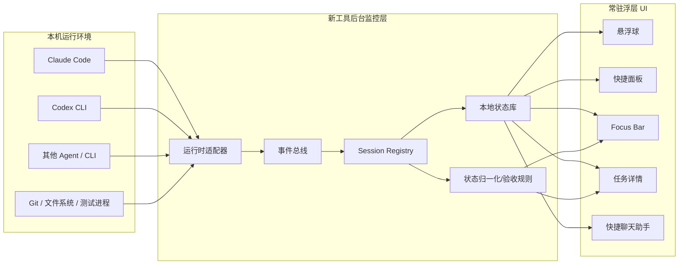
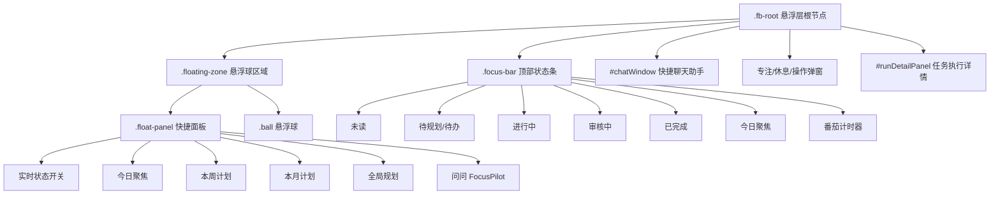
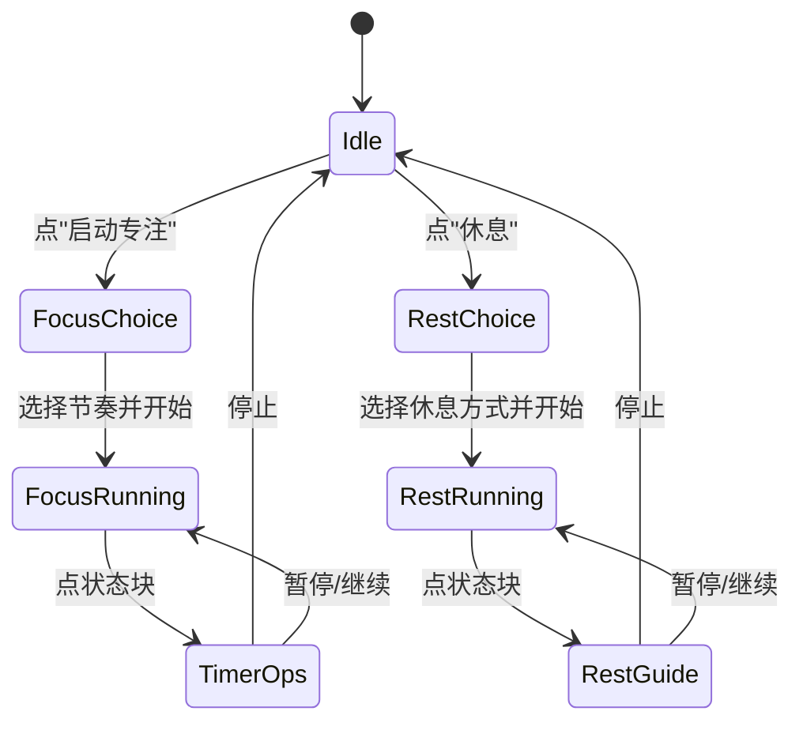

# FocusBar 功能全景与本地 AI 任务监控工具参考

> **来源边界**：本文只参考最新 FP-UI 设计文档 [docs/fp-ui/09-focusbar.md](fp-ui/09-focusbar.md) 与最新母版原型 [docs/fp-ui/00-layout-prototype.html](fp-ui/00-layout-prototype.html) 中 `.fb-root` 作用域的实现。旧版 V4/macOS 悬浮球实现不作为本文依据。
>
> **目标用途**：作为新起一个独立工具项目的参考文档，用于设计一个常驻本机的 AI 任务状态监控软件，监控本地安装的 Claude Code、Codex CLI 等 Agent/CLI 任务状态，并支持实时验收。
>
> **更新日期**：2026-06-21

---

## 1. 一句话定位

FocusBar 是一个常驻在桌面与所有 App 之上的系统级浮层，由 **悬浮球、快捷面板、顶部 Focus Bar、任务详情、快捷聊天入口** 组成。

对新工具项目来说，它不是一个普通项目管理页面，而是一个“本机 AI 任务雷达”：

- 悬浮球负责常驻入口、未读提醒、拖拽位置、专注/休息状态环。
- 快捷面板负责快速查看今日、本周、本月、全局规划，并打开 AI 对话。
- Focus Bar 负责实时展示所有 AI 任务状态，尤其是进行中、待验收、失败/阻塞、未读。
- 任务详情负责从一条状态项直接进入验收、继续对话、重新执行、删除或标记完成。
- 快捷聊天入口负责全局查询“哪些任务等我验收”“今天最该处理什么”“Claude/Codex 正在跑什么”。

核心设计原则是：**常驻、轻量、可验收、不打断**。

---

## 2. 当前最新设计源

| 源文件 | 作用 | 本文使用范围 |
|---|---|---|
| `docs/fp-ui/09-focusbar.md` | 悬浮层产品规格 | 定位、三层结构、区域结构、交互规则、状态 class、数据对象、自检规则 |
| `docs/fp-ui/00-layout-prototype.html` | 最新可交互母版 | `.fb-root` DOM、CSS、JS、数据池、设置项、详情面板、聊天入口、自检、拖拽 |
| `docs/FP-UI.md` | FP-UI 总览 | 确认悬浮层为非一级导航、状态为“可开发” |
| `docs/DesignGuide.md` | 视觉决策 | 悬浮层固定浅色玻璃调色板，不跟随母版主题 |
| `docs/PRD.md` | 产品级约束 | 悬浮层作为系统级入口，Focus Bar 承载状态条和番茄钟 |

本文刻意不采纳旧版 Swift/AppKit 里的实现细节，避免把新工具项目绑到旧架构。

---

## 3. 总体架构



### 3.1 新工具的三层职责

| 层级 | 职责 | 不做什么 |
|---|---|---|
| 采集层 | 监听 Claude Code、Codex CLI、测试、Git、文件变更、hook/notify 事件 | 不直接决定 UI 呈现 |
| 状态层 | 统一 Session、Task、Run、Review、Unread、Focus scope | 不耦合具体浮层组件 |
| 浮层层 | 展示实时状态、允许快速验收、打开详情和对话 | 不承载复杂项目编辑 |

### 3.2 与 FP-UI 原型的对应关系

| 原型概念 | 新工具项目中的建议实体 |
|---|---|
| `FB_POOL` | `TaskProjectionStore` 或 `TaskIndex` |
| `planScopes` | `FocusScopeIndex` |
| `RUN_DETAILS` | `RunDetailStore` |
| `openRunDetail(id)` | `openTaskDetail(taskId/runId)` |
| `bar-num` | 派生计数，不手写 |
| `window.__SELFCHECK__` | 内建自检/诊断面板 |
| `fbPlanAdd/fbPlanRemove` | Task 生命周期事件回调 |

---

## 4. 信息架构



### 4.1 部件清单

| 部件 | 原型 class/id | 功能定位 | 新工具复用建议 |
|---|---|---|---|
| 悬浮层根节点 | `.fb-root` / `#fbRoot` | 固定覆盖层、状态 class 容器 | 作为独立 window/webview 根作用域 |
| Focus Bar | `.focus-bar` / `#focusBar` | 顶部实时状态条 | 第一优先级功能 |
| 悬浮球区域 | `.floating-zone` / `#floatingZone` | 管理浮球、面板、拖拽位置 | 常驻入口 |
| 悬浮球 | `.ball` | 入口、角标、状态环、拖拽 | 必做 |
| 快捷面板 | `.float-panel` | 状态开关、规划速览、聊天入口 | 必做 |
| 二级菜单 | `.sub-menu` | scope 任务列表 | 必做 |
| 任务详情 | `#runDetailPanel` | 任务执行、验收、继续指令 | 新工具核心差异化 |
| 快捷聊天 | `#chatWindow` | 跨项目查询与指令入口 | P1，可先做查询再做执行 |
| 计时弹窗 | `#focusModal` / `#restModal` 等 | 专注/休息流程 | P2，保留接口即可 |

---

## 5. 悬浮球功能

### 5.1 常驻入口

悬浮球始终位于屏幕之上，是打开快捷面板和感知状态的最低摩擦入口。

必备能力：

- 常驻显示，可被设置项关闭。
- 支持拖拽移动。
- 拖拽后点击事件不误触发打开/锁定。
- 可显示未读角标。
- 可显示专注/休息状态环。
- 可点击切换面板锁定态。

### 5.2 状态表现

| 状态 | 原型表现 | 触发 |
|---|---|---|
| 默认 | 红色圆形玻璃球 + 内部禅圆 | 常规状态 |
| 有未读 | 右上 `ball-badge` 数字 | 未读任务/消息数量 > 0 |
| 专注中 | 外圈红色 `ball-ring` | `data-mode="focus"` |
| 休息中 | 外圈绿色 `ball-ring` | `data-mode="rest"` |
| 锁定面板 | 琥珀色球体 | `fb-locked` |
| 隐藏 | 悬浮球与快捷面板不显示 | `fb-hidden` |

### 5.3 拖拽规则

原型中浮球拖拽逻辑是独立脚本：

- 鼠标按下记录初始坐标。
- 移动距离超过 4px 才判定为拖拽。
- 拖拽中将 `floatingZone` 从 `right` 定位切到 `left/top` 定位。
- 拖拽位置限制在视口内，距边缘至少 6px。
- 鼠标释放后如果发生过拖拽，设置 `ball.dataset.justDragged`。
- 随后的 click 捕获阶段会拦截一次点击，避免“拖完立刻触发锁定”。

新工具建议：

- 桌面端应持久化浮球位置：`screenId + x + y + anchor`。
- 多显示器下按屏幕保存位置。
- 拖到屏幕边缘可以吸附，但不要强制贴边。
- 位置越界时自动回到可见区。

---

## 6. 快捷面板功能

### 6.1 打开与收起

| 行为 | 规则 |
|---|---|
| hover 打开 | hover **悬浮球本体** → 给 `floatingZone` 加 `open`；面板**展开后** hover 面板仅用于**保持**打开。未弹出时面板占位区 `pointer-events:none`、不参与感应（详见 [fp-ui/09-focusbar.md §4.1](fp-ui/09-focusbar.md)） |
| 离开收起 | 鼠标离开后 320ms 收起 |
| 点击锁定 | 点击悬浮球切换 `fb-locked`，锁定时面板常驻 |
| 设置常驻 | `window.fbAutoCollapse === false` 时离开不收起 |
| 二级菜单移动 | `.sub-menu::after` 提供透明桥接热区，避免鼠标移动时秒收 |

核心体验是“hover 快速扫一眼，点击进入常驻验收模式”。

### 6.2 面板内容

快捷面板包含 5 个动作行 + 1 个聊天入口：

| 动作行 | 功能 | 二级菜单 |
|---|---|---|
| 实时状态 | 开/关 Focus Bar | 无 |
| 今日聚焦 | 查看、新增、删除今日任务 | 有 |
| 本周计划 | 查看、新增、删除本周任务 | 有 |
| 本月计划 | 查看、新增、删除本月任务 | 有 |
| 全局规划 | 查看、新增、删除全部任务 | 有 |
| 问问 FocusPilot | 打开快捷聊天助手 | 无 |

### 6.3 二级菜单

每个规划行对应一个二级菜单：

- 标题：当前 scope 名称。
- 分组按钮：`按状态` / `按项目`。
- 列表容器：`plan-list`。
- 空态：`暂无任务，下面新建一条`。
- 底部动作：`＋ 新建任务`。

任务行结构：

| 字段 | 用途 |
|---|---|
| 状态圆点 | 使用状态色快速识别 |
| 标题 | 任务名 |
| 状态文字 | 待规划/待办/进行中/审核中/已完成/已阻塞 |
| 点击行为 | `openRunDetail(id)` |

### 6.4 新增与删除

原型中的新增链路：

1. 点击 `＋ 新建任务`。
2. 调用 `openNewTaskModal({source:'plan', scope})`。
3. 母版创建新任务后调用 `window.fbPlanAdd(scope, id, title, statusKey, project)`。
4. 快捷面板把任务加入对应 scope 并重渲染。

原型中的删除链路：

1. 在任务详情点击删除。
2. 删除 `RUN_DETAILS` 或 work item 中的任务。
3. 调用 `window.fbPlanRemove(id)`。
4. 从 `today/week/month/all` 所有清单中移除该 id。

新工具项目建议把这两条改成事件驱动：

```ts
type TaskEvent =
  | { type: "task.created"; task: Task }
  | { type: "task.updated"; taskId: string; patch: Partial<Task> }
  | { type: "task.deleted"; taskId: string }
  | { type: "task.scope.changed"; taskId: string; scopes: FocusScope[] };
```

---

## 7. Focus Bar 功能

### 7.1 状态条组成

Focus Bar 是顶部实时状态条，默认由 6 个状态组、计时器、进度条、关闭按钮组成。

| 分组 | tone | 数据来源 | 新工具语义 |
|---|---|---|---|
| 未读 | `unread` | `unread === true` 或消息未读 | 需要用户注意的新事件 |
| 待规划 | `plan` | 状态为待规划/待办 | 还没进入运行或等待排期 |
| 进行中 | `running` | 状态为进行中 | Claude/Codex/其他 Agent 正在执行 |
| 审核中 | `review` | 状态为审核中 | 等待用户验收，是新工具核心入口 |
| 已完成 | `done` | 状态为已完成 | 今天或当前周期已完成 |
| 今日聚焦 | `focus` | `planScopes.today` | 用户今日重点 |

> 原型的待规划分组标题叫“待规划”，内容包含“待规划 / 待办”。新工具项目建议 UI 文案保留“待规划”，但内部状态明确包含 `planned` 与 `todo`。

### 7.2 下拉列表

每个状态组都可 hover 或点击打开下拉：

- hover 显示临时下拉。
- 点击标题 `bar-btn` 钉住该下拉。
- 钉住后该组增加 `pinned` class，高亮。
- 再点取消钉住。
- 点击 Focus Bar 外部取消所有钉住。

下拉内容是 `mini-task`：

| 字段 | 用途 |
|---|---|
| `data-run-detail` | 详情 id |
| `data-st` | 状态 |
| `data-pj` | 项目/Workspace |
| 标题 | 任务名 |
| 小字 | Agent、项目、进度或状态 |
| `详情` | 进入任务详情 |

### 7.3 计数规则

`bar-num` 必须是派生值，不能手写。

不变量：

- `bar-num === 对应下拉 DOM 条数`
- `bar-num === 数据池派生数量`
- 今日聚焦 `bar-num === planScopes.today.length`

新工具中所有状态数字都应该来自同一个 selector，例如：

```ts
const counts = {
  unread: tasks.filter(t => t.unread).length,
  plan: tasks.filter(t => t.status === "planned" || t.status === "todo").length,
  running: tasks.filter(t => t.status === "running").length,
  review: tasks.filter(t => t.status === "review").length,
  done: tasks.filter(t => t.status === "done").length,
  focus: focusScopes.today.length,
};
```

### 7.4 Focus Bar 开关

| 入口 | 行为 |
|---|---|
| 快捷面板“实时状态” | 切换 `bar-pinned` |
| 设置“默认置顶显示” | 切换 `bar-pinned` |
| 进入专注/休息 | 自动显示 Focus Bar |
| 点击 `×` | 移除 `bar-pinned` 与 `timer-running`，回 normal |

### 7.5 Focus Bar 拖拽

原型支持按住状态条空白处拖动：

- 可拖动范围限制在视口内。
- 避开按钮、输入框、菜单、任务项、计时器等可交互元素。
- 设置项 `window.fbBarDragOff` 可关闭拖拽。

新工具建议：

- 拖动位置持久化。
- 提供“重置到顶部居中”。
- 全屏应用、菜单栏遮挡、多显示器切换时自动校正。

---

## 8. 番茄钟与专注/休息模式

### 8.1 状态模型

| 模式 | 根节点状态 | Focus Bar 状态 | 悬浮球状态 |
|---|---|---|---|
| 常规 | `data-mode="normal"` | 可显示/隐藏 | 无状态环 |
| 仅状态条 | `bar-pinned` | 显示状态条 | 无状态环 |
| 专注中 | `data-mode="focus"` + `timer-running` | 暖橙背景，显示工作中 | 红色状态环 |
| 休息中 | `data-mode="rest"` + `timer-running` | 绿色背景，`.resting` | 绿色状态环 |

### 8.2 操作流程



### 8.3 专注方案

原型提供：

- 常规节奏：35 min 工作 / 7 min 休息。
- 深度专注：25 min 工作 / 5 min 休息。
- 轻度脑力：50 min 工作 / 10 min 休息。
- 自定义：工作/休息时长 stepper。

### 8.4 休息方案

原型提供：

- 轻度恢复：远眺、深呼吸、坐姿核心激活、补水。
- 标准恢复：闭眼远眺、深呼吸、走动、站立核心激活、补水。
- 深度恢复：冥想、腹式呼吸、走动、全链路核心激活、补水。
- 自由休息：不跟步骤，按自己节奏恢复。

新工具项目可以把番茄钟作为 P2 功能。第一版更应该优先完成 AI 任务监控与验收闭环。

---

## 9. 任务详情与实时验收

任务详情是新工具项目最应该强化的部分。原型中的 `runDetailPanel` 已经把状态条和快捷面板的任务点击统一到 `openRunDetail(id)`。

### 9.1 详情面板信息

| 区域 | 内容 |
|---|---|
| 顶部 | 关闭、任务 ID、标题、状态 pill、删除 |
| 元信息条 | 优先级、Agent、调度方式、评估策略、Workspace、Project、目标、日期 |
| live 区 | Agent、运行状态、步骤、日志 |
| 描述 | 任务需求/目标 |
| 轮次记录 | Agent 执行、质量审查、用户回复、修复轮次 |
| 回复框 | 继续给 Agent 下发指令 |

### 9.2 新工具应强化的验收动作

原型已有“对话详情做后续操作”的方向，新项目建议明确成一组验收命令：

| 动作 | 适用状态 | 含义 |
|---|---|---|
| 查看 diff | 审核中/失败/完成 | 打开代码变更或产物摘要 |
| 运行验收 | 审核中 | 执行预设测试、脚本或截图验证 |
| 通过验收 | 审核中 | 标记完成，清未读 |
| 要求修改 | 审核中/失败 | 向原 Agent 会话发送下一轮指令 |
| 重新运行 | 失败/阻塞 | 重启同一任务 |
| 归档 | 完成 | 收起到历史 |
| 删除 | 任意 | 从所有 scope 移除 |

### 9.3 验收状态建议

```ts
type ReviewState =
  | "none"          // 无需验收
  | "waiting_user"  // 等用户验收
  | "passed"        // 用户验收通过
  | "changes_needed"// 用户要求修改
  | "auto_failed"   // 自动验收失败
  | "stale";        // 等待太久，需要提醒
```

### 9.4 实时验收的最低闭环

第一版必须能完成：

1. 发现 Claude/Codex 任务开始运行。
2. 展示任务进入“进行中”。
3. 任务结束后进入“审核中”或“失败”。
4. Focus Bar 的“审核中”数字实时更新。
5. 用户点击任务进入详情。
6. 用户看到结果、日志、产物路径、diff 或测试摘要。
7. 用户选择“通过”或“要求修改”。
8. 状态回写并从未读/审核中移除或重新进入运行。

---

## 10. 快捷聊天助手

原型中的快捷聊天窗口从面板底部“问问 FocusPilot...”打开。

### 10.1 当前设计

| 元素 | 功能 |
|---|---|
| 新建会话 | 清空当前聊天，创建全局新会话 |
| 展开到主界面 | 跳到 Home/主对话视图 |
| 关闭 | 收起聊天窗口 |
| 范围 chips | 全部项目、今日聚焦、本周计划、进行中、审核中 |
| 对话区 | 展示用户问题和系统回答 |
| 输入框 | 提问全部项目、运行记录、今日聚焦、本周计划 |

### 10.2 新工具建议

快捷聊天不应该只是聊天，而应该是“本机任务查询控制台”。

优先支持的问题：

- “现在 Claude Code 在跑什么？”
- “Codex 有哪些任务等我验收？”
- “最近失败的任务有哪些？”
- “哪些任务改了文件但没跑测试？”
- “今天完成了什么？”
- “帮我按风险排序待验收任务。”
- “把这个审核中的任务发回原会话继续修改。”

### 10.3 查询范围

| 范围 | 过滤条件 |
|---|---|
| 全部项目 | 所有 workspace/project/session |
| 今日聚焦 | `scope.today === true` |
| 本周计划 | `scope.week === true` |
| 进行中 | `status === running` |
| 审核中 | `status === review` |
| Claude Code | `runtime === claude_code` |
| Codex CLI | `runtime === codex_cli` |
| 当前目录 | `cwd === activeWorkspacePath` |

---

## 11. 数据模型

### 11.1 原型模型

原型采用一个轻量任务池：

```ts
type FbPoolItem = {
  t: string;        // 标题
  st: string;       // 状态
  pj: string;       // 项目
  unread?: boolean; // 是否未读
  sub?: string;     // 副标题，如 "Codex · FocusPilot · 62%"
};

type FbPool = Record<string, FbPoolItem>;

type PlanScopes = {
  today: string[];
  week: string[];
  month: string[];
  all: string[]; // today ∪ week ∪ month
};
```

### 11.2 新工具建议模型

```ts
type RuntimeKind =
  | "claude_code"
  | "codex_cli"
  | "gemini_cli"
  | "custom";

type TaskStatus =
  | "planned"
  | "todo"
  | "running"
  | "review"
  | "done"
  | "blocked"
  | "failed"
  | "cancelled";

type RunState =
  | "idle"
  | "queued"
  | "running"
  | "waiting_lock"
  | "completed"
  | "timed_out"
  | "failed";

type AgentTask = {
  id: string;
  title: string;
  runtime: RuntimeKind;
  cwd: string;
  workspaceName?: string;
  projectName?: string;
  status: TaskStatus;
  runState: RunState;
  reviewState: ReviewState;
  unread: boolean;
  progress?: number;
  startedAt?: string;
  endedAt?: string;
  lastEventAt: string;
  sourceSessionId?: string;
  branch?: string;
  changedFiles?: string[];
  testSummary?: TestSummary;
  errorSummary?: string;
};
```

### 11.3 Session 模型

```ts
type AgentSession = {
  id: string;
  runtime: RuntimeKind;
  pid?: number;
  cwd: string;
  command: string;
  status: "active" | "idle" | "completed" | "failed" | "detached";
  currentTaskId?: string;
  startedAt: string;
  lastHeartbeatAt: string;
  metadata: Record<string, unknown>;
};
```

### 11.4 事件模型

```ts
type AgentEvent =
  | { type: "session.started"; session: AgentSession }
  | { type: "session.heartbeat"; sessionId: string; at: string }
  | { type: "task.started"; task: AgentTask }
  | { type: "task.progress"; taskId: string; progress?: number; message?: string }
  | { type: "task.log"; taskId: string; level: "info" | "warn" | "error"; text: string }
  | { type: "task.completed"; taskId: string; summary?: string }
  | { type: "task.failed"; taskId: string; error: string }
  | { type: "task.review.requested"; taskId: string; artifacts: Artifact[] }
  | { type: "review.passed"; taskId: string; by: "user" | "auto" }
  | { type: "review.changes_requested"; taskId: string; message: string };
```

### 11.5 派生视图

不要让 UI 组件各自维护自己的任务列表。建议全部从统一 store 派生：

```ts
type FocusBarProjection = {
  unread: AgentTask[];
  plan: AgentTask[];
  running: AgentTask[];
  review: AgentTask[];
  done: AgentTask[];
  todayFocus: AgentTask[];
};
```

---

## 12. 状态归一化

新工具需要把不同 Agent/CLI 的原始状态归一化到 FocusBar 状态。

| 原始事件 | 统一状态 | Focus Bar 分组 |
|---|---|---|
| 进程启动/会话开始 | `running` | 进行中 |
| 有明确进度/日志刷新 | `running` | 进行中 |
| 命令成功结束但未验收 | `review` | 审核中 |
| 自动测试全部通过且无需用户确认 | `done` | 已完成 |
| 测试失败/命令失败 | `failed` 或 `blocked` | 未读 + 审核中/阻塞 |
| 等待锁/等待权限/等待用户输入 | `blocked` | 未读 |
| 用户通过验收 | `done` | 已完成 |
| 用户要求修改 | `running` 或 `todo` | 进行中/待规划 |

对“方便实时验收”这个目标，推荐默认策略是：**AI 任务执行结束后先进入审核中，而不是直接进入已完成**。只有明确配置了自动验收规则，才允许自动转完成。

---

## 13. Claude Code / Codex 监控适配

### 13.1 监控目标

新工具应监控本机安装的多种 AI 工具：

- Claude Code
- Codex CLI
- Gemini CLI 或其他 CLI
- 用户自定义 Agent 命令
- 由这些工具触发的测试、构建、Git 操作、文件修改

### 13.2 适配方式

| 方式 | 优点 | 风险 | 适合 |
|---|---|---|---|
| CLI hook/notify | 事件准确、成本低 | 各工具支持差异大 | Claude/Codex 首选 |
| wrapper 命令 | 可统一捕获 stdout/stderr/exit code | 需要用户从 wrapper 启动 | 自定义 Agent |
| shell integration | 覆盖面广 | 解析复杂 | Terminal 场景 |
| 文件系统监听 | 可发现产物变化 | 难判断任务边界 | 补充信号 |
| 进程扫描 | 能发现运行中进程 | 语义弱 | 兜底 |
| Git 监听 | 可定位 diff/branch | 不能代表任务完成 | 验收辅助 |

### 13.3 Claude Code 建议事件

```ts
type ClaudeCodeEvent =
  | { type: "claude.session.start"; cwd: string; sessionId: string }
  | { type: "claude.task.start"; prompt?: string; cwd: string }
  | { type: "claude.tool.call"; tool: string; args?: unknown }
  | { type: "claude.file.changed"; path: string }
  | { type: "claude.command.exit"; code: number }
  | { type: "claude.session.stop"; exitCode?: number };
```

### 13.4 Codex CLI 建议事件

```ts
type CodexEvent =
  | { type: "codex.session.start"; cwd: string; sessionId: string }
  | { type: "codex.task.start"; prompt?: string; cwd: string }
  | { type: "codex.plan.update"; items: { step: string; status: string }[] }
  | { type: "codex.command.run"; command: string }
  | { type: "codex.file.changed"; path: string }
  | { type: "codex.review.ready"; summary?: string }
  | { type: "codex.session.stop"; exitCode?: number };
```

### 13.5 最小可用适配策略

第一版可以先做到：

1. 用户通过本工具启动 Claude/Codex。
2. 工具生成 session id，记录 cwd/runtime/command/start time。
3. 捕获 stdout/stderr 和 exit code。
4. 监听 cwd 下文件变更和 Git diff。
5. 命令结束后生成“待验收”任务。
6. Focus Bar 的“审核中”出现该任务。
7. 用户在详情里看摘要、变更文件、日志尾部、测试结果。

第二版再接入各工具的原生 hook，让状态更细。

---

## 14. 设置项

原型设置区覆盖了悬浮球、快捷面板、Focus Bar 三组配置。

| 分区 | 设置项 | 原型行为 | 新工具建议 |
|---|---|---|---|
| 悬浮球 | 显示悬浮球 | 切换 `fb-hidden` | 可关闭，但保留菜单栏入口 |
| 悬浮球 | 大小 | 28-64px，默认 38px | 持久化 |
| 悬浮球 | 透明度 | 20%-100% | 持久化 |
| 快捷面板 | 透明度 | 20%-100% | 持久化 |
| 快捷面板 | 弹出动画 | 0-500ms | 允许关闭动画 |
| 快捷面板 | hover 离开后自动收起 | 写入 `window.fbAutoCollapse` | 应持久化 |
| Focus Bar | 默认置顶显示 | 切换 `bar-pinned` | 可按工作区/全局配置 |
| Focus Bar | 透明度 | 40%-100% | 持久化 |
| Focus Bar | 允许拖动 | 写入 `window.fbBarDragOff` | 持久化 |

新工具还应新增：

- 开机启动。
- 监控哪些 runtime。
- 哪些目录允许监控。
- 任务结束后是否自动进入审核中。
- 自动验收脚本。
- 文件变更隐私规则。
- 日志保留时长。
- 未读提醒方式。

---

## 15. 视觉与交互基调

### 15.1 视觉原则

最新设计明确：悬浮层使用固定浅色玻璃调色板，不跟随主界面主题。

原因：

- 它是系统级浮层，可能覆盖任意桌面和 App。
- 固定浅色玻璃能保持可读性和稳定感。
- 随主界面主题变化会导致在桌面环境中忽明忽暗。

### 15.2 交互原则

| 原则 | 要求 |
|---|---|
| 非侵入 | 不抢焦点，除非用户主动点击输入 |
| 可扫视 | 数字、状态色、未读角标优先 |
| 可直达 | 状态项一键进详情 |
| 可停留 | 点击锁定后不自动收起 |
| 可恢复 | 误拖、误关、位置越界都能恢复 |
| 可自检 | 数据一致性可随时验证 |

---

## 16. 自检与回归护栏

原型提供 `?selfcheck` / `#selfcheck` 自检，写入 `window.__SELFCHECK__`。

### 16.1 原型已有断言

| 编号 | 断言 |
|---|---|
| I1 | 全局规划 = 今日 ∪ 本周 ∪ 本月 |
| I2 | 各下拉 DOM 条数 = `bar-num` = 池派生数 |
| I3 | 今日聚焦下拉 = 今日规划成员 |
| I4 | 所有展示 id 都能打开详情 |
| I5 | `.float-action` 行恰好 3 列，防箭头换行 |
| I6 | Focus Bar 下拉 `data-st` / `data-pj` 与池一致 |

### 16.2 新工具建议增加断言

| 编号 | 断言 |
|---|---|
| N1 | 每个 running task 必须绑定 runtime session |
| N2 | 每个 review task 必须有产物摘要或日志 |
| N3 | 未读数量 = unread task/message 数量 |
| N4 | 已完成任务不能仍显示在进行中 |
| N5 | 任务结束后必须进入 review/done/failed 之一 |
| N6 | Codex/Claude session stop 事件不能丢失 |
| N7 | 删除任务后所有 scope 和状态组同步消失 |
| N8 | 任务详情中的 changedFiles 路径必须存在或标记已删除 |
| N9 | 关闭悬浮球不影响 Focus Bar 显示 |
| N10 | 拖拽后浮球和 Focus Bar 仍在可见区域 |

---

## 17. MVP 路线图

### P0：实时任务状态与验收闭环

必须做：

- 悬浮球常驻。
- Focus Bar 显示未读、进行中、审核中、已完成。
- 本地 task/session store。
- Claude Code/Codex 最小 wrapper 监控。
- 任务结束进入审核中。
- 任务详情展示日志、退出码、变更文件。
- 用户可以通过/要求修改/删除。

不必做：

- 完整番茄钟。
- 复杂聊天助手。
- 多种主题。
- 复杂项目管理。

### P1：快捷面板与查询助手

必须做：

- 今日/本周/本月/全局规划 scope。
- 按状态/按项目分组。
- 快捷聊天查询。
- 运行失败、阻塞、等待权限的提醒。
- 自动生成验收摘要。

### P2：深度集成与自动验收

可做：

- 原生 hook 集成 Claude Code/Codex。
- 自动运行测试。
- Git diff 可视化。
- 截图/浏览器验收。
- 多 Agent 并发监控。
- 专注/休息番茄钟。

### P3：产品化

可做：

- 菜单栏 App。
- 开机启动。
- 多显示器位置记忆。
- 任务历史搜索。
- 插件适配器市场。
- 团队共享或导出报告。

---

## 18. 新工具项目建议目录

如果用 Electron/Tauri/SwiftUI + WebView 都可以，关键是保持监控层和浮层 UI 解耦。

```text
agent-monitor/
  src/
    app/
      main.ts
      tray.ts
      windows.ts
    monitor/
      runtime-adapter.ts
      claude-code-adapter.ts
      codex-cli-adapter.ts
      process-watcher.ts
      fs-watcher.ts
      git-watcher.ts
    domain/
      task.ts
      session.ts
      event.ts
      projection.ts
      review.ts
    store/
      task-store.ts
      session-store.ts
      settings-store.ts
      event-log.ts
    ui/
      floating-root/
      floating-ball/
      quick-panel/
      focus-bar/
      run-detail/
      quick-chat/
    diagnostics/
      selfcheck.ts
      invariants.ts
```

---

## 19. 可直接迁移的行为契约

### 19.1 class/state 契约

| 状态 | 含义 |
|---|---|
| `floating-zone.open` | 快捷面板展开 |
| `fb-locked` | 面板锁定常驻 |
| `fb-hidden` | 隐藏悬浮球与快捷面板，不影响 Focus Bar |
| `bar-pinned` | Focus Bar 置顶显示 |
| `timer-running` | 计时器运行中 |
| `data-mode="focus"` | 专注模式 |
| `data-mode="rest"` | 休息模式 |
| `.resting` | Focus Bar 休息态 |
| `.bar-group.pinned` | 某个状态下拉钉住 |

### 19.2 数据契约

| 契约 | 规则 |
|---|---|
| 单一任务池 | 所有浮层任务展示从统一 store 派生 |
| scope 仅存 id | 今日/本周/本月只保存成员 id |
| all 自动派生 | 全局规划 = 今日 ∪ 本周 ∪ 本月 |
| 计数派生 | `bar-num` 与清单数量一致 |
| 详情可开 | 所有展示 id 必须能打开详情 |
| 分组独立 | 每个下拉、每个 scope 的分组状态互不影响 |

### 19.3 交互契约

| 交互 | 规则 |
|---|---|
| hover 打开 | hover **悬浮球本体**打开；面板展开后 hover 仅用于保持打开（未弹出的面板占位区不触发） |
| 延迟收起 | 离开后 320ms 收起 |
| 点击锁定 | 悬浮球点击锁定/解除 |
| 二级菜单桥接 | 一级与二级之间有透明热区 |
| 下拉钉住 | 点击状态组标题钉住，再点取消 |
| 点外关闭 | 点 Focus Bar 外取消钉住 |
| 隐藏解耦 | 隐藏悬浮球不隐藏 Focus Bar |

---

## 20. 快速验收清单

### 20.1 悬浮球

- [ ] 默认显示在屏幕右侧或用户上次位置。
- [ ] 可拖动，松手后不会误触发点击。
- [ ] 未读数变化时角标同步。
- [ ] 专注/休息状态环正确切换。
- [ ] 点击后进入/解除锁定态。
- [ ] 关闭悬浮球后 Focus Bar 仍可显示。

### 20.2 快捷面板

- [ ] hover 浮球打开面板。
- [ ] 鼠标离开 320ms 后收起。
- [ ] 锁定或关闭自动收起时不收起。
- [ ] 今日/本周/本月/全局四个二级菜单都可打开。
- [ ] 二级菜单移动过程中不秒收。
- [ ] 按状态/按项目/取消分组三态正确。
- [ ] 新建任务进入对应 scope。
- [ ] 删除任务从所有 scope 消失。

### 20.3 Focus Bar

- [ ] 实时状态开关可显示/隐藏。
- [ ] 6 个状态组数字与列表一致。
- [ ] 运行中任务显示 runtime 和进度。
- [ ] 审核中任务点击可进入详情。
- [ ] 点击状态组可钉住下拉。
- [ ] 点外可取消钉住。
- [ ] Focus Bar 可拖动且不越界。

### 20.4 AI 任务监控

- [ ] 启动 Claude/Codex 后出现 session。
- [ ] 任务运行时进入“进行中”。
- [ ] 任务结束后进入“审核中”。
- [ ] 失败任务有错误摘要。
- [ ] 审核中任务有日志、变更文件、退出码。
- [ ] 用户通过验收后进入“已完成”。
- [ ] 用户要求修改后能回到原会话或新一轮任务。

### 20.5 自检

- [ ] 全局规划等于今日/本周/本月并集。
- [ ] 未读、待规划、进行中、审核中、已完成、今日聚焦计数一致。
- [ ] 所有任务 id 都能打开详情。
- [ ] 删除任务后不会残留在 Focus Bar 或快捷面板。
- [ ] 关闭悬浮球不影响 Focus Bar。

---

## 21. 与原型的差异化改造点

原型已经把 UI 和交互闭环表达清楚，但新工具项目需要补齐真实监控能力：

| 原型现状 | 新工具需要 |
|---|---|
| `FB_POOL` 是静态演示数据 | 接本机实时 session/task store |
| `RUN_DETAILS` 是模拟详情 | 接真实日志、diff、测试、产物 |
| 任务状态由原型数据派生 | 由 Claude/Codex 事件归一化 |
| 快捷聊天是静态回复 | 接本地任务查询与指令路由 |
| 新建/删除只影响原型数据 | 持久化并同步所有投影 |
| 自检只验证 UI 数据一致 | 还要验证 runtime/session/event 完整性 |

换句话说，新项目不是复制原型代码，而是保留原型的交互契约，重做底层数据源和 Agent 适配层。

