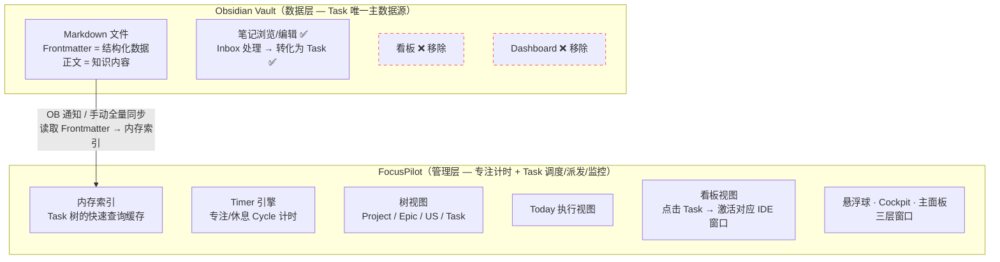
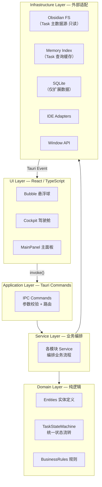
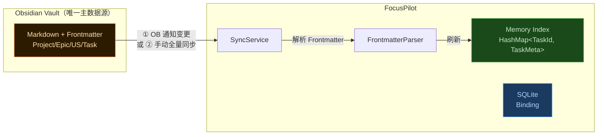
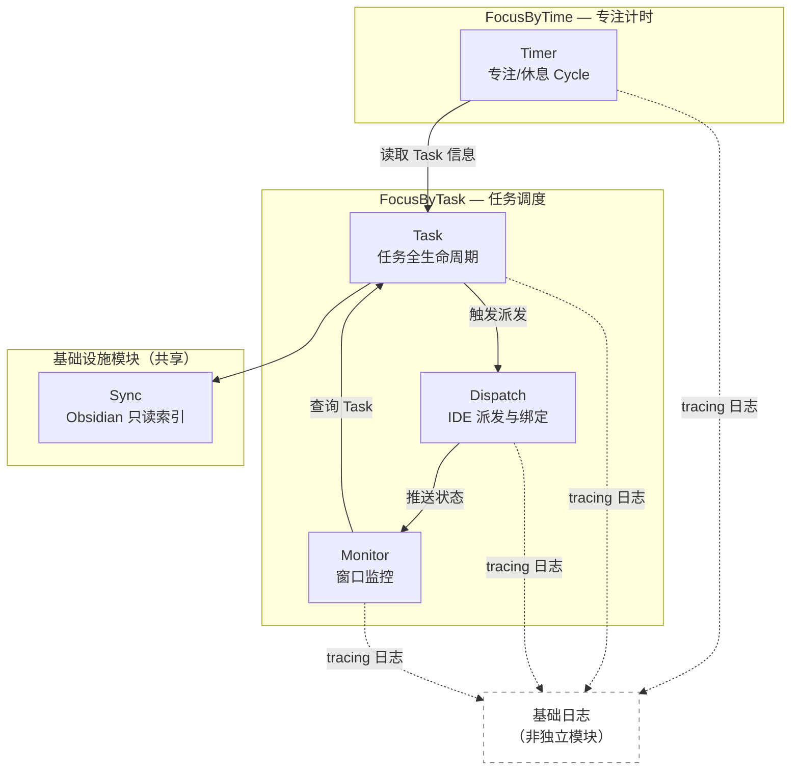
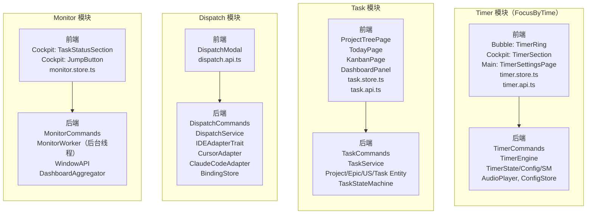
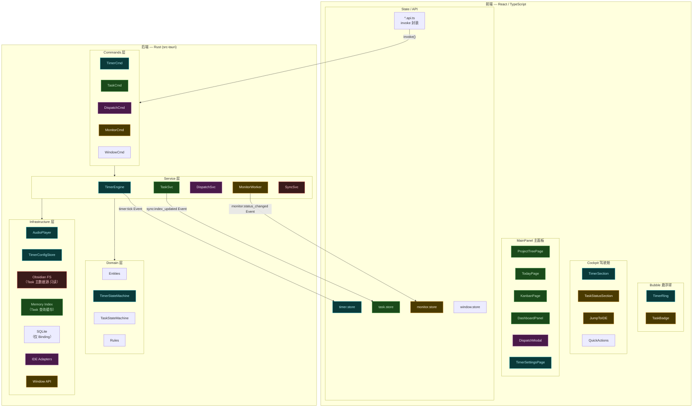
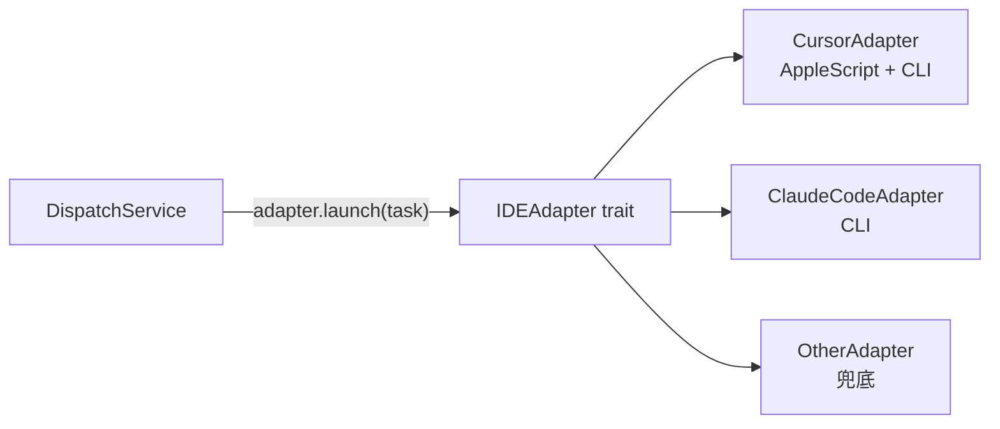
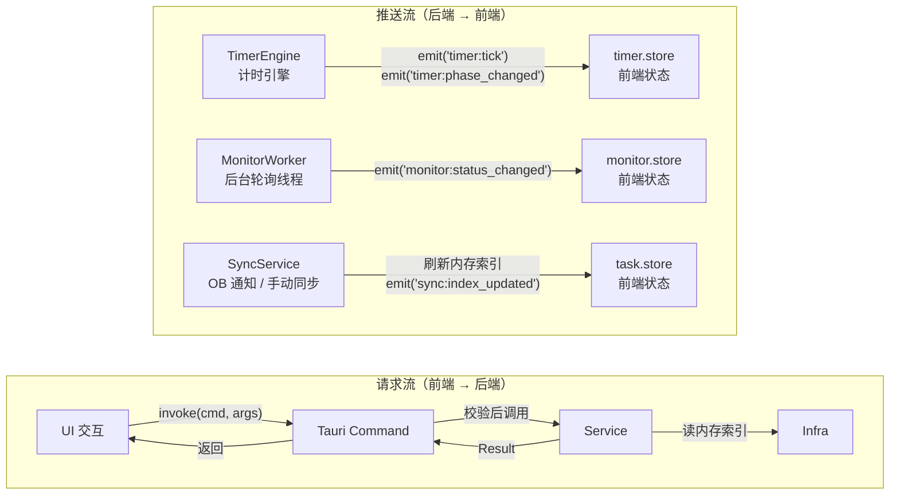
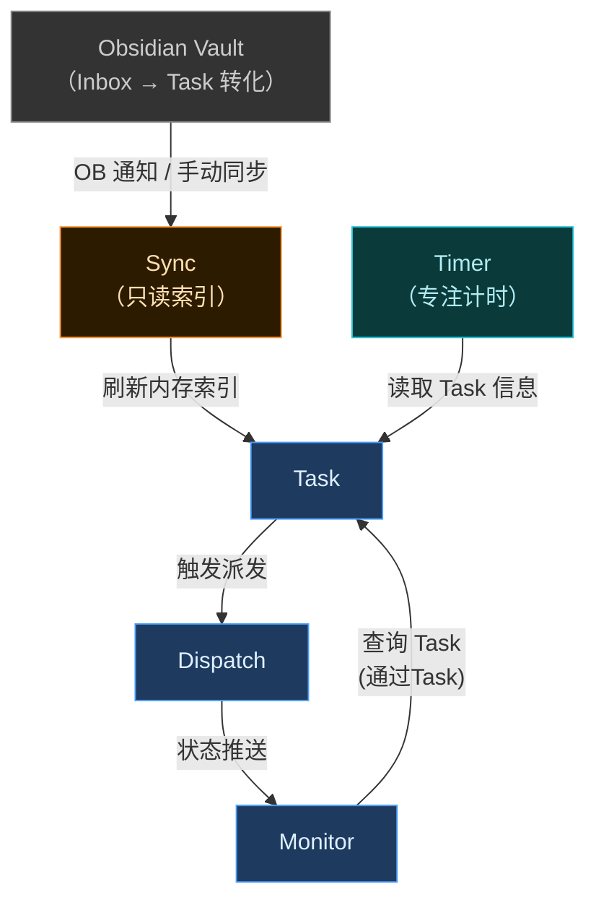

# FocusPilot 架构模块设计（Draft）

> 状态：**Draft** — 设计讨论中，尚未定稿
> 设计日期：2026-02-23
> 基于文档：FocusPilot设计方案.md V1.1

---

## 一、系统定位：Obsidian 与 FocusPilot 的职责分治

采用方案 C+：Obsidian 作为 **Task 唯一主数据源**（Markdown + Frontmatter），FocusPilot 融合两大核心能力（FocusByTime 专注计时 + FocusByTask 任务调度），接管全部任务管理与执行监控，不维护独立的 Task 存储副本。



**原则**：

- **Obsidian Vault 是 Task 的唯一主数据源**，FocusPilot 不在 SQLite 中维护 Task 副本
- **FocusPilot 对 Obsidian 数据只读**：只同步和展示 Task（包括 task 属性：所属的 project/epic/us），不写回任何字段。Task 状态变更由用户在 Obsidian 中手动完成
- 所有状态统一使用 Obsidian 的 `status` 字段（不引入额外字段）
- 同步方式支持两种：OB 端变更时主动通知 FocusPilot + FocusPilot 手动触发全量同步
- 任务的看板、Dashboard、派发、监控全部由 FocusPilot 提供
- SQLite 仅存储 Obsidian 语义之外的运行时扩展数据（ExecutionBinding）

---

## 二、整体分层架构



分层原则：

- **UI 层**：只做渲染和用户交互，零业务逻辑
- **Application 层**：Tauri Commands，只做参数校验和调用路由
- **Service 层**：业务编排，协调多个 Domain 和 Infra
- **Domain 层**：纯逻辑，无 IO，实体定义 + 状态机 + 规则校验
- **Infrastructure 层**：全部外部依赖（Obsidian FS / 内存索引 / SQLite / IDE / 窗口）
  - **Obsidian FS**：Task 主数据的只读访问（Frontmatter 解析 + 同步通知）
  - **Memory Index**：Task 树的内存缓存，启动时全量构建，运行时 OB 通知刷新
  - **SQLite**：仅存储 ExecutionBinding（Obsidian 语义之外的运行时数据）

---

## 三、存储策略：Obsidian 为主 + SQLite 仅扩展

### 3.1 核心原则

Obsidian Vault 通过 Frontmatter 完整维护 Task 层级数据（`type` / `status` / `priority` / `parent_*` 等），目录结构天然表达 `Project → Epic → US → Task` 的层级关系。

**采用「只读索引」模式**：FocusPilot 从 Obsidian 读取数据构建内存索引，不对 Obsidian 文件做任何写入。Task 状态变更由用户在 Obsidian 中手动完成。

### 3.2 数据归属矩阵

| 数据                                               | 存储位置                          | 读写方式                   | 理由                                           |
| -------------------------------------------------- | --------------------------------- | -------------------------- | ---------------------------------------------- |
| Project / Epic / US / Task 层级                    | **Obsidian Vault**                | 读：Frontmatter Parser     | 已存在，直接读取，避免冗余                     |
| Task 状态（backlog / week / today / doing / done） | **Obsidian Frontmatter** `status` | 只读：Parser 解析           | 复用 Obsidian 已有 `status` 字段，状态变更在 OB 中手动完成 |
| Task 树索引 / 聚合缓存                             | **内存** `HashMap`                | 启动全量扫描 + OB 通知刷新 | 查询性能保障                                   |
| ExecutionBinding（Task ↔ IDE 窗口）                | **SQLite**                        | CRUD                       | 纯运行时数据，Obsidian 无需感知                |

### 3.3 数据流向图



### 3.4 同步机制

FocusPilot 支持两种同步触发方式，避免 FileWatcher 的资源消耗与复杂度：

| 触发方式         | 机制                                                                                              | 适用场景                         |
| ---------------- | ------------------------------------------------------------------------------------------------- | -------------------------------- |
| **OB 端通知**    | Obsidian 插件/脚本在 Task 文件变更时，通过 IPC（HTTP / WebSocket / CLI）通知 FocusPilot 同步指定文件 | 运行时增量同步，实时性高         |
| **手动全量同步** | FocusPilot UI 提供"同步"按钮，触发全量扫描 Vault 并重建内存索引                                      | 启动时 / 数据不一致时 / 兜底手段 |

```
启动流程：
1. 全量扫描 Obsidian Vault，解析所有 Task 文件的 Frontmatter
2. 构建内存索引 HashMap<TaskId, TaskMeta>

运行时：
- OB 端 Task 变更 → 通知 FocusPilot 指定文件路径 → 解析该文件 → 刷新内存索引
- 手动全量同步 → 重新扫描 Vault → 重建内存索引
- UI 查询 → 从内存索引读取 → 零文件 IO
```

---

## 四、模块划分与前后端投影

### 4.1 模块总览

**四个业务模块 + 一个基础设施模块**，归属两大子能力：



**设计要点**：

- **FocusByTime**（Timer）回答"怎么做"：专注节奏、时间管理
- **FocusByTask**（Task + Dispatch + Monitor）回答"做什么"：任务列表、IDE 派发、执行监控
- Timer 模块有独立状态机（idle/focus/rest）、独立 Infra（音频播放、配置持久化），和 Task 仅松耦合
- Inbox 在 Obsidian 内处理，FocusPilot 只同步 Task
- EventLog 采用 `tracing` 框架实现基础日志能力，MVP 阶段不独立成模块
- Binding 是 Dispatch 和 Monitor 的共享数据表，合并在 Dispatch 模块内部

### 4.2 每个模块的前后端投影（模块 × 分层矩阵）

每个业务模块在前端和后端各有什么：



### 4.3 模块 × 分层详细矩阵

| 模块         | UI 层（React）                             | API 层                            | Commands 层（Rust） | Service 层（Rust） | Domain 层（Rust）                         | Infra 层（Rust）                                |
| ------------ | ------------------------------------------ | --------------------------------- | ------------------- | ------------------ | ----------------------------------------- | ----------------------------------------------- |
| **Timer**    | Bubble:TimerRing, Cockpit:TimerSection, Main:TimerSettings | timer.api.ts                      | TimerCommands       | TimerEngine        | TimerState, TimerConfig, TimerStateMachine | AudioPlayer, TimerConfigStore                   |
| **Task**     | Main:ProjectTreePage, TodayPage, KanbanPage, DashboardPanel | task.api.ts                       | TaskCommands        | TaskService        | Project, Epic, US, Task, TaskStateMachine | **内存索引（只读查询）**                         |
| **Dispatch** | Main:DispatchModal                         | dispatch.api.ts                   | DispatchCommands    | DispatchService    | ExecutionBinding                          | IDEAdapters, SQLite(Binding)                    |
| **Monitor**  | Cockpit:TaskStatusSection, JumpButton      | monitor.store.ts (event listener) | MonitorCommands     | MonitorWorker      | DashboardSummary                          | WindowAPI                                       |
| **Sync**     | —                                          | —                                 | SyncCommands        | SyncService        | —                                         | OB 通知接收, FrontmatterParser（只读）, **MemoryIndex** |

> **读法**：每一行就是一个模块从前端到后端的完整链路，任何一个功能需求都能精确定位到模块的某一层。

---

## 五、Tauri 前后端职责切分（按模块着色）



**图例**：青色=Timer | 绿色=Task | 紫色=Dispatch | 橙色=Monitor | 红色=Sync

每个颜色就是一个业务模块，从前端 UI 一路贯穿到后端 Infra，一目了然。

---

## 六、IDE Adapter 插件化设计



统一 trait 接口，新增 IDE 只加一个 Adapter 文件，DispatchService 零改动。

---

## 七、数据流与通信机制



| 通信方向     | 机制                                   | 使用场景                                               |
| ------------ | -------------------------------------- | ------------------------------------------------------ |
| 前端 → 后端  | `tauri::invoke()` 同步请求             | 所有用户主动操作（Timer 控制、派发、手动同步、激活 IDE 窗口） |
| 后端 → 前端  | `tauri::Event emit()` 异步推送         | Timer tick/阶段切换、Monitor 状态变更、同步完成通知     |
| OB → FocusPilot | IPC 通知（HTTP / WebSocket / CLI）     | Obsidian 端 Task 变更时主动通知                        |
| 后端内部     | 直接函数调用                           | Service 层调用 Domain / Infra                          |
| Task 读取    | 内存索引查询                           | 零文件 IO，所有 Task 查询走内存 HashMap                |

**Tauri Event 清单**：

| 事件 | 来源 | 频率 | 消费窗口 |
|------|------|------|---------|
| `timer:tick` | TimerEngine | 1次/秒（Timer 运行时） | Bubble, Cockpit |
| `timer:phase_changed` | TimerEngine | 阶段切换时 | 所有窗口 |
| `monitor:status_changed` | MonitorWorker | ~3秒/次 | Bubble, Cockpit |
| `sync:index_updated` | SyncService | OB 变更时 | MainPanel |
| `dispatch:binding_changed` | DispatchService | 派发/解绑时 | Cockpit, MainPanel |

---

## 八、推荐目录结构

```
FocusPilot/
├── src-tauri/                          # Rust 后端
│   └── src/
│       ├── main.rs                     # 入口，注册 Commands，启动三层窗口
│       ├── commands/                   # Application 层：IPC 入口
│       │   ├── mod.rs
│       │   ├── timer_cmd.rs            # ← Timer 模块（FocusByTime）
│       │   ├── task_cmd.rs             # ← Task 模块
│       │   ├── dispatch_cmd.rs         # ← Dispatch 模块
│       │   ├── monitor_cmd.rs          # ← Monitor 模块
│       │   ├── sync_cmd.rs             # ← 手动同步 + OB 通知接收
│       │   └── window_cmd.rs           # ← 窗口管理（Bubble/Cockpit/Main 控制）
│       │
│       ├── services/                   # Service 层：业务编排
│       │   ├── mod.rs
│       │   ├── timer_engine.rs         # ← Timer 模块（计时引擎，tokio 定时任务）
│       │   ├── task_service.rs         # ← Task 模块（读内存索引，只读查询）
│       │   ├── dispatch_service.rs     # ← Dispatch 模块（含 Binding 读写）
│       │   ├── monitor_worker.rs       # ← Monitor 模块（后台轮询线程）
│       │   └── sync_service.rs         # ← Sync 基础设施（索引构建 + OB 通知处理）
│       │
│       ├── domain/                     # Domain 层：纯逻辑，无 IO
│       │   ├── mod.rs
│       │   ├── entities.rs             # Project / Epic / US / Task / ExecutionBinding / TimerState / TimerConfig
│       │   ├── timer_sm.rs             # Timer 状态机：idle / focus / rest + 转移规则
│       │   ├── task_sm.rs              # 状态定义 backlog / week / today / doing / done（只读）
│       │   └── rules.rs               # 派发前置检查等业务规则
│       │
│       └── infra/                      # Infrastructure 层：外部依赖
│           ├── mod.rs
│           ├── audio/                  # 音频播放（Timer 模块 Infra）
│           │   ├── mod.rs
│           │   └── macos.rs            # macOS NSSound / afplay
│           ├── config/                 # 用户配置持久化（Timer 模块 Infra）
│           │   ├── mod.rs
│           │   └── timer_config_store.rs  # Timer 配置 JSON 读写
│           ├── index/                  # 内存索引（Task 查询缓存）
│           │   ├── mod.rs
│           │   ├── task_index.rs       # HashMap<TaskId, TaskMeta>，树查询，过滤，聚合
│           │   └── index_builder.rs    # 全量构建 + OB 通知刷新
│           ├── db/                     # SQLite（仅扩展数据）
│           │   ├── mod.rs
│           │   ├── schema.rs           # 建表 / 迁移（仅 binding 表）
│           │   └── binding_repo.rs     # ← Dispatch 模块（Binding 持久化）
│           ├── ide/                    # IDE Adapter（Dispatch 模块 Infra）
│           │   ├── mod.rs
│           │   ├── adapter_trait.rs    # trait IDEAdapter
│           │   ├── cursor.rs
│           │   └── claude_code.rs
│           ├── window/                 # 窗口 API（Monitor 模块 Infra）
│           │   ├── mod.rs
│           │   └── macos.rs            # Accessibility API / AppleScript + 窗口管理
│           └── obsidian/               # Obsidian Vault 只读访问（Sync 模块 Infra）
│               ├── mod.rs
│               ├── notify_receiver.rs  # 接收 OB 端变更通知（HTTP / WebSocket / CLI）
│               └── frontmatter.rs      # Frontmatter 解析（YAML，只读）
│
└── src/                                # React 前端
    ├── windows/
    │   ├── bubble/                     # Bubble 悬浮球
    │   │   ├── App.tsx
    │   │   ├── BubbleView.tsx                 # 主视图（倒计时 + 环形进度 + 角标）
    │   │   └── components/
    │   │       ├── TimerRing.tsx               # ← Timer 模块（环形进度条）
    │   │       └── TaskBadge.tsx               # ← Monitor 模块（任务数角标）
    │   │
    │   ├── cockpit/                    # Cockpit 驾驶舱（替代原 widget/）
    │   │   ├── App.tsx
    │   │   ├── CockpitLayout.tsx
    │   │   ├── sections/
    │   │   │   ├── TimerSection.tsx            # ← Timer 模块（倒计时 + 控制按钮 + 关联 Task）
    │   │   │   ├── TaskStatusSection.tsx       # ← Monitor 模块（任务状态列表 + 跳转）
    │   │   │   └── QuickActions.tsx            # 同步 / 设置 / 打开主面板
    │   │   └── components/
    │   │       ├── PinButton.tsx               # 固定/浮动切换
    │   │       └── SectionCard.tsx
    │   │
    │   └── main/                       # MainPanel 主面板
    │       ├── App.tsx
    │       ├── pages/
    │       │   ├── ProjectTreePage.tsx         # ← Task 模块
    │       │   ├── TodayPage.tsx               # ← Task 模块
    │       │   ├── KanbanPage.tsx              # ← Task 模块
    │       │   ├── DashboardPage.tsx           # ← Task + Monitor 模块
    │       │   ├── TimerSettingsPage.tsx       # ← Timer 模块（配置）
    │       │   └── SettingsPage.tsx            # ← 全局设置
    │       └── components/
    │           ├── TaskCard.tsx                # ← Task 模块（含 IDE 激活按钮）
    │           ├── DispatchModal.tsx           # ← Dispatch 模块
    │           └── StatusBadge.tsx             # ← 共享
    │
    ├── stores/                         # Zustand 状态管理
    │   ├── timer.store.ts              # ← Timer 模块（监听 timer:tick / timer:phase_changed）
    │   ├── task.store.ts               # ← Task 模块
    │   ├── monitor.store.ts            # ← Monitor 模块（监听 monitor:status_changed）
    │   └── window.store.ts             # ← 窗口管理（Bubble/Cockpit/Main 显隐控制）
    │
    ├── api/                            # Tauri invoke 封装
    │   ├── timer.api.ts                # ← Timer 模块
    │   ├── task.api.ts                 # ← Task 模块
    │   ├── dispatch.api.ts             # ← Dispatch 模块
    │   ├── monitor.api.ts              # ← Monitor 模块
    │   └── window.api.ts               # ← 窗口管理
    │
    └── shared/
        ├── types/                      # 共享 TypeScript 类型（与 Rust Entity 对齐）
        │   ├── timer.types.ts
        │   ├── task.types.ts
        │   ├── dispatch.types.ts
        │   └── monitor.types.ts
        ├── hooks/
        │   ├── useTauriEvent.ts               # 通用 Tauri Event 监听 hook
        │   └── useTimerTick.ts                # Timer tick 订阅 hook
        └── components/                 # 通用 UI 组件
```

> 每个文件的注释标注了它归属哪个业务模块，代码审查时可以快速定位职责。

---

## 九、各模块详细职责

### 9.1 Timer 模块（FocusByTime）

| 层      | 组件                              | 职责                                                                          |
| ------- | --------------------------------- | ----------------------------------------------------------------------------- |
| UI      | Bubble: TimerRing                 | 悬浮球中的环形进度条，显示倒计时和阶段颜色                                    |
| UI      | Cockpit: TimerSection             | Timer 控制区：倒计时大字、阶段/轮次指示、开始/暂停/停止按钮、关联 Task 选择   |
| UI      | Main: TimerSettingsPage           | Timer 配置页面：专注时长、休息时长、循环模式、声音开关                         |
| Store   | timer.store.ts                    | 缓存 Timer 状态，监听 `timer:tick` 和 `timer:phase_changed` 事件              |
| API     | timer.api.ts                      | 封装 start_focus / pause / resume / stop / get_status / update_config          |
| Command | TimerCommands                     | 参数校验，调用 TimerEngine                                                    |
| Service | TimerEngine                       | **核心计时引擎**：spawn tokio 任务每秒 emit tick 事件，检测 remaining<=0 自动切换阶段 |
| Domain  | TimerState / TimerConfig          | 字段定义：phase + paused + cycle + associated_task_id / 配置项                |
| Domain  | TimerStateMachine                 | 状态转移：Idle ↔ Focus ↔ Rest 循环，含暂停/恢复规则                          |
| Infra   | AudioPlayer (macos.rs)            | macOS 音频播放（NSSound / afplay），阶段结束时触发                             |
| Infra   | TimerConfigStore                  | Timer 配置 JSON 持久化（Tauri 应用数据目录）                                  |

> **计时精度**：不依赖 sleep 循环，而是记录 `phase_started_at` + 目标时长，每次 tick 计算 `remaining = target_end - now`。
> **计时放后端**：避免 Chromium 窗口不可见时 setInterval 被节流，且三窗口需要同步状态。
> **数据存储**：TimerState 存内存（纯运行时），TimerConfig 存 JSON 文件（用户偏好），SQLite 不新增表。

### 9.2 Task 模块

| 层      | 组件                              | 职责                                                                          |
| ------- | --------------------------------- | ----------------------------------------------------------------------------- |
| UI      | ProjectTreePage                   | 展示 Project → Epic → US → Task 四级树                                        |
| UI      | TodayPage                         | 展示 status=today 的 Task，提供派发入口                                       |
| UI      | KanbanPage                        | 看板视图：按状态分列展示 Task，点击已绑定 IDE 的 Task 可激活对应 IDE 窗口     |
| UI      | DashboardPanel                    | 汇总面板：各状态 Task 数量、本周/今日概览（**替代 Obsidian Dashboard**）      |
| Store   | task.store.ts                     | 缓存树结构 + Today 列表，监听 Tauri Event 更新                                |
| API     | task.api.ts                       | 封装查询接口                                                                  |
| Command | TaskCommands                      | 参数校验，调用 TaskService                                                    |
| Service | TaskService                       | 所有查询走内存索引（只读）                                                    |
| Domain  | Project / Epic / US / Task Entity | 字段定义                                                                      |
| Domain  | TaskStateMachine                  | 状态定义：backlog / week / today / doing / done（状态变更在 OB 中手动完成）   |
| Infra   | task_index.rs                     | **内存索引**：HashMap 树查询 + 过滤 + 聚合                                    |

> **状态统一**：复用 Obsidian 的 `status` 字段（backlog / week / today / doing / done）。FocusPilot 只读取和展示状态，状态变更由用户在 Obsidian 中手动完成。

### 9.3 Dispatch 模块

| 层      | 组件                    | 职责                                                                                      |
| ------- | ----------------------- | ----------------------------------------------------------------------------------------- |
| UI      | DispatchModal           | 选择 IDE 类型 + 确认派发                                                                  |
| API     | dispatch.api.ts         | 封装 `dispatch_task` / `unbind_task`                                                      |
| Command | DispatchCommands        | 参数校验，调用 DispatchService                                                            |
| Service | DispatchService         | 调用 IDEAdapter 启动 IDE → 写入 Binding                                                   |
| Domain  | ExecutionBinding Entity | taskId / ideType / processId / windowId / status / boundAt                                |
| Domain  | Rules.dispatch_check    | 前置校验（Task 必须是 today 状态）                                                        |
| Infra   | IDEAdapter trait        | `launch(task) -> Result<ProcessInfo>`                                                     |
| Infra   | CursorAdapter           | AppleScript + `cursor` CLI                                                                |
| Infra   | ClaudeCodeAdapter       | `claude` CLI                                                                              |
| Infra   | binding_repo.rs         | Binding 表 CRUD                                                                           |

### 9.4 Monitor 模块

| 层      | 组件                 | 职责                                                                         |
| ------- | -------------------- | ---------------------------------------------------------------------------- |
| UI      | Bubble: TaskBadge    | 悬浮球中的任务数角标                                                         |
| UI      | Cockpit: TaskStatusSection | 驾驶舱中的任务状态列表（执行中/待验收）                                      |
| UI      | Cockpit: JumpButton  | 点击跳转到对应 IDE 窗口                                                      |
| Store   | monitor.store.ts     | 监听 `monitor:status_changed` Event，维护 Dashboard 数据                     |
| API     | monitor.api.ts       | 封装 `get_dashboard_summary` / `jump_to_window`（Cockpit 和 KanbanPage 共用） |
| Command | MonitorCommands      | 参数校验                                                                     |
| Service | MonitorWorker        | **独立后台线程**，定期轮询 Binding 表中 doing 状态的窗口存活情况，emit Event |
| Service | DashboardAggregator  | 聚合：执行中 N / 待验收 N / 今日完成 N                                       |
| Infra   | WindowAPI (macos.rs) | macOS Accessibility API / AppleScript 查窗口 + 激活窗口                      |

### 9.5 Sync 模块（纯后端）

| 层      | 组件              | 职责                                                                                                                      |
| ------- | ----------------- | ------------------------------------------------------------------------------------------------------------------------- |
| Service | SyncService       | **启动**：全量扫描 → 构建内存索引。**运行时**：接收 OB 通知刷新 + 支持手动全量同步 + emit 事件通知前端 |
| Command | SyncCommands      | 手动全量同步入口 + OB 通知接收端点                                                                     |
| Infra   | NotifyReceiver    | 接收 OB 端变更通知（HTTP / WebSocket / CLI）                                                           |
| Infra   | FrontmatterParser | 解析 YAML Frontmatter（只读）                                                                          |
| Infra   | IndexBuilder      | 全量构建 + OB 通知单文件刷新                                                                           |

### 9.6 基础日志（横切能力，非独立模块）

MVP 阶段使用 Rust `tracing` 框架记录关键业务事件（Task 状态变更、派发、Binding 变化等），输出到日志文件。后续按需升级为独立 EventLog 模块。

---

## 十、模块间依赖关系（调用方向）



**依赖规则**：

- 业务模块之间：单向调用，无循环依赖
- **Timer → Task**：Timer 读取 Task 信息用于关联展示（只读），不依赖 Dispatch / Monitor
- Sync 模块：只被调用，不主动调用业务模块
- Monitor → Task：UI 发起 invoke，走 TaskCommands 链路查询 Task 数据
- FocusPilot 对 Obsidian 只读：不写回任何字段，Task 状态变更由用户在 Obsidian 中手动完成
- Obsidian 是外部系统：Inbox 在 OB 内处理完毕后产出 Task 文件，通过 Sync 通知 FocusPilot

---

## 十一、关键解耦点

| 解耦点                   | 设计方式                                                                                      |
| ------------------------ | --------------------------------------------------------------------------------------------- |
| **FocusByTime vs FocusByTask** | Timer 是旁路模块，仅向 Task 查询关联信息（只读），不依赖 Dispatch / Monitor。两者互补而非互斥 |
| **Obsidian vs FocusPilot**  | Obsidian = Task 唯一主数据源 + Inbox 处理场所 + 状态变更，FocusPilot = 只读索引 + 管理 UI + 执行监控。不维护 Task 副本，不写回数据 |
| **主数据 vs 扩展数据**   | Task 层级数据存 Obsidian（只读访问），运行时扩展数据（Binding）存 SQLite，TimerState 存内存，TimerConfig 存 JSON |
| **状态统一**             | 复用 Obsidian `status` 字段（backlog / week / today / doing / done），状态变更在 OB 中手动完成                                  |
| **IDE 失联 vs 任务数据** | Binding 是 Dispatch 模块的内部数据，IDE 崩溃只影响 Binding，不污染 Task                       |
| **Monitor 感知粒度**     | 只感知窗口存活，不关心执行结果，结果由人工判断                                                |
| **前端 vs 后端**         | invoke() 请求 + Event 推送，前端零业务逻辑。Timer 计时放后端避免 Chromium 节流               |
| **三层窗口独立**         | Bubble / Cockpit / MainPanel 各自独立 Tauri 窗口，通过 Event 统一数据源，无直接窗口间通信    |
| **新增 IDE**             | 实现 `IDEAdapter` trait，Dispatch 模块内部扩展，其他模块零感知                                |
| **同步策略**             | OB 端通知（实时）+ 手动全量同步（兜底），避免 FileWatcher 资源消耗                            |

---

_架构设计状态：Draft | 最后更新：2026-02-24_
