# FocusPilot UI 功能层次梳理

> 按「产品定位 → 核心功能全景 → 整体布局 → 模块细节」的层次组织。
> 每章均附 ASCII 线框图 / Mermaid 流程图辅助理解。
> 基于 [PRD.md](PRD.md)（0.0.1）提炼，代码引用基于 V4.3 实现。

---

## 〇、产品定位

**FocusPilot 是一个本地优先的多端 AI Agent 编排平台（macOS 桌面应用）**，在操作系统之上提供智能 AIOS 层，面向独立开发者、重度知识工作者、终身学习者和自由职业者。

核心命题：**"You think. FocusPilot builds, learns, and remembers."**

- **人负责思考**：探索、研究、规划（Project/Epic/US/Task），在任意粒度上细化意图
- **FocusPilot 负责执行**：连接人的思考，调度 AI 工具，将 Task 转化为代码、文档、数据、报告
- **VaultOne 管知识，FocusPilot 管执行**，两者构成"认知 → 执行"自迭代闭环

### 与竞品的核心差异

| 维度 | FocusPilot | Cursor | Devin | WorkBuddy |
|------|-----------|--------|-------|-----------|
| 定位 | 本地智能 AIOS 层 | IDE + Agent | 纯云端 Agent | 办公 Agent |
| 项目管理 | 四模式 Markdown 引擎 | — | Playbook | 文档管理 |
| 两阶段模型 | planning → executing | — | — | — |
| 多 AI 工具调度 | MCP 统一编排 | 内置单工具 | 内置单工具 | 多模型切换 |
| 知识管道 | Materials→Reports→KB→Anki | — | — | — |
| 窗口管理 + 番茄钟 | 内置 | — | — | — |
| Today Dashboard | 四维驾驶舱 | — | — | — |

> **商业化状态**：FocusPilot 为本地自部署应用，当前代码中未发现付费/订阅相关逻辑。Editions.md 规划了 PilotOne 企业版，但属于独立产品线。

---

## 一、核心功能全景（Feature Map）

FocusPilot 共 **7 大核心功能模块 + 3 类基础能力**，按用途聚类为三层。

### 1.1 能力层次总览

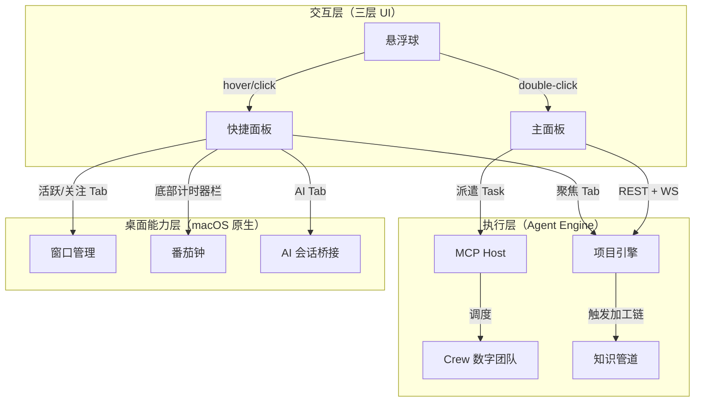

### 1.2 核心功能速览表

| # | 功能 | 一句话描述 | 面向用户 | 交互入口 |
|---|------|-----------|---------|---------|
| 1 | 悬浮球 | 常驻屏幕的最小化入口，拖拽吸附、贴边半隐藏、角标提醒 | 所有用户 | 屏幕边缘常驻 |
| 2 | 快捷面板 | hover 弹出的三 Tab 窗口：活跃/关注/聚焦，快速一瞥 | 所有用户 | hover 或 click 悬浮球 |
| 3 | 主面板 | VS Code 风格多功能面板：项目管理/Kanban/Crew/对话 | 深度用户 | double-click 悬浮球或 Dock 图标 |
| 4 | 窗口快切 | App/窗口实时列表，一键前置，支持重命名 | 多窗口用户 | 快捷面板活跃/关注 Tab |
| 5 | FocusByTime 番茄钟 | 25min 专注 + 引导休息（三级强度），进度环实时显示 | 需要专注的用户 | 快捷面板底部计时器栏 |
| 6 | AI 会话管理 | Coder-Bridge 桥接 AI 编码工具会话，窗口绑定与未读角标 | 开发者 | 快捷面板 AI Tab |
| 7 | 项目管理（四模式） | Agile/Flow/Lite/Free 四种项目模式，Markdown 驱动 | 项目管理用户 | 主面板项目树 |
| 8 | Dashboard 驾驶舱 | 今日/本周/本月/Backlog 四维视图，跨项目汇总 | 所有用户 | 主面板首页/快捷面板聚焦 Tab |
| 9 | Crew 数字团队 | Agent 角色化管理，用户面对"团队"隐喻而非技术概念 | 深度用户 | 主面板 Crew 侧边栏 |
| 10 | 知识管道 | 素材收集→整合报告→知识卡片→Anki 同步，五阶段加工链 | 学习者 | Dashboard 一键同步 |

### 1.3 人机协作主流程（两阶段模型）

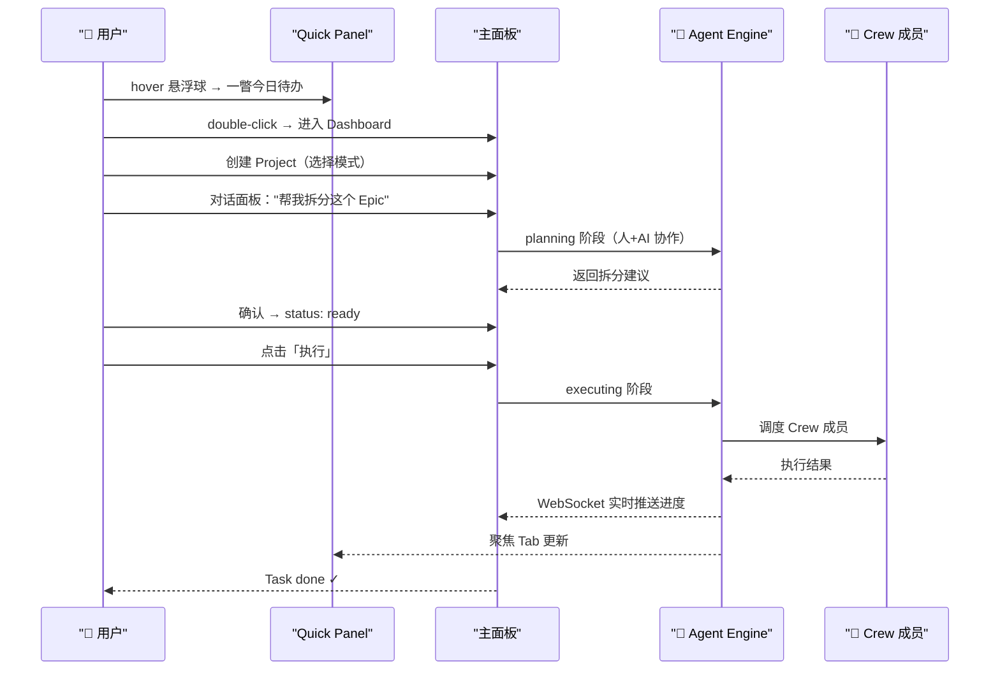

### 1.4 概念数据模型（ER 简图）

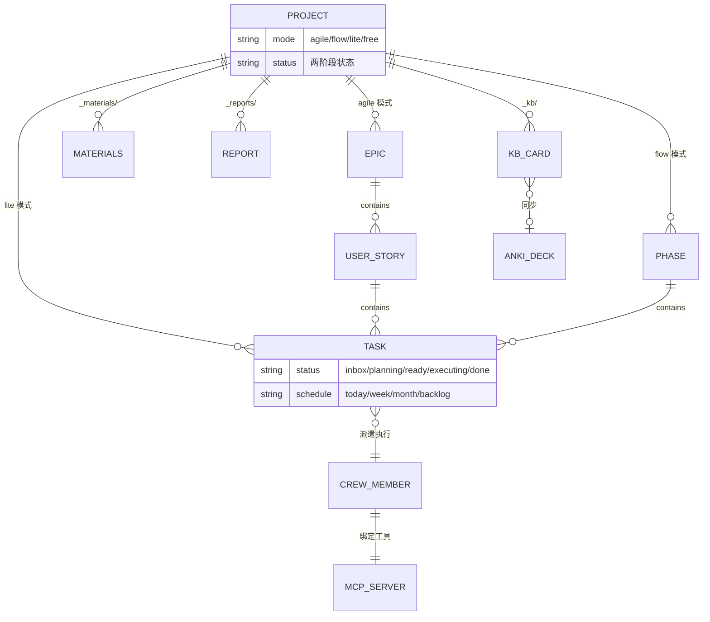

> **关键设计差异化**：Task 双轴管理（status 管执行生命周期 × schedule 管时间安排）+ 四模式统一数据结构（树形 Markdown 节点，模式仅定义词汇表和层级规则）。

---

## 二、整体布局（三层 UI + Engine）

FocusPilot 采用「三层递进 + 后台 Engine」架构，交互密度逐层递增：

- **Layer 1 悬浮球**：常驻最小化入口（0 信息密度，仅角标）
- **Layer 2 快捷面板**：hover 弹出的轻量面板（低信息密度，快速一瞥）
- **Layer 3 主面板**：VS Code 风格深度操作面板（高信息密度，完整管理）
- **Layer 4 Engine**：后台 Python 服务（用户无感知）

### 整体架构线框图

```
┌─ 屏幕 ──────────────────────────────────────────────────────────────┐
│                                                                      │
│                                                                      │
│   ┌──┐                                                               │
│   │⬤│ ← Layer 1: 悬浮球（40px 毛玻璃圆球）                          │
│   └──┘   常驻边缘，拖拽吸附，进度环+角标                             │
│    │                                                                 │
│    │ hover 150ms / click                                             │
│    ▼                                                                 │
│   ┌──────────────────────────┐                                       │
│   │ [活跃] [关注] [聚焦]     │ ← Layer 2: 快捷面板（280px 宽）       │
│   │                          │   三 Tab，hover 弹出 / 可钉住         │
│   │  App 列表 / 窗口快切     │                                       │
│   │  今日待办摘要             │                                       │
│   │  AI 会话列表             │                                       │
│   │                          │                                       │
│   │ ▶ 开始专注 │ ☕ 休息     │ ← 底部计时器栏（48px）                │
│   └──────────────────────────┘                                       │
│    │                                                                 │
│    │ double-click / Dock 图标                                        │
│    ▼                                                                 │
│   ┌──┬──────────┬────────────────────────────────────────┐           │
│   │📁│ 项目树    │  Dashboard / Kanban / 对话面板          │           │
│   │📋│          │                                        │ ← Layer 3 │
│   │👥│ 侧边栏   │  主内容区                               │   主面板  │
│   │💬│          │                                        │           │
│   │⚙️│          │                                        │           │
│   └──┴──────────┴────────────────────────────────────────┘           │
│                                                                      │
│   ┌──────────── Layer 4: Agent Engine (后台) ────────────┐           │
│   │  项目引擎 │ MCP Host │ 调度器 │ 知识管道 │ 技能系统   │           │
│   │  localhost:19840 (REST + WebSocket)                   │           │
│   └──────────────────────────────────────────────────────┘           │
└──────────────────────────────────────────────────────────────────────┘
```

> 基于 PRD §2.1 三层 UI 架构 + 代码 `Constants.swift:75-77` 窗口层级定义

### 层级关系

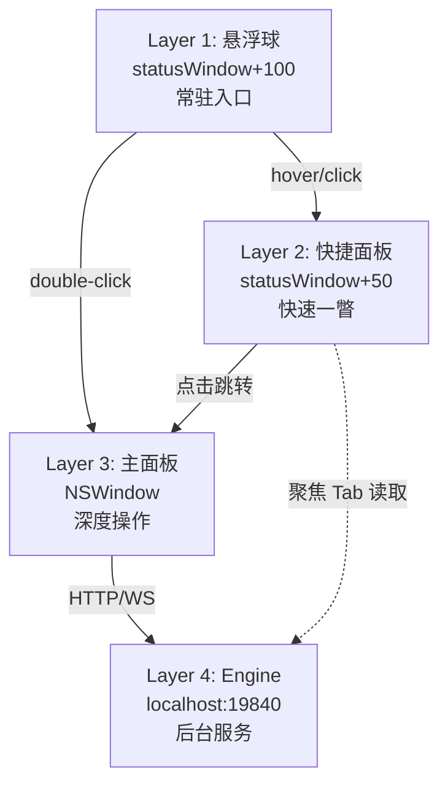

---

## 三、快捷面板（Quick Panel）— 核心交互枢纽

快捷面板是 FocusPilot 最高频的交互界面，定位为「快速一瞥，不做深度操作」。

### 结构线框图

```
┌─ Quick Panel (280×400px, 可拖拽调整) ──────────────┐
│                                                      │
│  [≡]     [活跃]  [关注]  [聚焦]              (●3)   │
│  ↑                  ↑                          ↑     │
│  打开主面板    选中指示条（accent 色下划线）   AI 角标 │
├──────────────────────────────────────────────────────┤
│                                                      │
│  ▾ 🅰 Cursor                            ★           │ ← App 行（28px）
│     📄 FocusPilot — AppDelegate.swift              │ ← 窗口行（24px）
│     📄 FocusPilot — Models.swift                   │
│                                                      │
│  ▾ 🅰 Chrome                                        │
│     🌐 GitHub - Issues                              │
│     🌐 Claude                                       │
│                                                      │
│  ▸ 🅰 Finder                                        │ ← 折叠状态
│                                                      │
│  ── ── ── ── ── ── ── ── ── ── ── ──               │
│  🅰 iTerm2                              (未运行)    │ ← 关注但未运行（灰化）
│                                                      │
├──────────────────────────────────────────────────────┤
│  ▶ 开始专注          │          ☕ 休息               │ ← 底部计时器栏
│       ← 左半区 →      │      ← 右半区 →              │   48px，整栏可点击
└──────────────────────────────────────────────────────┘
```

> 基于 `QuickPanelView.swift:59-161`（顶部栏）、`Constants.swift:14-33`（尺寸常量）

### 三个 Tab 导航

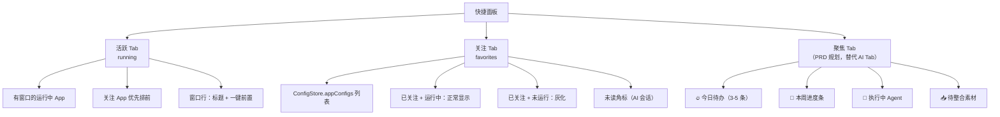

**Tab 状态模型**（`QuickPanelView.swift:5-9`）：

- `selectedTab`：持久状态，写入 UserDefaults
- `displayTab`：渲染态，hover 预览时临时切换，面板关闭时回退到 selectedTab

**当前 V4.3 实现 vs PRD 规划**：

| Tab | V4.3 实现 | PRD 0.0.1 规划 |
|-----|----------|---------------|
| 活跃 | ✅ App/窗口列表 | 不变 |
| 关注 | ✅ 收藏 App + 未读角标 | 不变 |
| AI（第三 Tab） | ✅ CoderBridge 会话 + Todo 看板 | → 升级为「聚焦」Tab，展示 Dashboard 精华摘要 |

---

## 四、悬浮球（Floating Ball）— 常驻入口

悬浮球是 FocusPilot 的视觉锚点，始终悬浮在屏幕边缘。

### 结构线框图

```
      ┌────── 40px ──────┐
      │                  │
      │   ╭─ 进度环 ──╮  │ ← FocusByTime 进度弧（2.5px 宽）
      │   │            │  │   accent 色（工作）/ 绿色（休息）
      │   │  ┌────┐    │  │
      │   │  │ 禅 │    │  │ ← 品牌 Logo：Ensō 弧线 + 墨滴
      │   │  │ 圆 │    │  │   动态渐变色（从主题 accent 派生）
      │   │  └────┘    │  │
      │   │         ●3 │  │ ← AI 角标（红色 pill，右上角）
      │   ╰────────────╯  │   >=100 显示 "99+"
      │                  │
      └──────────────────┘
      毛玻璃 NSVisualEffectView
      + 4 层渐变覆盖（立体感）
```

> 基于 `FloatingBallView.swift:41-101`（UI 元素）、`FloatingBallView.swift:565-697`（Logo 绘制）

### 交互行为

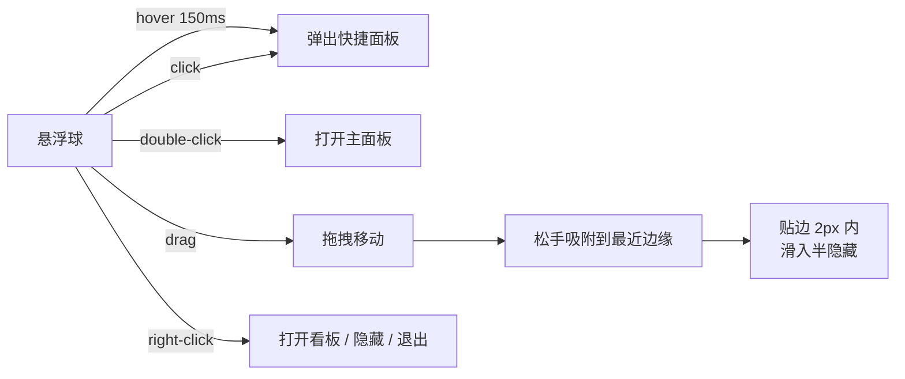

**视觉状态叠加**：

| 状态 | 视觉表现 | 触发条件 |
|------|---------|---------|
| 默认 | 呼吸脉搏动画（2.5s 周期） | 始终 |
| 番茄钟进行中 | 进度环（12 点钟顺时针） | FocusTimerService running |
| AI 未读 | 红色 pill 角标 + 数字 | CoderBridgeService actionableCount > 0 |
| 面板钉住 | 红底白色图钉角标 | quickPanel pinned |
| 半隐藏 | 球体滑入屏幕边缘一半 | 贴边 + 面板未钉住 |

---

## 五、主面板（Main Panel）— 深度操作中心

主面板是 FocusPilot 的深度操作界面，通过 **双击悬浮球** 或 **Dock 图标** 打开。V4.3 当前实现为「关注管理 + 偏好设置」的简化面板，0.0.1 规划升级为 **VS Code 风格多功能面板**（项目/Kanban/Crew/对话/设置）。

### 5.1 V4.3 当前实现：MainKanbanWindow

当前主面板定位于「配置中心」，左侧 180px 侧边栏 + 右侧内容区，覆盖三大配置场景。

#### 整体线框图

```
┌─ MainKanbanWindow ──────────────────────────────────────────┐
│                                                              │
│ ┌────────────┬────────────────────────────────────────────┐ │
│ │            │                                            │ │
│ │ ⭐ 关注管理 │  ← selectedTab                            │ │
│ │            │                                            │ │
│ │ 🔵 悬浮球   │   主内容区（随 selectedTab 切换）         │ │
│ │    与面板   │                                            │ │
│ │            │                                            │ │
│ │ 🎨 个性化   │                                            │ │
│ │            │                                            │ │
│ │            │                                            │ │
│ │            │                                            │ │
│ │  180px     │               maxWidth/.infinity           │ │
│ └────────────┴────────────────────────────────────────────┘ │
└──────────────────────────────────────────────────────────────┘
```

> 基于 `MainKanbanView.swift:4-16`（KanbanTab 枚举）、`MainKanbanView.swift:63-91`（侧边栏布局）

#### 三个 Tab 的功能布局

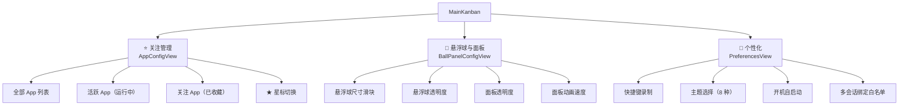

#### Tab 1：关注管理（AppConfigView）

三分 Tab（全部 / 活跃 / 关注）的 App 列表管理界面。

```
┌─ 关注管理 ─────────────────────────────────────────────┐
│                                                          │
│  [全部]  [活跃]  [关注]                  ← 子 Tab       │
│                                                          │
│  ┌─────────────────────────────────────────────────┐   │
│  │ 🅰 Cursor                              ★ ← 星标 │   │
│  │ 🅰 Chrome                              ☆        │   │
│  │ 🅰 Visual Studio Code                  ★        │   │
│  │ 🅰 Finder                              ★        │   │
│  │ 🅰 iTerm2                              ☆        │   │
│  │ 🅰 Notes                               ☆        │   │
│  │ ...                                              │   │
│  └─────────────────────────────────────────────────┘   │
│                                                          │
└──────────────────────────────────────────────────────────┘
```

- **全部 Tab**：系统已安装的所有 App（AppMonitor.scanInstalledApps 异步扫描）
- **活跃 Tab**：当前运行中的 App
- **关注 Tab**：ConfigStore.appConfigs 中已收藏的 App
- 点击星标即切换收藏状态（关注 App 在快捷面板优先展示）

> 基于 `AppConfigView.swift`（310 行）

#### Tab 2：悬浮球与面板（BallPanelConfigView）

悬浮球和快捷面板的外观与行为配置。

```
┌─ 悬浮球与面板 ─────────────────────────────────────────┐
│                                                          │
│  悬浮球尺寸                                              │
│  ○──────●──────○    35px ← 当前值                      │
│  25px          50px                                      │
│                                                          │
│  悬浮球透明度                                            │
│  ○───────●────○    0.80                                │
│  0.4           1.0                                       │
│                                                          │
│  快捷面板透明度                                          │
│  ○─────────●──○    0.90                                │
│  0.4           1.0                                       │
│                                                          │
│  面板动画速度                                            │
│  ○───●───────○    0.15s (快)                           │
│  0.1s          0.6s                                      │
│                                                          │
└──────────────────────────────────────────────────────────┘
```

> 基于 `BallPanelConfigView.swift`（143 行）

#### Tab 3：个性化（PreferencesView）

```
┌─ 个性化 ──────────────────────────────────────────────┐
│                                                         │
│  【快捷键】                                             │
│  显示/隐藏悬浮球  [⌘⇧B]  ← 点击录制                   │
│                                                         │
│  【主题】                                               │
│  ┌─ 浅色主题 ───────────────────────────────────┐     │
│  │  ┌───┐  ┌───┐  ┌───┐  ┌───┐                 │     │
│  │  │默认│  │象牙│  │薄荷│  │天蓝│                 │     │
│  │  └───┘  └───┘  └───┘  └───┘                 │     │
│  │  ★Selected                                    │     │
│  └──────────────────────────────────────────────┘     │
│  ┌─ 深色主题 ───────────────────────────────────┐     │
│  │  ┌───┐  ┌───┐  ┌───┐  ┌───┐                 │     │
│  │  │暗夜│  │深海│  │墨绿│  │纯黑│                 │     │
│  │  └───┘  └───┘  └───┘  └───┘                 │     │
│  └──────────────────────────────────────────────┘     │
│                                                         │
│  【通用】                                               │
│  ☑ 开机自动启动                                        │
│                                                         │
│  【AI 多会话绑定白名单】                                │
│  ☑ Cursor      ☑ VSCode       ☐ Terminal              │
│  ☐ iTerm2      ☐ WezTerm      ☐ Warp                  │
│                                                         │
└─────────────────────────────────────────────────────────┘
```

- **主题选择**：8 种主题（4 浅 + 4 深），卡片预览 + 选中 2px accent 边框
- **快捷键**：HotkeyRecorderButton 录制模式，按下组合键完成
- **多会话绑定**：IDE 类 App 允许多 session 共享同窗口，Terminal 独占

> 基于 `PreferencesView.swift:46-216`（配置项）

### 5.2 0.0.1 规划：VS Code 风格多功能面板

PRD 0.0.1 将主面板升级为 **活动栏 + 侧边栏 + 主内容区** 的三区布局，对齐项目管理工具范式。

#### 整体线框图

```
┌──┬─────────┬───────────────────────────────────────┐
│  │         │                                        │
│📁│ 项目树   │  ┌─ Kanban ──────────────────────────┐ │
│  │ ▾ 项目A  │  │ Ready │ Executing │ Done │ Blocked│ │
│  │ ▾ 项目B  │  │       │           │      │        │ │
│📋│ ▸ 项目C  │  └────────────────────────────────────┘ │
│  │         │                                        │
│  │         │  ┌─ 对话面板 ─────────────────────────┐ │
│👥│         │  │ > 帮我把这个 Epic 拆成 US            │ │
│  │         │  │ < 建议分 3 个 US：登录/注册/权限...  │ │
│💬│         │  └─────────────────────────────────────┘ │
│  │         │                                        │
│⚙️│         │                                        │
└──┴─────────┴───────────────────────────────────────┘
 ↑      ↑                       ↑
活动栏  侧边栏                 主内容区
40px   200-300px                剩余空间
```

> 基于 [PRD.md §3.7](PRD.md)

#### 活动栏五大入口

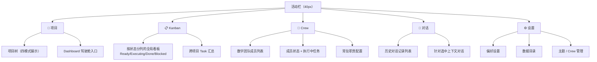

#### 活动栏图标功能对照

| 图标 | 功能 | 侧边栏内容 | 主内容区 |
|------|------|-----------|---------|
| 📁 | 项目 | 项目树（四模式展示）+ Dashboard 入口 | Dashboard / 项目详情 / Kanban 视图 |
| 📋 | Kanban | （无侧边栏）或筛选条件面板 | 跨项目全局看板（按 status 分列）|
| 👥 | Crew | 数字团队成员列表 + 状态 | Crew 成员详情：常驻职责表 + 执行历史 + 对话 |
| 💬 | 对话 | 历史对话列表 | 对话面板 + AI 响应流 |
| ⚙️ | 设置 | 设置分组列表 | 偏好 / 数据目录 / 主题 / Crew 管理 |

#### 核心交互逻辑

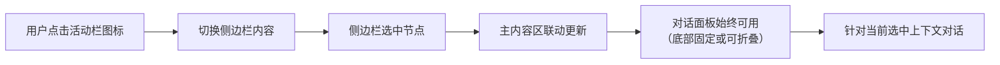

#### 项目树按模式展示（📁 Tab）

四种项目模式在侧边栏项目树中的表现形式不同，详见 [§6.4 项目管理（四模式）](#4-项目管理四模式-markdown-引擎)。此处仅示意顶层结构：

```
侧边栏项目树（📁 Tab）
┌───────────────────────┐
│ 🏠 Dashboard          │ ← 默认入口
│                       │
│ ─ 我的项目 ─          │
│ ▾ 📁 FocusPilot V1    │ ← Agile
│ ▾ 📁 Q2 大客户跟踪    │ ← Flow
│ ▾ 📁 重构登录模块     │ ← Lite
│ ▸ 📁 学术论文         │ ← Free
│                       │
│ [+ 新建项目]          │
└───────────────────────┘
```

#### Crew 侧边栏（👥 Tab）

```
┌─ 👥 我的 Crew ──────────────────┐
│                                  │
│ 🟢 代码工程师        本地         │
│    claude-code | 空闲            │
│                                  │
│ 🟢 架构师           本地         │
│    claude-code | 执行中 🔄       │
│    └─ FocusPilot / MCP Host 设计   │
│                                  │
│ 🔴 数据分析师        云端         │
│    未连接                        │
│                                  │
│ [+ 添加成员]                     │
└──────────────────────────────────┘
```

选中 Crew 成员时，主内容区展示：常驻职责表 + 执行历史 + 针对该成员的对话。

#### 对话面板（💬 Tab / 底部常驻）

对话面板是两阶段模型的统一入口：

```
┌─ 对话面板 ──────────────────────────────────────┐
│                                                   │
│  [选中上下文：Epic: Engine 基础架构]              │
│                                                   │
│  > 帮我把这个 Epic 拆成 US                        │
│                                                   │
│  < 建议分 3 个 US：                               │
│     1. US: 项目引擎（Markdown CRUD）              │
│     2. US: MCP Host（Agent 编排）                 │
│     3. US: 任务调度（SQLite 记录）                │
│    [应用到 Epic] [调整建议] [取消]                │
│                                                   │
│  ──────────────────────────────────────────      │
│                                                   │
│  [ 输入意图... ]                          [发送] │
└───────────────────────────────────────────────────┘
```

- **planning 阶段**："帮我拆分这个 Epic" → Engine 理解意图 → 调用合适能力 → 返回建议 → 用户确认/调整
- **executing 阶段**："把这个 Task 交给代码工程师做" → Engine 调度 Crew 成员执行 → 实时反馈

用户不需要感知 Skill、Agent 等技术概念。

### 5.3 V4.3 → 0.0.1 升级对照

| 维度 | V4.3 MainKanban | 0.0.1 主面板 |
|------|----------------|-------------|
| 布局结构 | 侧边栏 180px + 内容区 | 活动栏 40px + 侧边栏 + 内容区 |
| 定位 | 配置中心 | 项目管理 + 执行平台 |
| Tab 数量 | 3（关注管理/悬浮球面板/个性化） | 5（项目/Kanban/Crew/对话/设置） |
| Dashboard | — | 🆕 驾驶舱首页 |
| 项目树 | — | 🆕 四模式展示 |
| 全局 Kanban | — | 🆕 跨项目状态看板 |
| Crew 管理 | — | 🆕 数字团队面板 |
| 对话面板 | — | 🆕 统一对话式交互 |
| 原有配置 | ✅ 保留 | → 并入「⚙️ 设置」Tab |

### 5.4 触发入口

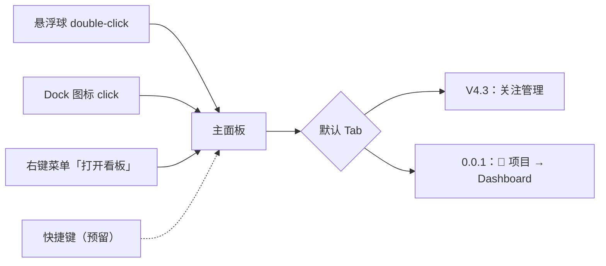

> 基于 `MainKanbanWindow.swift`（55 行）+ `AppDelegate.swift:507`（窗口管理）

---

## 六、核心功能模块详解

### 1. 窗口快切（活跃/关注 Tab）

FocusPilot 的原始核心功能，解决 `⌘Tab` 在 15+ App 时的效率问题。

#### 线框图

```
┌─ 活跃 Tab ───────────────────────────────────────┐
│                                                    │
│  ▾ 🅰 Cursor                          ★  ← 星标  │
│     📄 FocusPilot — AppDelegate.swift    ← AX 标题│
│     📄 FocusPilot — Models.swift                  │
│     📄 untitled                          ← CG 标题│
│                                                    │
│  ▾ 🅰 Chrome                                      │
│     🌐 GitHub - FocusPilot Issues                 │
│     🌐 Claude - New Chat                          │
│                                                    │
│  ▸ 🅰 Finder                            ← 折叠   │
│  ▸ 🅰 Notes                                       │
│                                                    │
└────────────────────────────────────────────────────┘
```

#### 窗口标题四级解析

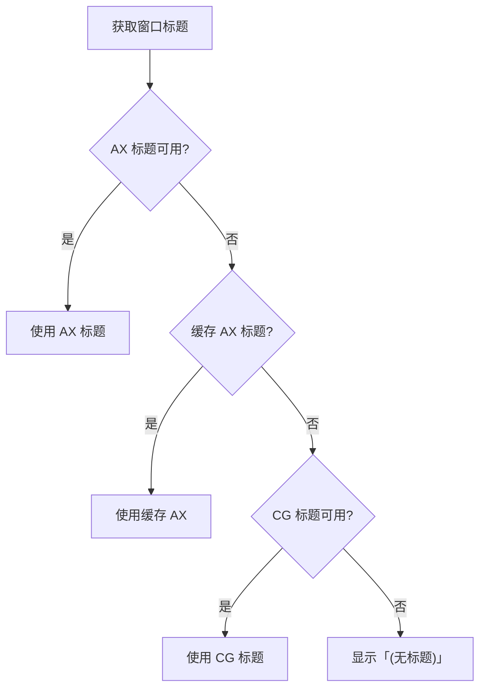

> 基于 `WindowService.swift` 两阶段刷新：Phase 1 CG 标题主线程快速渲染 → Phase 2 AX 标题后台补全

#### 子功能

- **App 行**：图标 + 名称 + 星标收藏 + hover 展开窗口列表
- **窗口行**：标题 + 双击前置（NSWorkspace + AXRaise + AXMain + AXFocused 三重设置）
- **右键菜单**：关注/取消关注、置顶排序、重命名窗口、关闭 App、启动 App
- **关注排序**：拖拽排序，通过 ConfigStore.reorderApps 持久化
- **自适应刷新**：面板显示 1s → 无变化降至 3s → 面板隐藏完全停止
- **差分 UI 更新**：结构变化全量重建，标题变化走轻量路径

### 2. FocusByTime 番茄钟

内置番茄钟，专注计时与引导休息深度整合到快捷面板底部栏。

#### 状态机

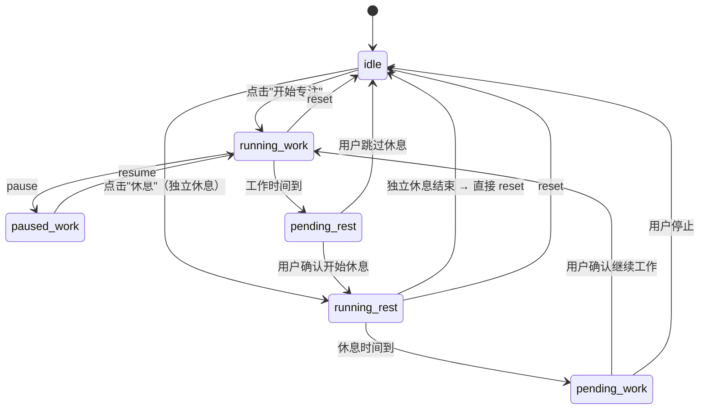

#### 引导休息三级强度

| 强度 | 总时长 | 步骤数 | 覆盖维度 |
|------|--------|--------|---------|
| 轻度 Light | 5 min（300s） | 4 步 | 远眺→深呼吸→坐姿核心→补水 |
| 中度 Standard | 7 min（420s） | 5 步 | 闭眼→深呼吸→走动→站立核心→补水 |
| 深度 Deep | 10 min（600s） | 5 步 | 冥想→腹式呼吸→走动→全链路核心→收尾 |

> 基于 `FocusTimerService.swift:56-118`（RestStep 定义）

#### 计时器栏线框图（三种状态）

```
┌─ idle 状态 ────────────────────────────────────┐
│  ▶ 开始专注            │        ☕ 休息         │
│    ← 左半区（click）→   │   ← 右半区（click）→  │
└────────────────────────────────────────────────┘

┌─ running 状态（工作中）────────────────────────┐
│       🎯  24:37                                │
│  ████████████████████░░░░░░░░  ← 进度条 3px   │
└────────────────────────────────────────────────┘

┌─ running 状态（引导休息中）────────────────────┐
│       🧘  深呼吸  01:25                        │
│  ████████░░░░░░░░░░░░░░░░░░░  ← 步骤进度     │
└────────────────────────────────────────────────┘
```

### 3. AI 会话管理（Coder-Bridge）

通过 DistributedNotificationCenter 桥接 Claude Code/Codex/Gemini CLI 等 AI 编码工具会话。

#### 会话生命周期

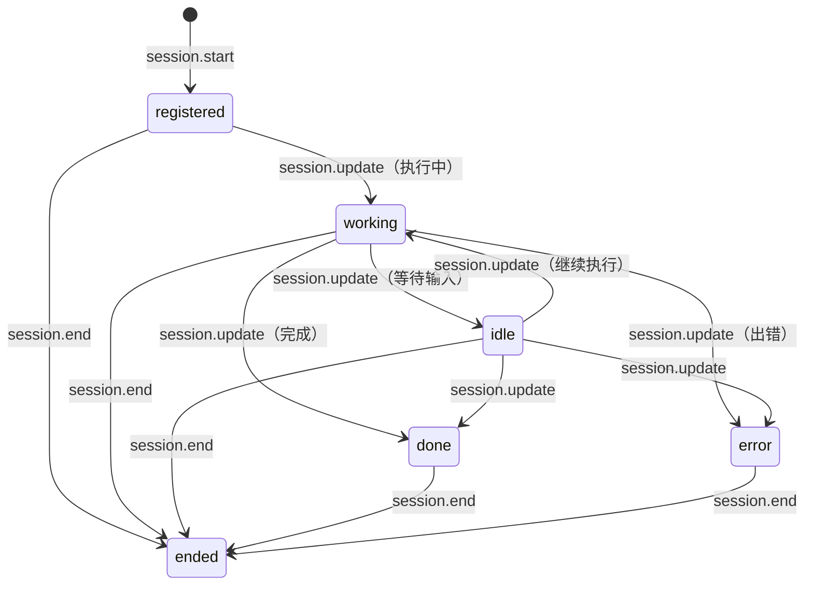

#### 窗口绑定策略

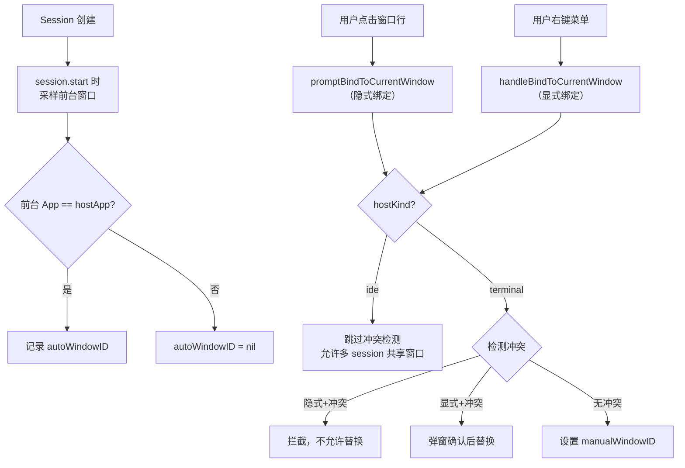

> 基于 `CoderBridgeService.swift:10-15`（BindingState）+ `CoderSession.swift:44-149`

#### AI Tab 线框图（V4.3 当前实现）

```
┌─ AI Tab ─────────────────────────────────────────┐
│                                                    │
│  ▾ ~/Workspace/FocusPilot                         │ ← cwd 分组
│     🤖 claude  FocusPilot — AppDelegate  🟢 执行中 │ ← Session 行
│        最近: 帮我修复窗口标题的 bug              │ ← query 摘要
│     🤖 claude  FocusPilot — Models       ⏳ 等待   │
│        最近: 添加主题色支持                       │
│                                                    │
│  ▸ ~/Workspace/OtherProject               (2)    │ ← 折叠 + 计数
│                                                    │
│  ── ── ── ── ── ── ── ── ── ── ── ──             │
│  ▾ 📋 Todo                                        │ ← Todo 看板
│     ☐ 实现 EngineManager                          │   Task section
│     ☐ 添加 WebSocket 推送                         │
│  ▸ 🔄 InProgress                          (1)    │
│  ▸ ✅ Done                                (3)    │
│                                                    │
└────────────────────────────────────────────────────┘
```

### 4. 项目管理（四模式 Markdown 引擎）

FocusPilot 的项目管理基于 Markdown 文件 + frontmatter 元数据，支持四种组织模式。

#### 四模式对比

```
┌─ Agile（软件开发）──────────────────────┐
│ Project → Epic → User Story → Task      │
│ 四级固定，重规划引导（敏捷方法论）        │
│                                          │
│ ▾ 📁 FocusPilot V1          [planning]  │
│   ▾ 🎯 Epic: Engine 基础架构 [ready]    │
│     ▾ 💼 US: 项目引擎        [executing] │
│       📄 frontmatter 解析    [done ✓]    │
│       📄 目录扫描            [executing🔄]│
└──────────────────────────────────────────┘

┌─ Flow（阶段制项目）─────────────────────┐
│ Project → Phase → Task                   │
│ 三级固定，中等引导（阶段推进）            │
│                                          │
│ ▾ 📁 Q2 大客户跟踪          [executing] │
│   ▸ 📊 Phase 1: 数据收集  ████████░ 80% │
│   ▾ 📊 Phase 2: 分析报告  ██░░░░░░ 20% │
│     📄 拉取 CRM 数据         [done ✓]    │
│     📄 生成客户画像           [executing🔄]│
└──────────────────────────────────────────┘

┌─ Lite（简单项目）───────────────────────┐
│ Project → Task                           │
│ 两级固定，轻量（可选规划）                │
│                                          │
│ ▾ 📁 重构登录模块            [executing] │
│   📄 分析现有代码             [done ✓]    │
│   📄 实现 JWT 认证            [executing🔄]│
└──────────────────────────────────────────┘

┌─ Free（自定义层级）─────────────────────┐
│ Project → 自由嵌套 → Task                │
│ 不限层级，开放式对话引导                  │
│                                          │
│ ▾ 📁 学术论文                [planning]  │
│   ▾ 📂 文献综述                          │
│     📄 搜索相关论文           [done ✓]    │
│   ▾ 📂 实验                              │
│     ▾ 📂 实验设计                        │
│       📄 定义变量             [ready]     │
└──────────────────────────────────────────┘
```

#### 统一状态流转

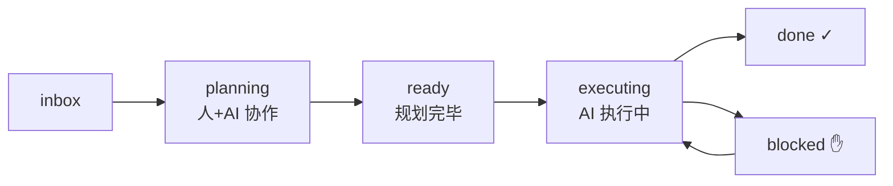

### 5. Dashboard 驾驶舱

四维时间管理视图，跨项目汇总所有 Task。

#### 线框图

```
┌─ Dashboard ──────────────────────────────────────────┐
│                                                       │
│ 🔥 今日待办 (4/7)                       [+ 新建任务]  │
│ ┌─────────────────────────────────────────────────┐  │
│ │ ☐ 实现 frontmatter 解析   FocusPilot V1  [执行]  │  │
│ │ ☐ 生成客户画像            大客户跟踪     [执行]  │  │
│ │ ─ ─ ─ ─ ─ 已完成 ─ ─ ─ ─ ─                     │  │
│ │ ☑ JWT 认证实现            FocusPilot V1   8min ✓ │  │
│ └─────────────────────────────────────────────────┘  │
│                                                       │
│ 📅 本周计划 (12/20)                  W14 进度 60%    │
│ ┌─────────────────────────────────────────────────┐  │
│ │ ▸ FocusPilot V1        5/8 Task   ██████░░ 63%  │  │
│ │ ▸ 大客户跟踪           4/6 Task   ████████ 67%  │  │
│ └─────────────────────────────────────────────────┘  │
│                                                       │
│ 📆 本月目标 (April)                                   │
│ 📥 Backlog (15)             📥 待整合素材 (3) [同步]  │
└───────────────────────────────────────────────────────┘
```

> 基于 PRD §3.6

#### 数据来源映射

| Dashboard 区域 | 数据筛选条件 | 快速操作 |
|---------------|-------------|---------|
| 🔥 今日待办 | `schedule: today` 的 Task（跨项目） | 点击 [执行] 派遣 Crew |
| 📅 本周计划 | `schedule: week` 或 `today`，按项目分组 | 点击项目名跳转 |
| 📆 本月目标 | `schedule: month` 的项目级目标 | — |
| 📥 Backlog | `schedule: backlog` 的 Task | 拖拽到今日 |
| 📥 待整合素材 | Pipeline 中 `status: new` 的 materials | 一键同步整合 |

### 6. Crew 数字团队

用户不直接面对 Agent/MCP/Skill 等技术概念，而是管理一个「数字团队」。

#### Crew 侧边栏线框图

```
┌─ 👥 我的 Crew ─────────────────────────┐
│                                          │
│ 🟢 代码工程师           本地             │
│    claude-code │ 空闲                    │
│                                          │
│ 🟢 架构师              本地             │ ← V1 预留
│    claude-code │ 执行中 🔄               │
│    └─ FocusPilot / MCP Host 设计         │
│                                          │
│ 🔴 数据分析师           云端             │ ← V1 预留
│    未连接                                │
│                                          │
│ [+ 添加成员]                             │
└──────────────────────────────────────────┘
```

> V1 范围：仅预置「代码工程师」1 个 Crew 成员（绑定 claude-code）

#### Crew 成员属性

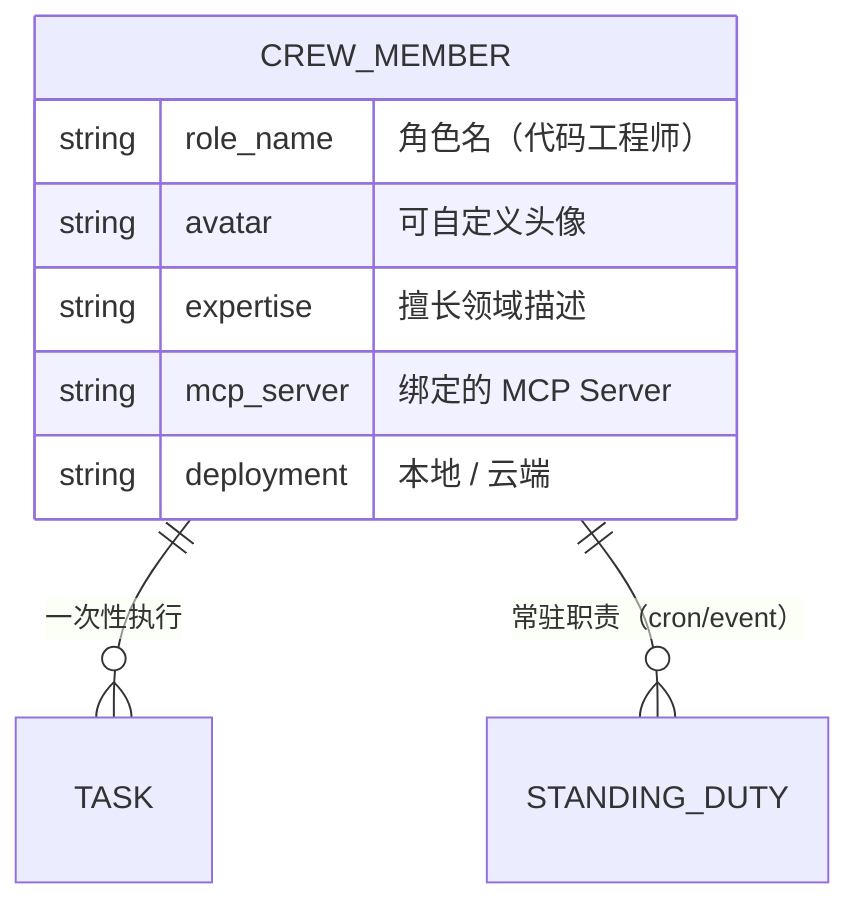

### 7. 知识管道（Knowledge Pipeline）

从原始素材到内化智慧的完整加工链路。

#### 五阶段流程

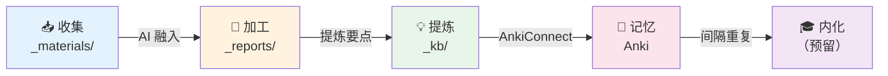

#### 项目产出结构

```
任意层级/
├── task-*.md              ← Task（可执行单元）
├── _materials/            ← 原始素材（文章/PDF/笔记/数据）
│   └── status: new → integrated
├── _kb/                   ← 知识卡片（原子化要点）
│   └── anki_synced: false → true
└── _reports/              ← 增量整合报告（AI 持续融入）
    └── 每次新素材加入后自动更新
```

---

## 七、跨模块共享功能

### 1. Notion 风格主题系统

8 种预设主题（4 浅色 + 4 深色），9 色槽覆盖全 UI：

| 主题 | 类型 | accent 色 | 适用场景 |
|------|------|----------|---------|
| Default White | 浅色 | 蓝色系 | 默认 |
| Warm Ivory | 浅色 | 暖色系 | 阅读舒适 |
| Mint Green | 浅色 | 绿色系 | 清新 |
| Light Blue | 浅色 | 天蓝系 | 明亮 |
| Classic Dark | 深色 | 蓝灰系 | 暗色默认 |
| Deep Ocean | 深色 | 深蓝系 | 深沉 |
| Ink Green | 深色 | 墨绿系 | 护眼 |
| Pure Black | 深色 | OLED 黑 | 极简 |

> 基于 `Models.swift:253-442`（AppTheme 枚举 + ThemeColors 结构）

主题刷新链路：`PreferencesView → @Published → AppDelegate.applyPreferences → NSApp.appearance + quickPanelWindow.applyTheme + themeChanged 通知`

### 2. 全局快捷键

- 默认 `⌘⇧B`：显示/隐藏悬浮球 + 快捷面板
- 支持自定义录制（HotkeyRecorderButton）
- Carbon API 注册全局热键

> 基于 `HotkeyManager.swift`（68 行）

### 3. 辅助功能权限管理

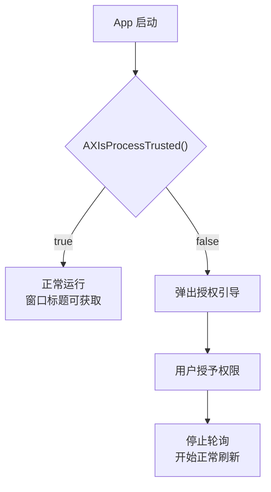

> 基于 `PermissionManager.swift`（92 行）。**关键约束**：codesign --force 会改变 CDHash 导致 TCC 失效。

### 4. 通知驱动架构

模块间通过 NotificationCenter 解耦通信：

| 通知 | 发送方 | 接收方 | 用途 |
|------|--------|--------|------|
| ballShowQuickPanel | FloatingBall | AppDelegate | hover/click 弹出面板 |
| panelPinStateChanged | QuickPanel | FloatingBall | 钉住状态同步 |
| focusTimerChanged | FocusTimerService | FloatingBall + QuickPanel | 进度环 + 计时器栏刷新 |
| coderBridgeSessionChanged | CoderBridgeService | QuickPanel + FloatingBall | AI 会话列表 + 角标刷新 |
| appStatusChanged | AppMonitor | QuickPanel | App 列表刷新 |
| windowsChanged | WindowService | QuickPanel | 窗口列表刷新 |
| accessibilityGranted | PermissionManager | WindowService | 权限获取后开始 AX 查询 |

> 基于 `Constants.swift:94-129`

### 5. 弹窗层级处理

所有弹窗均遵循统一策略：

- **失焦自动关闭**：NSApp.didResignActive → abortModal
- **层级处理**：prepareAlert 降低面板到 .normal → didBecomeKey 提升弹窗到 alertLevel（floatingBallLevel + 10）→ restoreAfterAlert 恢复面板层级
- **未决动作保留**：弹窗意外关闭后，FocusPendingAction 保留待处理动作，计时器栏显示 pending pill 徽章

---

## 八、差异化特性总览

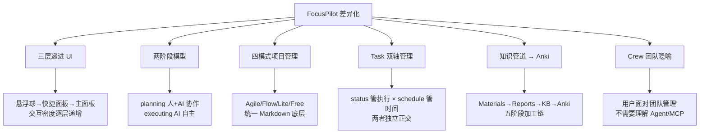

| 差异化特性 | 呈现位置 | 说明 |
|-----------|---------|------|
| 三层递进 UI | 悬浮球/快捷面板/主面板 | 唯一同时提供悬浮球+窗口管理+项目管理的桌面应用 |
| 两阶段模型 | 项目树 + 对话面板 | planning→executing，任意粒度均适用 |
| 四模式 | 项目创建时选择 | Agile/Flow/Lite/Free 覆盖所有项目类型 |
| Task 双轴 | Dashboard 四维视图 | status × schedule 正交管理 |
| 知识管道 | Dashboard 一键同步 | 唯一内置素材→报告→知识卡片→Anki 的桌面工具 |
| Crew 隐喻 | 主面板 Crew 侧边栏 | Agent 角色化，降低认知负担 |
| 引导休息 | 番茄钟计时器栏 | 三级强度，脑/眼/肌肉三维恢复步骤 |
| 本地 + 云端同构 | Engine 部署 | 同一份 Engine 代码可部署到本地/云端/Docker |

---

## 九、交互入口速查表

FocusPilot 是 macOS 原生桌面应用，不存在 Web 路由。以下按交互入口组织：

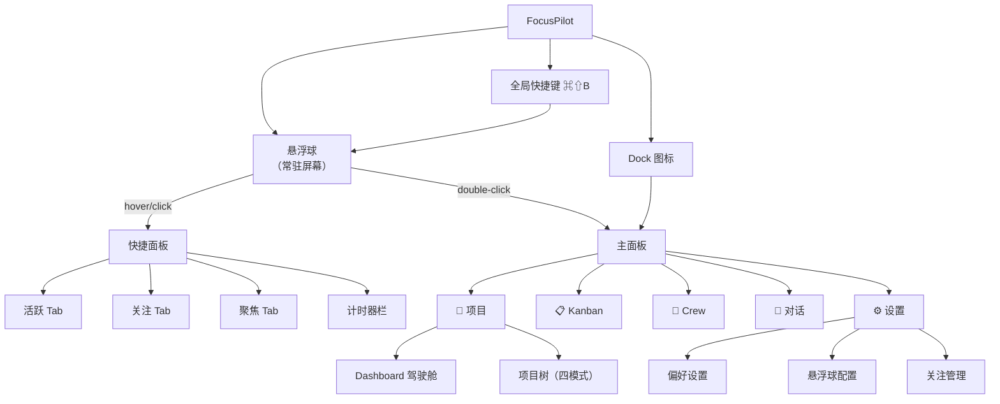

| 入口 | 层级 | 触发方式 | 目标功能 |
|------|------|---------|---------|
| 悬浮球 hover | L1→L2 | 鼠标悬停 150ms | 弹出快捷面板 |
| 悬浮球 click | L1→L2 | 鼠标单击 | 弹出快捷面板 |
| 悬浮球 double-click | L1→L3 | 鼠标双击 | 打开主面板 |
| 悬浮球右键 | L1 | 鼠标右键 | 打开看板/隐藏/退出 |
| Dock 图标 | →L3 | 点击 Dock | 打开主面板 |
| ⌘⇧B | →L1 | 键盘快捷键 | 显示/隐藏悬浮球+面板 |
| 活跃 Tab | L2 | 点击 Tab | App/窗口列表 |
| 关注 Tab | L2 | 点击 Tab | 收藏 App 列表 |
| 聚焦 Tab | L2 | 点击 Tab | 今日待办摘要 |
| 计时器栏左半 | L2 | 点击 | 开始专注/编辑时长 |
| 计时器栏右半 | L2 | 点击 | 直接休息 |
| 主面板活动栏 | L3 | 点击图标 | 切换侧边栏内容 |
| Dashboard [+ 新建] | L3 | 点击按钮 | 创建 Task（选项目+时间维度） |
| Dashboard [执行] | L3 | 点击按钮 | 派遣 Crew 执行 Task |
| Dashboard [同步] | L3 | 点击按钮 | 触发知识管道加工链 |

---

## 附录：V4.3 实现 vs 0.0.1 规划对照

| 功能模块 | V4.3 已实现 | 0.0.1 新增/升级 |
|---------|-----------|---------------|
| 悬浮球 | ✅ 完整 | 角标从"AI 会话数"扩展为"执行中 Task 数" |
| 快捷面板（活跃/关注） | ✅ 完整 | 不变 |
| 快捷面板（第三 Tab） | ✅ AI Tab（CoderBridge） | → 聚焦 Tab（Dashboard 精华摘要） |
| 主面板 | ✅ 关注管理 + 偏好设置 | → VS Code 风格（项目/Kanban/Crew/对话/设置） |
| 番茄钟 | ✅ 完整（含引导休息） | 不变 |
| Coder-Bridge | ✅ 完整 | 保留兼容，逐步迁移到 Engine MCP |
| 项目管理 | — | 🆕 四模式 Markdown 引擎 |
| Dashboard | — | 🆕 四维驾驶舱 |
| Crew | — | 🆕 数字团队（V1 预置 1 个） |
| 知识管道 | — | 🆕 五阶段加工链 |
| Agent Engine | — | 🆕 Python 后台服务 |
| 对话面板 | — | 🆕 统一对话式交互 |
| 自动日志 | — | 🆕 每日归档 _logs/ |
