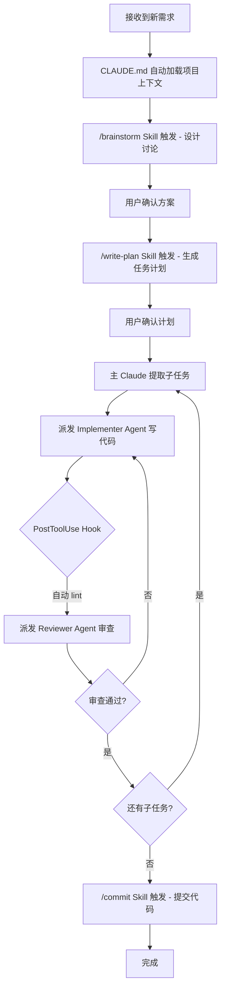

# Claude Code 设计理念与可操作元素培训教程

> 面向科普小白的简洁培训手册，用案例串联所有核心概念。

---

## 一、设计理念：三个核心原则

### 1.1 上下文即配置（Context as Config）

Claude Code 不用传统的 JSON Schema 或代码插件来扩展能力，而是用**自然语言 Markdown 文件**作为配置。你写给 Claude 的指令就是它的"代码"。

### 1.2 按需加载（Load on Demand）

不把所有规则塞进一个巨型提示词，而是拆成独立模块（Skills、Agents），只在需要时加载到上下文窗口，降低"认知噪音"。

### 1.3 分层治理（Layered Governance）

从组织到项目到个人，每一层都能设置指令、权限和钩子，高层可锁定低层不可覆盖。

优先级：托管策略（组织） > CLI 参数 > 项目本地 > 项目共享 > 用户个人

---

## 二、六大可操作元素及其逻辑关系

### 2.1 全景架构图

```
+---------------------------------------------------+
|                   Plugin（分发包）                   |
|  +--------+ +--------+ +-------+ +-----+ +-----+  |
|  | Skills | | Agents | | Hooks | | MCP | | LSP |  |
|  +---+----+ +---+----+ +---+---+ +--+--+ +-----+  |
+------|---------|-----------|---------|--------------+
       |         |           |         |
       v         v           v         v
+------------------------------------------------------+
|               Claude Code 运行时引擎                   |
|                                                      |
|  CLAUDE.md   --> 持久上下文（始终加载）                  |
|  Skills      --> 按需注入（用户/AI 触发）               |
|  Agents      --> 隔离执行（独立上下文窗口）              |
|  Hooks       --> 事件拦截（生命周期各节点）              |
|  MCP         --> 外部工具桥接（数据库、API、浏览器）      |
|  Permissions --> 分层安全控制                           |
+------------------------------------------------------+
```

### 2.2 一句话总结

> CLAUDE.md 定义"规矩"，Skill 定义"能力"，Agent 定义"角色"，Hook 定义"自动化"，MCP 定义"外部连接"，Plugin 把它们打包分发。Permission 贯穿始终控制安全。

---

## 三、逐个拆解

### 3.1 CLAUDE.md — 项目的"宪法"

| 属性         | 说明                                                     |
| ------------ | -------------------------------------------------------- |
| **是什么**   | 自然语言写的持久指令文件，每次会话自动加载               |
| **作用域**   | 全局 `~/.claude/CLAUDE.md` / 项目 `./CLAUDE.md` / 子目录 |
| **核心用途** | 编码规范、项目架构说明、团队约定                         |

**作用域与优先级：**

| 作用域   | 位置                                                        | 优先级 |
| -------- | ----------------------------------------------------------- | ------ |
| 托管策略 | `/Library/Application Support/ClaudeCode/CLAUDE.md` (macOS) | 最高   |
| 项目     | `./CLAUDE.md` 或 `./.claude/CLAUDE.md`                      | 中     |
| 用户     | `~/.claude/CLAUDE.md`                                       | 低     |

Claude Code 从当前工作目录向上遍历目录树，依次加载路径上所有 CLAUDE.md 文件。

**案例：团队统一提交规范**

```markdown
# CLAUDE.md

- Git 提交信息使用中文
- 提交前必须运行 `npm test`
- 禁止直接 push 到 main 分支
- 使用 2 空格缩进
```

放在项目根目录，团队所有人的 Claude 都会遵守这些规则。

**进阶用法：**

- 用 `@path/to/file` 语法导入其他文件（最大递归 5 层）
- 用 `.claude/rules/` 目录按主题组织规则
- 规则文件可用 `paths` frontmatter 限定只对特定路径生效

```markdown
---
paths:
  - "src/api/**/*.ts"
---

# API 开发规则

- 所有端点需输入验证
- 返回标准错误格式
```

---

### 3.2 Skill — 可复用的"技能卡"

| 属性         | 说明                                                      |
| ------------ | --------------------------------------------------------- |
| **是什么**   | 一个包含 `SKILL.md` 的文件夹，用 frontmatter 声明触发条件 |
| **调用方式** | 用户输入 `/skill-name` 或 Claude 自动识别触发             |
| **核心用途** | 标准化工作流（提交、调试、代码审查等）                    |

**两种类型：**

- **参考型**：给 Claude 应用于当前工作的知识（约定、模式、风格指南），内联运行
- **任务型**：给 Claude 特定操作的步骤说明（部署、提交），通常用 `/skill-name` 调用

**文件结构：**

```
.claude/skills/my-skill/
  SKILL.md          # 必需 - 技能主文件
  template.md       # 可选 - 模板文件
  examples/          # 可选 - 示例
  scripts/           # 可选 - 辅助脚本
```

**案例：一个提交技能 `/commit`**

```yaml
# .claude/skills/commit/SKILL.md
---
name: commit
description: 规范化 Git 提交流程
argument-hint: "默认: commit+push | [no-push] 仅提交"
---
1. 运行 `git diff --staged` 查看变更
2. 根据变更内容生成符合 Conventional Commits 的提交信息
3. 执行 `git commit`
4. 若无 no-push 参数，执行 `git push`
```

用户只需输入 `/commit`，Claude 就会按流程执行完整的提交操作。

**Frontmatter 关键字段：**

| 字段                       | 说明                                          |
| -------------------------- | --------------------------------------------- |
| `name`                     | 技能名称（小写字母、数字、连字符）            |
| `description`              | 何时使用（Claude 用此判断是否自动加载）       |
| `argument-hint`            | 自动完成时显示的参数提示                      |
| `disable-model-invocation` | `true` = 仅手动调用，Claude 不自动触发        |
| `user-invocable`           | `false` = 仅 Claude 可调用，不出现在 `/` 菜单 |
| `allowed-tools`            | 激活时允许使用的工具                          |
| `context`                  | `fork` = 在隔离的子代理上下文运行             |

**字符串替换：**

| 变量                  | 说明                 |
| --------------------- | -------------------- |
| `$ARGUMENTS`          | 调用时传递的所有参数 |
| `$ARGUMENTS[0]`       | 第一个参数           |
| `${CLAUDE_SKILL_DIR}` | 技能所在目录路径     |

---

### 3.3 Agent（子代理） — 专职的"虚拟角色"

| 属性                | 说明                                                     |
| ------------------- | -------------------------------------------------------- |
| **是什么**          | 拥有独立上下文窗口和工具权限的专门助手                   |
| **与 Skill 的区别** | Skill 在主会话内注入指令；Agent **开一个新窗口**独立工作 |
| **核心用途**        | 代码审查、并行任务、隔离高风险操作                       |

**内置子代理：**

| 代理              | 模型  | 工具 | 用途                   |
| ----------------- | ----- | ---- | ---------------------- |
| `Explore`         | Haiku | 只读 | 快速代码搜索和分析     |
| `Plan`            | 继承  | 只读 | Plan Mode 中的代码研究 |
| `general-purpose` | 继承  | 全部 | 复杂的多步操作         |

**案例：代码审查子代理**

```yaml
# .claude/agents/reviewer.md
---
name: reviewer
description: 代码质量审查专家
tools: Read, Grep, Glob
model: sonnet
maxTurns: 10
---
你是代码审查员。检查以下方面：
1. 是否有安全漏洞（SQL注入、XSS）
2. 是否违反 DRY 原则
3. 测试覆盖是否充分
给出具体的改进建议，不要泛泛而谈。
```

主 Claude 写完代码后，自动派发 reviewer 子代理检查，形成"双重校验"。

**关键配置项：**

| 字段              | 说明                                                 |
| ----------------- | ---------------------------------------------------- |
| `tools`           | 允许使用的工具（白名单）                             |
| `disallowedTools` | 禁止使用的工具（黑名单）                             |
| `model`           | 使用的模型（`sonnet`/`opus`/`haiku`/`inherit`）      |
| `permissionMode`  | 权限模式（`default`/`acceptEdits`/`plan`/`dontAsk`） |
| `skills`          | 预加载的技能（子代理不继承父会话技能）               |
| `memory`          | 持久记忆范围（`user`/`project`/`local`）             |
| `background`      | `true` = 后台并发运行                                |
| `isolation`       | `worktree` = 在隔离的 git worktree 中运行            |

---

### 3.4 Hook — 生命周期的"拦截器"

| 属性         | 说明                                                                           |
| ------------ | ------------------------------------------------------------------------------ |
| **是什么**   | 在特定事件自动执行的命令                                                       |
| **类型**     | `command`（脚本）、`http`（远程）、`prompt`（LLM 判断）、`agent`（子代理验证） |
| **核心用途** | 自动格式化、安全拦截、日志审计                                                 |

**生命周期事件：**

```
SessionStart → UserPromptSubmit → PreToolUse → PostToolUse → Stop → SessionEnd
                                       |
                                  PermissionRequest
```

| 事件               | 触发时机        | 能否阻断 | 典型用途     |
| ------------------ | --------------- | -------- | ------------ |
| `SessionStart`     | 会话开始        | 否       | 环境初始化   |
| `UserPromptSubmit` | 用户提交提示    | 是       | 输入验证     |
| `PreToolUse`       | 工具执行前      | 是       | 安全检查     |
| `PostToolUse`      | 工具成功后      | 有限     | 自动格式化   |
| `Stop`             | Claude 完成回答 | 是       | 阻止过早停止 |
| `TaskCompleted`    | 任务标记完成    | 是       | 验证完成质量 |

**案例：每次编辑文件后自动 lint**

```json
// .claude/settings.json
{
  "hooks": {
    "PostToolUse": [
      {
        "matcher": "Edit|Write",
        "hooks": [
          {
            "type": "command",
            "command": "npx eslint --fix ${TOOL_INPUT_FILE_PATH}"
          }
        ]
      }
    ]
  }
}
```

**案例：阻止危险的 Bash 命令**

```json
{
  "hooks": {
    "PreToolUse": [
      {
        "matcher": "Bash",
        "hooks": [
          {
            "type": "command",
            "command": ".claude/hooks/block-dangerous.sh"
          }
        ]
      }
    ]
  }
}
```

**Hook 脚本的退出码约定：**

| 退出码 | 含义                   |
| ------ | ---------------------- |
| `0`    | 成功，继续执行         |
| `2`    | 阻断错误，阻止动作     |
| 其他   | 非阻断错误，记录但继续 |

---

### 3.5 MCP Server — 外部世界的"桥梁"

| 属性         | 说明                                                     |
| ------------ | -------------------------------------------------------- |
| **是什么**   | Model Context Protocol，让 Claude 调用外部工具的标准协议 |
| **接入方式** | `claude mcp add` 命令注册                                |
| **核心用途** | 连接数据库、浏览器、GitHub、Slack 等外部服务             |

**三种传输方式：**

| 方式    | 适用场景           | 示例                                                             |
| ------- | ------------------ | ---------------------------------------------------------------- |
| `http`  | 远程服务（推荐）   | `claude mcp add --transport http github https://mcp.github.com`  |
| `sse`   | 旧版远程（已弃用） | `claude mcp add --transport sse asana https://mcp.asana.com/sse` |
| `stdio` | 本地进程           | `claude mcp add --transport stdio db -- npx db-server`           |

**三种作用域：**

| 作用域        | 存储位置                    | 适用场景                   |
| ------------- | --------------------------- | -------------------------- |
| local（默认） | `~/.claude.json` 项目路径下 | 个人本地使用               |
| project       | `.mcp.json`                 | 团队共享（可提交版本控制） |
| user          | `~/.claude.json`            | 个人跨项目使用             |

**案例：接入 GitHub MCP**

```bash
# 注册
claude mcp add --transport http github https://mcp.github.com

# 在会话中使用
claude> 帮我看一下 issue #42 的内容
# → Claude 自动调用 GitHub API 获取 issue 详情
```

**管理命令：**

```bash
claude mcp list              # 列出所有 MCP 服务器
claude mcp get github        # 查看特定服务器详情
claude mcp remove github     # 移除服务器
/mcp                         # 在会话中检查状态
```

---

### 3.6 Plugin — 一键安装的"能力包"

| 属性             | 说明                                                    |
| ---------------- | ------------------------------------------------------- |
| **是什么**       | 把 Skills + Agents + Hooks + MCP 打包成一个可分发的目录 |
| **与散装的区别** | 有命名空间（`/plugin:skill`）、版本管理、一键安装卸载   |
| **核心用途**     | 团队共享工作流、社区分发最佳实践                        |

**目录结构：**

```
my-plugin/
  .claude-plugin/
    plugin.json         # 必需 - 插件元信息
  skills/               # 技能集合
    code-review/
      SKILL.md
  agents/               # 子代理集合
    reviewer.md
  hooks/                # 钩子配置
    hooks.json
  .mcp.json             # MCP 服务器
  settings.json         # 默认设置
```

**plugin.json 示例：**

```json
{
  "name": "my-plugin",
  "description": "我的开发工作流插件",
  "version": "1.0.0",
  "author": { "name": "Your Name" },
  "license": "MIT"
}
```

**开发与测试：**

```bash
# 本地测试
claude --plugin-dir ./my-plugin

# 多个插件
claude --plugin-dir ./plugin-one --plugin-dir ./plugin-two

# 实时重载（在会话中）
/reload-plugins
```

---

## 四、完整案例串联：一个功能从需求到上线

用一个实际开发场景把六大元素串起来：

```
场景：给项目添加"用户登录"功能

Step 1 - CLAUDE.md 提供背景
  Claude 自动读取项目的技术栈、编码规范、目录结构

Step 2 - /brainstorm（Skill 触发）
  Claude 进入头脑风暴模式，和你讨论方案
  确认用 JWT + bcrypt，不要 session

Step 3 - /write-plan（Skill 触发）
  生成分步实施计划（5个子任务）

Step 4 - 执行计划（Agent 调度）
  主 Claude 拆任务
    -> 派发 Implementer 子代理写代码
    -> 每个子任务完成后派发 Reviewer 子代理审查
    -> 审查不通过则打回修改再审查

Step 5 - Hook 自动触发
  每次 Edit 文件 -> PostToolUse Hook 自动 lint
  每次 Bash 执行 -> PreToolUse Hook 检查危险命令

Step 6 - MCP 桥接外部
  需要查 GitHub issue -> 通过 GitHub MCP 获取
  需要测试 API -> 通过浏览器 MCP 自动化测试

Step 7 - /commit（Skill 触发）
  自动生成规范提交信息 -> push 到远程
```

**流程图：**



---

## 五、对比速查表

| 元素           | 类比         | 加载时机       | 谁来写    | 文件格式                    |
| -------------- | ------------ | -------------- | --------- | --------------------------- |
| **CLAUDE.md**  | 公司规章制度 | 始终加载       | 人        | Markdown                    |
| **Skill**      | 技能培训手册 | 按需加载       | 人        | Markdown + YAML frontmatter |
| **Agent**      | 专职岗位人员 | 被派发时启动   | 人        | Markdown + YAML frontmatter |
| **Hook**       | 流水线质检站 | 事件触发       | 人        | JSON + Shell/HTTP           |
| **MCP**        | 外部系统接口 | 会话启动时连接 | 人/社区   | JSON 配置                   |
| **Plugin**     | 能力安装包   | 启用时加载     | 人/社区   | 目录结构                    |
| **Permission** | 安保门禁     | 贯穿始终       | 人/管理员 | JSON                        |

---

## 六、Skill vs Agent 何时用哪个？

这是新手最常困惑的问题：

| 场景                           | 用 Skill | 用 Agent |
| ------------------------------ | -------- | -------- |
| 标准化一个流程（提交、部署）   | 是       |          |
| 注入知识（编码规范、API 文档） | 是       |          |
| 需要独立上下文（不污染主会话） |          | 是       |
| 需要限制权限（只读审查）       |          | 是       |
| 需要并行执行多个任务           |          | 是       |
| 简单的一次性操作               | 是       |          |
| 复杂的多步骤自治操作           |          | 是       |

**经验法则**：如果任务需要"换个人来做"，用 Agent；如果只是"按手册操作"，用 Skill。

---

## 七、权限系统速览

### 权限模式

| 模式                | 说明                   | 适用场景       |
| ------------------- | ---------------------- | -------------- |
| `default`           | 首次使用时提示批准     | 日常开发       |
| `acceptEdits`       | 自动接受文件编辑       | 信任度高的任务 |
| `plan`              | 只读，不执行不修改     | 方案设计阶段   |
| `dontAsk`           | 自动拒绝未预批准的工具 | CI/CD 环境     |
| `bypassPermissions` | 跳过所有权限检查       | 隔离沙盒环境   |

### 权限规则示例

```json
{
  "permissions": {
    "allow": ["Bash(npm run *)", "Bash(git commit *)", "Read(./.env)"],
    "deny": ["Bash(rm -rf *)", "Bash(git push *)", "Edit(.env)"]
  }
}
```

**规则原则**：任何层级的 deny 都无法被其他层级的 allow 覆盖。

---

## 八、快速上手路径

### 第一步：创建 CLAUDE.md（5 分钟）

在项目根目录创建 `CLAUDE.md`，写下你的编码规范。

### 第二步：写一个 Skill（10 分钟）

创建 `.claude/skills/hello/SKILL.md`，体验 `/hello` 调用。

### 第三步：配置一个 Hook（10 分钟）

在 `.claude/settings.json` 中添加 `PostToolUse` Hook，体验自动化。

### 第四步：接入一个 MCP（5 分钟）

运行 `claude mcp add` 接入一个外部服务。

### 第五步：写一个 Agent（10 分钟）

创建 `.claude/agents/reviewer.md`，体验子代理审查。

### 第六步：打包成 Plugin（15 分钟）

把以上内容组织到插件目录结构中，用 `claude --plugin-dir` 测试。
