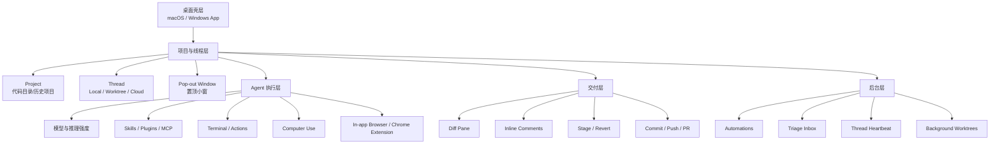

# Codex App macOS 竞品调研

> 调研日期：2026-05-24  
> 调研对象：OpenAI Codex App for macOS  
> 本机版本：Codex.app `26.519.22136`，Bundle ID `com.openai.codex`，Build `3003`；Codex CLI `0.133.0`  
> 目标：从 macOS 桌面产品形态、Agent 工作流、权限/沙箱、并行任务、Git 交付闭环与对 FocusPilot 的启发角度，形成可用于产品设计参考的竞品分析。

---

## 1. 结论先行

Codex App 的核心定位已经从“CLI 的图形壳”升级为 **AI 编程代理的桌面指挥台**。官方定义强调它是一个用于并行处理 Codex threads 的桌面体验，内置 worktree、自动化和 Git 能力；这意味着它的主战场不是传统 IDE 编辑器，也不是单轮 Chat，而是“多任务代理协作 + 本地/云端执行 + 交付管理”。

对 FocusPilot 最有价值的启发不是“把 Codex 复制进来”，而是三点：

1. **任务不是对话列表，而是可执行线程**：Codex 把每个 thread 做成有模式、目录、沙箱、终端、diff、提交状态的执行单元。
2. **并行代理需要隔离机制**：worktree 是 Codex 支撑多任务并行的关键产品化抓手，解决“AI 改代码会污染主工作区”的信任问题。
3. **桌面 AIOS 的差异点在上下文入口**：Computer Use、Appshots、in-app browser、Chrome extension 都在争夺“让 AI 看见真实桌面状态”的入口。

FocusPilot 当前的悬浮球 + 快捷面板 + AI 会话管理，天然更接近“跨工具会话总控”而不是单一 coding agent。Codex App 的强项在工程执行闭环，FocusPilot 可以避开正面重叠，把重点放在 **人的注意力、窗口上下文、跨 AI 工具会话、个人复盘与判断闭环**。

---

## 2. 资料来源与可信度

| 来源 | 类型 | 可信度 | 用途 |
|---|---|---:|---|
| OpenAI Codex App 官方文档 | 官方一手资料 | 高 | 产品定位、功能清单、平台支持、工作流 |
| OpenAI Codex App Features 官方文档 | 官方一手资料 | 高 | 多项目、skills、automations、modes、Git、terminal、browser、Computer Use |
| OpenAI Codex App Worktrees 官方文档 | 官方一手资料 | 高 | worktree/Handoff 机制与并行任务模式 |
| OpenAI Computer Use 官方文档 | 官方一手资料 | 高 | macOS Computer Use 能力、权限、适用边界 |
| OpenAI Automations 官方文档 | 官方一手资料 | 高 | 后台自动化、Triage、thread automation |
| OpenAI Codex Pricing / Help Center | 官方一手资料 | 高 | 订阅、权限、数据与企业控制 |
| 本机 `/Applications/Codex.app/Contents/Info.plist` 与 `codex --version` | 本机实测 | 高 | 安装形态与版本 |
| `docs/竞品分析/Codex UI 功能层次梳理.md` | 项目内既有分析 | 中 | 与 FocusPilot 文档体系对齐 |

关键链接：

- Codex App：https://developers.openai.com/codex/app
- Codex App Features：https://developers.openai.com/codex/app/features
- Worktrees：https://developers.openai.com/codex/app/worktrees
- Computer Use：https://developers.openai.com/codex/app/computer-use
- Automations：https://developers.openai.com/codex/app/automations
- Codex CLI：https://developers.openai.com/codex/cli
- Codex Pricing：https://chatgpt.com/codex/pricing
- ChatGPT plan with Codex：https://help.openai.com/en/articles/11369540-using-codex-with-your-chatgpt-plan

---

## 3. 产品定位

### 3.1 一句话定位

**Codex App 是 OpenAI 面向开发者的桌面 Agent Command Center：用一个 macOS/Windows 桌面应用管理多个本地、worktree 和云端 Codex 执行线程，并把代码修改、验证、审查、提交、自动化任务纳入同一工作流。**

### 3.2 它不是传统 IDE

Codex App 没有把重点放在编辑器、文件树、语法服务或插件生态上，而是围绕 Agent 任务组织界面：

- 项目是一级入口，每个项目对应一个代码目录。
- Thread 是核心工作单元，每个 thread 可选择 Local、Worktree 或 Cloud。
- Diff / review / terminal / actions 围绕 thread 展开。
- Git 操作内置在 App 中，但高级 Git 仍建议回到终端。
- IDE extension 与 App 同步，用于连接用户已有编辑器，而不是替代编辑器。

这说明 Codex App 的设计假设是：**开发者仍有自己的 IDE，Codex App 负责让 AI 并行工作、可审查、可交付。**

### 3.3 Mac App 的特殊价值

相比 CLI，macOS App 增加了三类桌面能力：

| 能力 | 价值 | 对用户信任的作用 |
|---|---|---|
| 多线程可视化 | 同时管理多个任务、项目、状态 | 降低“AI 在后台做什么”的不透明感 |
| Worktree / Git UI | 隔离变更、审查 diff、提交 PR | 降低误改主工作区风险 |
| Computer Use / Appshots | 看见并操作 GUI、捕获前台窗口 | 把本地桌面上下文引入 Agent |

---

## 4. 功能层次

### 4.1 项目与线程

Codex App 使用 Project + Thread 组织工作。Project 类似“在某个目录启动一段 Codex 会话”，Thread 则是具体任务执行单元。用户可以在一个窗口里添加多个项目并快速切换，适合多仓库、多包或多应用协同。

Thread 的三种模式是理解 Codex App 的关键：

| 模式 | 执行位置 | 适用场景 | 风险 |
|---|---|---|---|
| Local | 当前项目目录 | 快速问答、读代码、小修小补 | 可能直接修改当前工作区 |
| Worktree | 本机 Git worktree | 并行任务、探索性修改、后台任务 | 需要 Git 仓库与依赖环境 |
| Cloud | 远程配置环境 | 长任务、跨设备委派、云端执行 | 环境复现与权限治理成本更高 |

### 4.2 Worktree 与 Handoff

Worktree 是 Codex App 的核心安全设计。它让 Codex 在同一仓库中创建独立 checkout，从而并行推进多个任务，不干扰用户当前 Local checkout。官方文档还引入 Handoff，用于在 Local 与 Worktree 之间迁移 thread 和代码。

产品含义：

- Worktree 把“试一下”变成低风险动作。
- Handoff 把“AI 后台做完了，我接手”变成明确流程。
- Background worktrees 让自动化任务不污染用户正在编辑的代码。

对 FocusPilot 的启发：如果未来支持 AI 编码会话管理，不应只展示会话状态，还应标记 **会话是否隔离、是否绑定分支、是否有未审查变更、是否可安全接手**。

### 4.3 内置 Git 与 Review

Codex App 的 Git 能力围绕交付闭环设计：

- Diff pane 展示本地或 worktree 变更。
- 用户可以对 diff 加 inline comments，让 Codex 按评论修改。
- 支持 stage / revert 文件或 chunk。
- 支持 commit、push、创建 PR。
- 更复杂 Git 操作交给 integrated terminal。

这套设计的强点是把 AI 产物放在审查界面里，而不是直接让用户相信最终回答。它强化的是“AI 负责产出，人负责验收”。

### 4.4 Terminal 与 Actions

每个 thread 都有一个 scoped terminal，作用不仅是给用户运行命令，也让 Codex 能读取当前 terminal 输出。典型场景包括：

- 运行测试、lint、build。
- 观察 dev server 状态。
- 读取失败日志并继续修复。
- 通过 local environment 定义快捷 actions。

这一点对 Agent 体验很关键：**终端输出成为 thread 上下文的一部分**，而不是散落在外部窗口。

### 4.5 Computer Use

Computer Use 是 Codex App 在 macOS 上的强差异功能。它允许 Codex 通过视觉和辅助功能操作 GUI：看屏幕、点击、输入、测试桌面 App 或浏览器流程。启用时需要安装 Computer Use plugin，并授予 Screen Recording 与 Accessibility 权限。

适用场景：

- 测试 macOS App、iOS Simulator 或其他桌面 App。
- 复现只能通过 GUI 看到的问题。
- 操作没有插件/API 的数据源或设置页面。
- 跨多个 App 执行狭窄、明确的流程。

限制与风险：

- 会影响项目目录之外的系统状态。
- 需要用户授权目标 App。
- 对本地隐私、误操作、后台执行有更高治理要求。
- 官方建议本地 Web 开发优先使用 in-app browser，Computer Use 作为更强但更敏感的能力。

对 FocusPilot 的启发：FocusPilot 已经有窗口枚举、前台窗口关联、辅助功能权限基础，天然适合做“人类可控的桌面上下文路由器”。但如果引入 Computer Use 类能力，必须坚持更强的可见状态、审批和作用域边界。

### 4.6 Appshots

Appshots 的方向是把 Mac 前台窗口状态快速送入 Codex：截图 + 可用文本。这是比完整 Computer Use 更轻量的上下文采集方式，适合“让 AI 看一眼当前 App 状态再继续”的场景。

对 FocusPilot 的启发：FocusPilot 的悬浮球可以成为 Appshot 类入口，但产品语义应偏向“采集当前窗口上下文到项目/会话”，而不是只做截图发送。

### 4.7 In-app Browser 与 Chrome Extension

Codex App 同时提供 in-app browser 和 Chrome extension：

- In-app browser：面向本地 dev server、文件预览、无需登录的公开页面，可评论页面区域，也可让 Codex 操作本地浏览器流。
- Chrome extension：用于需要用户浏览器登录态、cookies、扩展、既有标签页的任务。

这体现出 Codex 的边界分层：能用受控内置浏览器就不用真实浏览器；必须接触真实浏览器时再提升权限。

### 4.8 Automations

Automations 把 Codex 从“被动回复”扩展为“后台例行任务”：

- 可按计划运行 recurring tasks。
- 有发现时进入 Triage inbox，无事可自动归档。
- Git 仓库可选择 local 或 background worktree 执行。
- 可结合 skills，形成团队可复用流程。
- Thread automations 是附着在当前 thread 上的 heartbeat，适合持续检查长任务、PR 状态或部署结果。

这对 FocusPilot 的战略启发很强：Codex 的自动化是工程导向的，而 FocusPilot 可以把自动化扩展到个人知行闭环，例如“每日收集、整理、复盘、推进下一步”。

---

## 5. 典型用户旅程

### 5.1 本地快速修复

1. 用户选择项目，创建 Local thread。
2. 输入“找出这个 bug 并最小修复”。
3. Codex 读取代码、运行测试、修改文件。
4. 用户在 diff pane 审查变更。
5. 用户添加 inline comments，Codex 继续修改。
6. 用户 stage、commit、push。

优势：路径短，适合低风险任务。  
风险：直接作用于 Local checkout，容易与用户未完成修改交错。

### 5.2 并行探索性任务

1. 用户在同一项目创建 Worktree thread。
2. 选择基准分支或当前分支。
3. Codex 创建 worktree 并独立执行。
4. 用户继续在 Local 做自己的工作。
5. 完成后在 App 内审查 diff，创建 branch 或 Handoff 回 Local。

优势：隔离清晰，可并行。  
风险：依赖安装、服务端口、数据库状态可能需要额外环境配置。

### 5.3 GUI 验证任务

1. 用户让 Codex 使用 Computer Use 打开目标 App 或浏览器。
2. Codex 请求目标 App 权限。
3. Codex 复现 GUI 问题，观察状态。
4. Codex 修改代码，再次运行同一 UI 流程。
5. 用户审查最终 diff 与截图/操作证据。

优势：补齐 CLI 无法验证的真实体验。  
风险：权限敏感，任务范围必须窄。

### 5.4 后台例行任务

1. 用户创建 automation，例如每日检查错误日志、生成报告或跟进 PR。
2. Codex 按计划在 local 或 background worktree 运行。
3. 有结果进入 Triage inbox。
4. 用户审查、接受或继续派生 thread。

优势：从“问答工具”变成“后台工作系统”。  
风险：需要可靠的噪声控制，否则 inbox 会变成新的负担。

---

## 6. 商业模式与进入门槛

Codex 采用 ChatGPT 订阅 + 企业 credits + API key 的混合模式：

- ChatGPT Free / Go / Plus / Pro / Business / Enterprise 均可包含不同程度的 Codex 访问。
- Plus / Pro / Business / Enterprise 是主力付费层。
- Business / Enterprise 可通过 credits 扩展用量。
- API key 可运行额外本地任务，按 API 价格计费。
- 使用 ChatGPT 账号登录时，遵循 ChatGPT 账号与工作区控制；企业可通过 Codex Local / Codex Cloud / Remote Control 等权限做治理。

产品策略判断：

- OpenAI 在把 Codex 从“开发者工具”包装进 ChatGPT 订阅体系，降低分发成本。
- Codex App 是订阅权益的一部分，目标是提高高频开发者留存，而不只是单独卖 App。
- 企业场景的关键不是功能数量，而是权限、审计、数据治理与统一账户。

---

## 7. 竞品对照

| 维度 | Codex App | Z Code | Plane | Multica | FocusPilot 机会 |
|---|---|---|---|---|---|
| 核心定位 | AI 编程代理桌面指挥台 | ADE，多 Agent 框架热切换 | 项目管理/Issue 工作流 | Agent Runtime / workspace 模型 | 个人 AIOS，跨工具知行闭环 |
| 主对象 | Thread / Project / Worktree | Session / Agent Framework | Project / Issue / Cycle | Workspace / Agent Task | Project / Window / AI Session / Focus |
| 执行闭环 | 代码修改、测试、diff、Git、PR | 对话开发、checkpoint、Git GUI | 管理任务，不执行代码 | Agent 执行与任务状态 | 人的任务推进 + AI 会话聚合 |
| 并行机制 | Worktree + 多 thread | 多 session / checkpoint | 多项目视图 | Agent 队列/状态 | 多 AI 工具会话 + 窗口绑定 |
| 桌面上下文 | Computer Use、Appshots、Browser | 内置浏览器/DevTools | Web app 为主 | 本地 runtime | macOS 窗口枚举、悬浮球、快捷面板 |
| 权限模型 | Sandbox、approvals、macOS 权限 | Agent 权限模式 | 企业权限 | Runtime 权限 | 窗口级/会话级可见状态与用户掌控 |
| 差异化壁垒 | OpenAI 模型 + ChatGPT 账户体系 | 多框架/BYOK/插件 | 项目管理成熟度 | 开源架构参考 | 个人注意力入口 + 本地上下文理解 |

---

## 8. Codex App 的优势

### 8.1 把 Agent 工作从“黑箱对话”变成“可审查工作流”

Codex App 的界面围绕 thread、diff、terminal、Git 动作展开，天然要求用户审查产物。相比纯聊天产品，它更接近工程团队能接受的协作模型。

### 8.2 Worktree 降低并行 AI 的心理成本

用户最怕 AI 在主工作区乱改。Worktree 把并行任务隔离成显性空间，使“开多个 AI 工人同时干活”变得可控。

### 8.3 Mac 桌面上下文入口强

Computer Use 和 Appshots 让 Codex 能处理命令行之外的真实桌面问题。尤其对 macOS/iOS/前端测试，它能形成“看见 -> 修改 -> 再看见”的闭环。

### 8.4 订阅与生态分发强

Codex 直接接入 ChatGPT 计划、OpenAI 模型、IDE extension、CLI、web、GitHub、mobile，用户迁移成本低，生态闭环大。

---

## 9. Codex App 的短板与风险

### 9.1 对非工程工作流仍偏重

虽然官方 use cases 已覆盖知识工作、表格、PPT、邮件等方向，但 Codex App 的主信息架构仍是代码项目、thread、diff、Git。对个人目标管理、长期复盘、知识沉淀、跨生活/工作事项的支持不是核心。

### 9.2 多线程会带来新的注意力负担

并行 thread 和 automation 能提高吞吐，但也会制造“我到底该看哪个结果”的 triage 压力。Codex 通过 Triage inbox 处理自动化结果，但是否能长期降低噪声，取决于摘要、优先级和归档质量。

### 9.3 Computer Use 权限敏感

Screen Recording、Accessibility、锁屏后使用等能力很强，但也会带来隐私、误操作、系统状态污染风险。普通用户可能需要明确的“为什么要授权、授权到哪里、可撤销吗”的解释。

### 9.4 深度绑定 OpenAI 生态

Codex 的模型、账户、订阅、云任务、企业治理都绑定 OpenAI。对希望 BYOK、多模型、多 Agent 框架并存的用户，Z Code 类产品更灵活。

---

## 10. 对 FocusPilot 的产品启发

### 10.1 不要与 Codex 正面抢“写代码主战场”

Codex 的护城河在模型、工程执行和生态分发。FocusPilot 不适合做第二个 Codex App。更好的方向是成为：

**macOS 上的个人 AIOS 控制层：识别用户当前窗口、项目、专注状态与 AI 会话，把不同 Agent 工具的输出纳入同一个行动闭环。**

### 10.2 AI 会话列表应升级为“会话状态雷达”

当前 FocusPilot 的 AI Tab 已能展示 AI 编码会话。下一步可借鉴 Codex 的 thread 思路，但不必复制完整界面：

- 标记会话绑定的 App / 窗口 / cwd。
- 显示是否有未读 action、是否等待审批、是否有 diff、是否测试失败。
- 区分 Local 主工作区与隔离分支/工作区。
- 支持从悬浮球快速跳到对应 AI 工具窗口。

重点是“帮人知道哪个 AI 正需要我”，而不是“替代 AI 工具执行所有操作”。

### 10.3 引入轻量 Appshot，而不是直接上完整 Computer Use

FocusPilot 更适合先做轻量上下文采集：

- 捕获当前前台窗口标题、App、截图、选中文本。
- 让用户选择发送给哪个 AI 会话或项目。
- 保存到 Project 的 Inbox/Context，而不是直接允许 AI 操作桌面。

这样能形成 FocusPilot 的桌面入口优势，同时避免过早进入高风险自动操作。

### 10.4 把“后台自动化”改造成个人复盘自动化

Codex Automations 面向代码任务。FocusPilot 可以面向个人知行闭环：

- 每日收集：今天哪些窗口/项目/AI 会话占用最多注意力？
- 每日复盘：哪些任务有 AI 结果但未处理？
- 每周推进：哪些 Project 卡住超过 N 天？
- 知识加工：把 AI 会话中的关键决策沉淀为项目笔记。

这更贴合 FocusPilot 的“信息采集 -> 知识加工 -> 认知规律 -> 智慧实践 -> 个人判断”定位。

### 10.5 UI 上学习 Codex 的“工作单元可视化”

Codex 的 thread 卡片值得参考：

- 每个工作单元要有明确状态。
- 状态要能映射到下一步动作。
- 用户不应在消息流里翻找“现在该干嘛”。
- Diff、terminal、artifact、summary 应成为可扫描区域。

FocusPilot 可把 Project / Focus / AI Crew 的信息压缩成“下一步动作卡”，而不是堆叠更多设置。

---

## 11. FocusPilot 可落地机会清单

| 优先级 | 机会 | 为什么值得做 | 粗略形态 |
|---:|---|---|---|
| P0 | AI 会话待办雷达 | 直接增强现有 AI Tab 与浮球角标 | 等待用户、运行中、失败、完成、未读分类 |
| P0 | 当前窗口发送到 AI 会话 | 放大 macOS 悬浮入口价值 | 右键/快捷键：发送窗口标题、截图、cwd 到选定会话 |
| P1 | 会话与 Project 绑定 | 把 AI 工具输出纳入 FocusPilot 项目系统 | CoderSessionPreference 扩展 projectId |
| P1 | 轻量 Appshot Inbox | 做桌面上下文采集，不做高风险操作 | 截图 + OCR/AX 文本 + 用户注释 |
| P1 | AI 结果复盘队列 | 解决多 Agent 并行后的注意力负担 | Review Queue：待看 diff、待读总结、待决策 |
| P2 | Worktree 状态识别 | 为未来编码会话治理铺路 | 识别 cwd 是否为 Git worktree、branch、dirty 状态 |
| P2 | 自动化复盘 | 对齐个人 AIOS 战略 | 每日/每周生成项目推进摘要 |

---

## 12. 设计原则提炼

1. **让 AI 的状态可见**：运行中、卡住、等审批、完成、有风险，必须一眼看懂。
2. **让 AI 的作用域可见**：它在哪个 App、哪个窗口、哪个目录、哪个分支工作。
3. **让接手动作明确**：继续、审查、跳转、归档、绑定、忽略。
4. **让桌面上下文轻量流动**：窗口状态、截图、用户意图能快速进入项目，而不是散落在截图文件和聊天记录里。
5. **让人保持判断权**：FocusPilot 的优势不在替用户全自动执行，而在把 AI 工作组织成可判断、可复盘、可推进的个人系统。

---

## 13. 一句话给 FocusPilot 的战略建议

Codex App 证明“桌面 AI 代理”的下一阶段不是更聪明的聊天框，而是 **可并行、可审查、可交付、可自动化的工作线程系统**；FocusPilot 应避开工程执行主战场，抓住 macOS 本地上下文和个人注意力入口，成为用户调度多个 AI 工具、多个项目与多个行动闭环的上层控制台。
