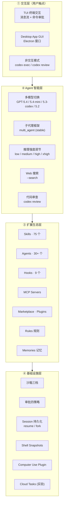
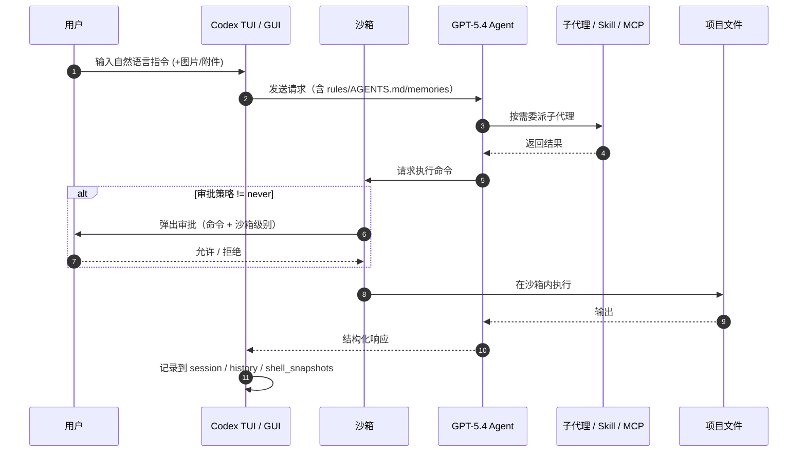
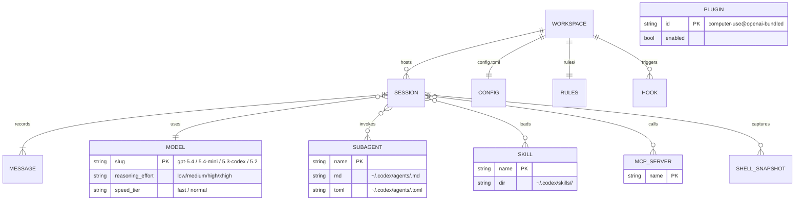
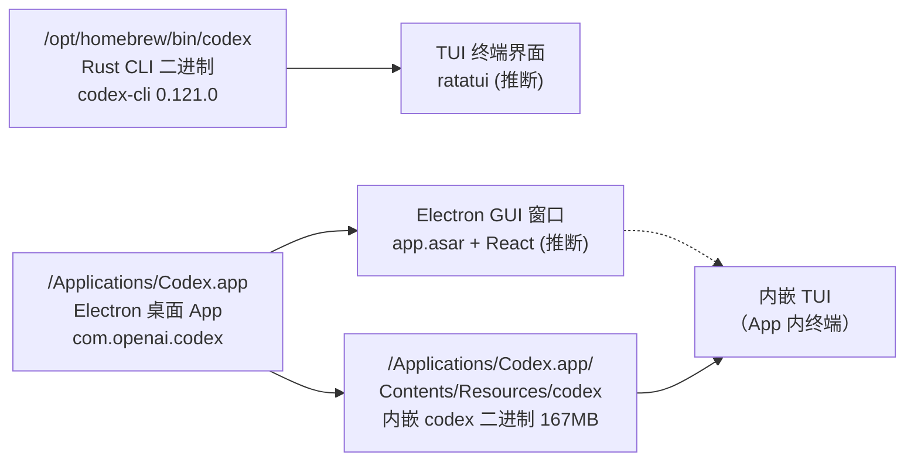
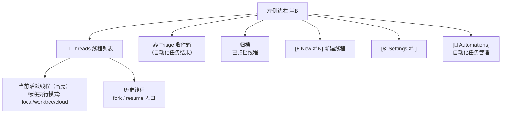
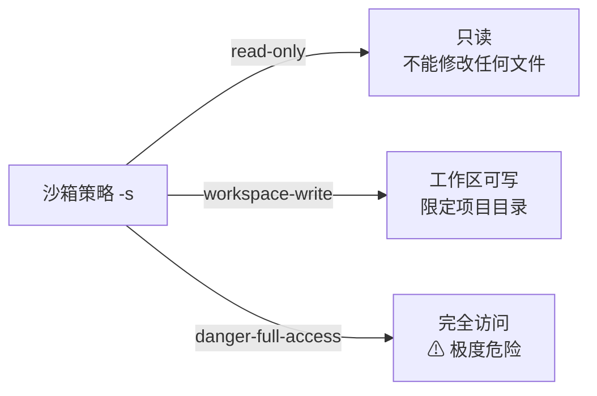
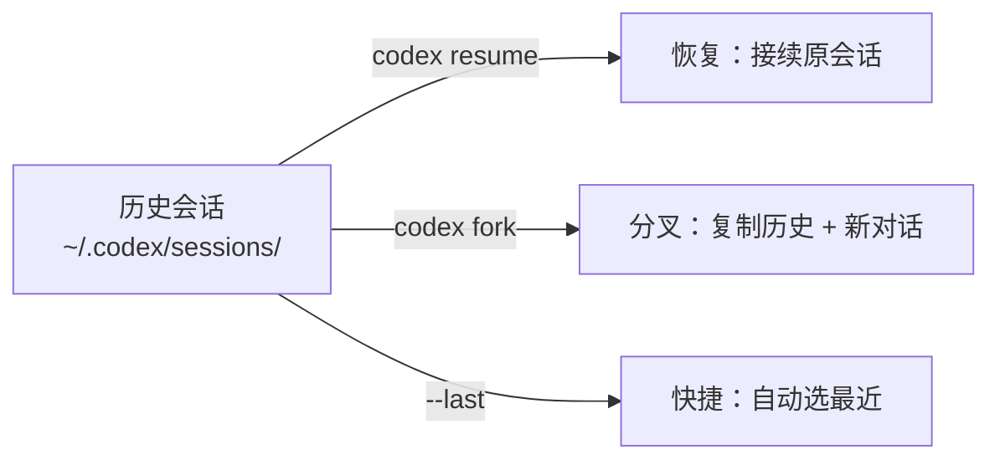
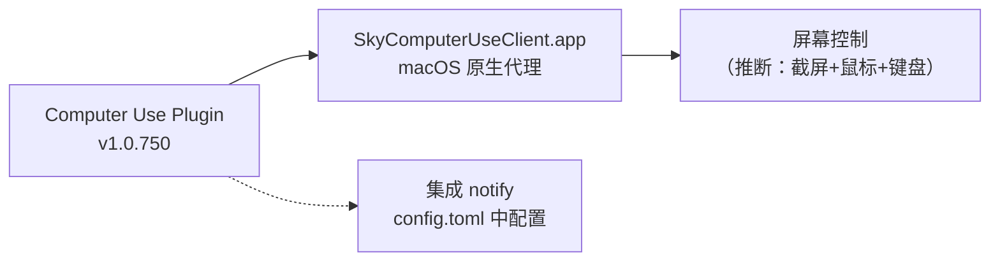
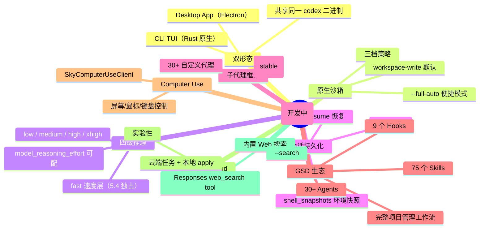
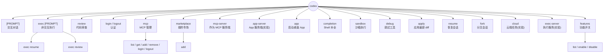

# Codex UI 功能层次梳理

> 系统还原本机已安装的 **OpenAI Codex**（CLI `0.121.0` + Desktop App `Codex.app`）的 UI 结构、功能分布与差异化能力。
>
> 证据来源四条：① 本地 CLI `--help`、feature flags、models_cache.json；② 本地 `.app` Bundle 资源（Electron）；③ 本机用户数据 `~/.codex/`（config.toml / skills / agents / plugins / history）；④ 官方文档 `developers.openai.com/codex`（74 页全量抓取）。
>
> 每条关键断言均标注来源：`[cli:--help]`、`[bundle:<path>]`、`[~/.codex/<path>]`、`[models_cache]`、`[docs/<slug>]`。推断处标注 `（推断）`。

---

## 一 产品定位

**一句话定位**：Codex 是 OpenAI 的 **AI 编程代理**（coding agent）—— 以对话驱动代码生成、调试、审查、重构，支持 CLI（终端 TUI）和 Desktop App（Electron GUI）两种形态，背靠 GPT-5 系列模型。

### 竞品差异对比

| 维度 | Claude Code（Anthropic） | Z Code（智谱） | **Codex（OpenAI）** |
|---|---|---|---|
| 核心形态 | CLI only | Electron GUI（内嵌多 CLI） | **CLI + Electron GUI 双形态** |
| 模型 | Claude Opus/Sonnet/Haiku | 多框架多厂 BYOK | **GPT-5.4 / 5.4-Mini / 5.3-Codex / 5.2**（自家独占） |
| 沙箱 | 无原生沙箱 | 无 | **原生三档沙箱**（read-only / workspace-write / danger-full-access）`[cli:--help]` |
| 审批策略 | 权限模式（4 档） | 权限模式（4 档） | **4 档 + `--full-auto` 便捷模式** `[cli:--help]` |
| 会话持久化 | 无（单次） | Checkpoint 自动存档 | **resume / fork 双入口**（恢复 or 分叉会话）`[cli:--help]` |
| 子代理 | Subagent（spawn） | 专业 Agents（5 内置） | **multi_agent 稳定 + multi_agent_v2 开发中** `[features]` |
| 计算机使用 | 无 | 内置浏览器 + DevTools | **Computer Use 插件**（SkyComputerUseClient）`[~/.codex/plugins]` |
| 扩展机制 | Commands + Skills + MCP | 六类插件（Agent/Command/MCP/LSP/Skill/Hook） | **Skills + Agents + Hooks + MCP + Marketplace + Rules + Memories** `[~/.codex/]` |
| Web 搜索 | 无原生 | MCP（web-search-prime） | **`--search` 内置 Responses web_search** `[cli:--help]` |
| 云端任务 | 无 | 无 | **Codex Cloud（实验性）**：`codex cloud` 浏览云端任务 `[cli:--help]` |
| 定价 | API Key 计量 | 工具免费 + BYOK | **ChatGPT Plus/Pro/Business/Enterprise 订阅** `[docs/pricing]` |

> CLI 为 Apache-2.0 开源；Desktop App 为 Electron 封装。商业化通过 **ChatGPT 订阅** 完成 `[docs/pricing]`：

| 方案 | 月费 | 能力 |
|---|---|---|
| **Free** | $0 | 基础体验 |
| **Go** | $8 | 轻量任务 |
| **Plus** | $20 | Web + CLI + IDE + iOS |
| **Pro** | $100+ | 5x-20x 高速率限制 |
| **Business/Enterprise** | 定制 | 团队管理 + 高级管控 |

> 用量按 token 计量（API token-based rates），超出包含额度可购买额外 credits `[docs/pricing]`。

---

## 二 核心功能全景

### 2.1 能力层总览



### 2.2 功能速览表

| 功能 | CLI 入口 | Desktop 入口 | 说明 | 证据 |
|---|---|---|---|---|
| 交互对话 | `codex [PROMPT]` | App 启动 | 主交互模式，TUI / GUI | `[cli:--help]` |
| 非交互执行 | `codex exec [PROMPT]` | — | 脚本集成，无 TUI | `[cli:exec --help]` |
| 代码审查 | `codex review` | — | 非交互，自动审查 | `[cli:--help]` |
| 恢复会话 | `codex resume [--last]` | — | 选择器或最近会话 | `[cli:--help]` |
| 分叉会话 | `codex fork [--last]` | — | 复制历史+新分支 | `[cli:--help]` |
| 云端任务 | `codex cloud` | — | 实验性，浏览 Codex Cloud | `[cli:--help]` |
| 应用 diff | `codex apply` | — | 将最新 diff 作 `git apply` | `[cli:--help]` |
| MCP 管理 | `codex mcp list/get/add/remove` | 设置面板 | 外部 MCP 服务 | `[cli:mcp --help]` |
| 插件市场 | `codex marketplace add` | 设置面板 | 添加远程市场 | `[cli:marketplace --help]` |
| 登录/登出 | `codex login / logout` | — | OpenAI 认证 | `[cli:--help]` |
| 启动桌面 | `codex app` | 直接打开 | 下载/启动 macOS 安装器 | `[cli:--help]` |
| Shell 补全 | `codex completion` | — | bash/zsh/fish | `[cli:--help]` |
| 沙箱执行 | `codex sandbox` | — | 隔离环境 | `[cli:--help]` |
| 调试工具 | `codex debug` | — | 诊断 | `[cli:--help]` |
| Feature Flags | `codex features list/enable/disable` | — | 功能开关 | `[cli:features]` |
| 模型切换 | `-c model="gpt-5.4"` | 界面选择 | 运行时覆盖 | `[cli:--help]` |
| 图片附件 | `-i <FILE>` | 拖拽 | 多模态输入 | `[cli:--help]` |
| 沙箱策略 | `-s read-only/workspace-write/danger-full-access` | 界面选择 | 三档 | `[cli:--help]` |
| 审批策略 | `-a untrusted/on-request/never` | 界面选择 | 三档 + --full-auto | `[cli:--help]` |
| 搜索 | `--search` | 界面开关 | Responses web_search | `[cli:--help]` |
| 远程连接 | `--remote ws://host:port` | — | 连接远程 app server | `[cli:--help]` |
| 工作目录 | `-C <DIR>` / `--add-dir <DIR>` | — | 指定/追加可写目录 | `[cli:--help]` |

### 2.3 协作时序（一轮典型对话）



### 2.4 核心实体关系（ER）



---

## 三 整体布局

### 3.1 双形态架构

Codex 有两种 UI 形态，共享同一个 Rust CLI 二进制：



### 3.2 App Shell 线框

#### TUI 模式（终端界面）

```
┌────────────────────────────────────────────────────────────────────┐
│ 🤖 Codex (gpt-5.4)                           sandbox: workspace  │  ← 顶栏
├────────────────────────────────────────────────────────────────────┤
│                                                                    │
│  User:                                                             │
│  > 帮我重构 auth 模块为 OAuth2                                      │
│                                                                    │
│  Codex:                                                            │
│  我来分析当前的认证结构...                                           │
│                                                                    │
│  ┌─ Shell Command ──────────────────────────────────────────┐     │
│  │ $ cat src/auth/index.ts                                   │     │
│  │ [Auto-approved: read-only]                                │     │
│  └──────────────────────────────────────────────────────────┘     │
│                                                                    │
│  ┌─ Approval Required ──────────────────────────────────────┐     │
│  │ $ npm install passport-oauth2                             │     │
│  │                                                           │     │
│  │ [y] Approve  [n] Deny  [e] Edit  [a] Always approve      │     │
│  └──────────────────────────────────────────────────────────┘     │
│                                                                    │
│  Codex:                                                            │
│  文件已修改:                                                        │
│  + src/auth/oauth.ts (新增)                                        │
│  ~ src/auth/index.ts (修改)                                        │
│                                                                    │
├────────────────────────────────────────────────────────────────────┤
│ > [输入框: 输入消息或 / 命令...]                          [↑ 发送]  │  ← 底栏
└────────────────────────────────────────────────────────────────────┘
```
> 示意图。TUI 基于 Rust（CLI 二进制 = Mach-O arm64），推断使用 ratatui/crossterm。`[cli:--help][bundle:codex]`

#### Desktop App 模式（Electron GUI）

```
┌──────────────────────────────────────────────────────────────────────────────────┐
│ ● ● ●     Codex — MyProject                [gpt-5.4 ▾] [⚙] [🔍] [⌘⇧P] [_][□]│  ← 标题栏
├──────────────┬───────────────────────────────────────────────────────────────────┤
│ 📂 Threads   │  ┌ 执行模式 [Local ▾ | Worktree | Cloud]  ──────────────────┐  │
│              │  │                                                            │  │
│ ● 重构 auth  │  │  User:                                                    │  │
│   local      │  │  帮我重构 auth 模块为 OAuth2                                │  │
│              │  │                                                            │  │
│ ○ Bug fix    │  │  Codex (gpt-5.4):                                         │  │
│   worktree   │  │  正在分析...                                               │  │
│              │  │                                                            │  │
│ ○ 写测试     │  │  ┌ Shell ──────────────┐  ┌ Diff ────────────────────┐   │  │
│   cloud      │  │  │ $ cat src/auth/...  │  │ - old code              │   │  │
│              │  │  └─────────────────────┘  │ + new code              │   │  │
│ 📥 Triage    │  │                           └──────────────────────────┘   │  │
│  2 条自动化   │  │  [✓ Approve] [✗ Deny] [✎ Edit] [⚡ Always]              │  │
│              │  │                                                            │  │
│ ── 归档 ──── │  │  ┌ 内置终端 ──────────────────────────────────────────┐  │  │
│ ○ 旧线程...  │  │  │ $ npm test                                         │  │  │
│              │  │  └────────────────────────────────────────────────────┘  │  │
│              │  └────────────────────────────────────────────────────────────┘  │
│ [+ New ⌘N]  │  ┌ 输入框 ────────────────────────────────────────────────────┐  │
│ [⚙ ⌘,]     │  │ 描述你的需求...    [📎] [🎤 ⌃M] [🖼] [/]      [↑ 发送]   │  │
│ [🤖 Auto]   │  └────────────────────────────────────────────────────────────┘  │
└──────────────┴──────────────────────────────────────────────────────────────────┘
  ⌘B 切换侧栏     ⌘⇧B 切换浏览器面板       ⌘F 搜索         ⌘⇧P 命令面板
```

**Desktop App 关键 UI 能力**（来自官方文档 `[docs/app*]`）：

| 能力 | 说明 | 证据 |
|---|---|---|
| **三种执行模式** | Local（本地直接执行）/ Worktree（Git worktree 隔离）/ Cloud（远程容器） | `[docs/app-features]` |
| **并行线程** | 同一项目多个 Thread 并行运行、快速切换 | `[docs/app]` |
| **Git Worktree** | 并行代码隔离 + Handoff 机制转移环境 + 自动清理（默认保留 15 个） | `[docs/app-worktrees]` |
| **内置终端** | 每个 Thread 独立终端，可运行测试/脚本/Git 命令 | `[docs/app-features]` |
| **内置浏览器** | `⌘⇧B` 打开；预览本地 Web 应用 + 元素评论（点击元素标注反馈） | `[docs/app-browser]` |
| **Computer Use** | macOS 专属；操控桌面 GUI 应用；需屏幕录制+辅助功能权限 | `[docs/app-computer-use]` |
| **自动化 Automations** | 三种类型（Standalone / Thread / Project）；后台调度定时任务；Triage 收件箱 | `[docs/app-automations]` |
| **代码审查 Review** | Diff 视图 + 行内评论 + PR 支持 + Git 暂存/还原 | `[docs/app-review]` |
| **语音输入** | `⌃M` 语音听写 | `[docs/app-features]` |
| **弹出窗口** | 会话可弹出为独立窗口 | `[docs/app-features]` |
| **图片输入/生成** | 多模态输入 + 图像生成 | `[docs/app-features]` |
| **Artifact 查看器** | 预览 PDF / 电子表格 / 演示文稿 | `[docs/app-features]` |
| **Deep Links** | `codex://settings` / `codex://new?prompt=...&path=...` 直接导航 | `[docs/app-commands]` |
| **快捷键** | `⌘⇧P` 命令面板 / `⌘,` 设置 / `⌘B` 侧栏 / `⌘N` 新线程 / `⌘F` 搜索 | `[docs/app-commands]` |
| **Slash 命令** | `/feedback` 反馈 / `/review` 审查 / `/status` 状态 / `/plan-mode` 规划 | `[docs/app-commands]` |

> Desktop App 为 Electron（Sparkle 自动更新、Squirrel/Mantle 生命周期）`[bundle:Frameworks/]`。线框基于官方文档描述（无截图证据）。

### 3.3 端差异

| 端 | 技术栈 | 二进制大小 | 能力 | 证据 |
|---|---|---|---|---|
| **CLI（TUI）** | Rust（arm64 Mach-O） | `/opt/homebrew/bin/codex` | 完整命令行交互 + exec/review/resume/fork/cloud/sandbox/apply | `[cli:--help]` |
| **Desktop App** | Electron + 内嵌 Rust CLI（167MB） | `/Applications/Codex.app`（738MB） | GUI 窗口 + 设置面板 + 会话管理 + Computer Use 插件 | `[bundle]` |
| **Codex Cloud** | Web（实验性） | — | 浏览远程任务 + 本地 apply | `[cli:cloud --help]` |
| **MCP Server** | CLI 子命令 | — | `codex mcp-server` 作为 stdio MCP 服务端 | `[cli:--help]` |
| **Exec Server** | CLI 子命令（实验） | — | `codex exec-server` 独立执行服务 | `[cli:--help]` |

---

## 四 侧边栏（Desktop App）

> 基于官方文档描述，无截图直接证据。CLI 模式无侧边栏（通过子命令管理会话）。



**设置面板（⌘,）内容**（`[docs/app-settings]`）：

| 设置区 | 说明 |
|---|---|
| **General** | 文件打开行为、命令输出可见性、`⌘↩` 多行模式、防休眠 |
| **Notifications** | 线程完成通知时机与权限 |
| **Agent** | 继承 CLI/IDE 配置，可进入 `config.toml` 高级编辑 |
| **Appearance** | 主题（含自定义 accent/background/foreground 色）、UI 字体、代码字体 |
| **Git** | 分支命名规范、force push 控制、commit/PR 描述模板 |
| **Integrations & MCP** | 连接外部工具（Figma/Playwright/Sentry 等），启用推荐 MCP 或自定义 |
| **Computer Use** | macOS 桌面操控权限（EEA/UK/瑞士不可用） |
| **Personalization** | 人格风格（Friendly / Pragmatic / None）+ 自定义指令 |
| **Context-aware Suggestions** | 上下文建议与可恢复任务浮出 |
| **Memories** | 跨会话记忆开关（从前轮携带上下文） |
| **Archived Threads** | 查看/恢复已归档线程 |

**CLI 模式的会话管理**（非侧边栏，通过子命令）：

| 命令 | 功能 | 证据 |
|---|---|---|
| `codex resume` | 选择器列出历史会话，选择恢复 | `[cli:--help]` |
| `codex resume --last` | 恢复最近会话 | `[cli:--help]` |
| `codex fork` | 选择器列出历史会话，选择分叉 | `[cli:--help]` |
| `codex fork --last` | 分叉最近会话 | `[cli:--help]` |

会话数据存储在 `~/.codex/sessions/` 和 `~/.codex/session_index.jsonl`（本机已有 330 条历史 `[~/.codex/history.jsonl]`）。

---

## 五 顶部栏

### 5.1 TUI 顶栏

```
┌────────────────────────────────────────────────────────────┐
│ 🤖 Codex (gpt-5.4)               sandbox: workspace-write │
│        ↑                                    ↑              │
│     模型名                              沙箱策略           │
└────────────────────────────────────────────────────────────┘
```

### 5.2 Desktop App 顶栏（推断）

```
┌──────────────────────────────────────────────────────────────────────┐
│ ● ● ●   Codex     [gpt-5.4 ▾]  [sandbox ▾]  [🔍 search]  [⚙]     │
│                        ↑            ↑             ↑          ↑      │
│                     模型选择     沙箱策略      Web搜索     设置     │
└──────────────────────────────────────────────────────────────────────┘
```

---

## 六 核心功能模块详解

### 6.1 模型系统（6 模型）

本机缓存 5 个 `[models_cache]` + 官方文档额外提到 1 个 `[docs/models]`：

| 模型 | 定位 | 推理强度 | 速度 | 可用平台 | 证据 |
|---|---|---|---|---|---|
| **gpt-5.4** | 最新旗舰编程代理 | low / medium / high / xhigh | ✅ fast 模式 | CLI/App/IDE/Cloud/SDK | `[models_cache][docs/models]` |
| **gpt-5.4-mini** | 轻量旗舰（子代理优选）| low / medium / high / xhigh | — | 同上 | `[models_cache][docs/models]` |
| **gpt-5.3-codex** | 上代 Codex 优化版 | low / medium / high / xhigh | — | 同上 | `[models_cache][docs/models]` |
| **gpt-5.3-codex-spark** | 实时极速编码（Pro 限定）| — | 极速 | Pro 用户 | `[docs/models]` |
| **gpt-5.2** | 通用长时 Agent | low / medium / high / xhigh | — | 同上 | `[models_cache]` |
| **codex-auto-review** | 自动审批（隐藏）| low / medium / high / xhigh | — | 内部 | `[models_cache]` |

**关键特性**：
- **四级推理强度**（reasoning effort）：`low < medium < high < xhigh`，通过 `model_reasoning_effort` 配置或运行时 `-c` 覆盖 `[~/.codex/config.toml]`
- **Fast 模式**：gpt-5.4 独有的 `fast` 速度层（约 1.5x 加速 / 2x token 消耗）`[models_cache][docs/speed]`
- **Spark 实时模式**：gpt-5.3-codex-spark 为研究预览，面向 Pro 用户，"near-instant real-time coding" `[docs/models]`
- **Personality 人格**：gpt-5.4 有详细人格设定（"vivid inner life…intelligent, playful, curious"），5.4-mini/5.3-codex 偏务实 `[models_cache:base_instructions]`
- **Auto-review 隐藏模型**：visibility=`hide`，用于 `guardian_approval` 功能（实验阶段）`[features]`
- **自定义模型支持**：兼容任何 OpenAI Chat Completions / Responses API 的模型 `[docs/models]`

### 6.2 沙箱系统（三档）



**快捷模式**：`--full-auto` = `-a on-request --sandbox workspace-write`（低摩擦沙箱化自动执行）`[cli:--help]`

### 6.3 审批策略（四策略）

| 策略 | `-a` 值 | 行为 | 场景 |
|---|---|---|---|
| **仅信任** | `untrusted` | 白名单命令自动通过，其它弹审批 | 安全优先 |
| **按需** | `on-request` | 模型自行决定是否请求审批 | **推荐**（`--full-auto` 默认） |
| **从不** | `never` | 全自动，失败直接回模型 | CI/CD 管道 |
| ~~失败时~~ | `on-failure` | 已废弃 | — |

**审批交互**（TUI）：

```
┌─ Approval Required ──────────────────────────────────┐
│ $ npm install passport-oauth2                         │
│                                                       │
│ [y] Approve   [n] Deny   [e] Edit   [a] Always       │
└───────────────────────────────────────────────────────┘
```
> 四选项：`y` 单次允许 / `n` 拒绝 / `e` 编辑命令后执行 / `a` 始终允许同类命令。

### 6.4 会话持久化（resume / fork）



**相关存储** `[~/.codex/]`：
- `sessions/` — 完整会话数据
- `session_index.jsonl` — 会话索引（id + 线程名 + 更新时间）
- `history.jsonl` — 命令历史（本机 330 条）
- `shell_snapshots/` — Shell 环境快照（本机 17 个）

### 6.5 扩展生态

#### 6.5.1 Skills（75 个）

```
~/.codex/skills/
├── codex-primary-runtime     ← 核心运行时 Skill
├── gsd-*                     ← GSD (Get-Shit-Done) 工作流：65+ 个
│   ├── gsd-new-project       ← 项目初始化
│   ├── gsd-plan-phase        ← 阶段规划
│   ├── gsd-execute-phase     ← 阶段执行
│   ├── gsd-verify-work       ← 验收验证
│   ├── gsd-code-review       ← 代码审查
│   ├── gsd-ship              ← PR + 发布
│   ├── gsd-debug             ← 调试
│   ├── gsd-autonomous        ← 自主全流程
│   └── ...                   ← 60+ 个 GSD 子技能
└── structured-review-cn      ← 结构化审查（中文版）
```
> Skills 实质是 Markdown 文件目录，定义 Agent 的工作方式 `[~/.codex/skills/]`

#### 6.5.2 Agents（30+ 自定义代理）

每个 Agent 由 `.md`（Prompt）+ `.toml`（配置）组成 `[~/.codex/agents/]`：

| 代理分类 | 示例 | 职责 |
|---|---|---|
| **研究型** | `gsd-phase-researcher`, `gsd-project-researcher`, `gsd-ai-researcher`, `gsd-domain-researcher` | 技术/领域/框架调研 |
| **规划型** | `gsd-planner`, `gsd-roadmapper`, `gsd-framework-selector` | 路线图/计划/框架选型 |
| **执行型** | `gsd-executor`, `gsd-code-fixer`, `gsd-doc-writer` | 编码/修复/文档 |
| **审查型** | `gsd-code-reviewer`, `gsd-plan-checker`, `gsd-security-auditor`, `gsd-nyquist-auditor`, `gsd-ui-auditor`, `gsd-eval-auditor` | 代码/安全/UI/质量审查 |
| **验证型** | `gsd-verifier`, `gsd-integration-checker`, `gsd-doc-verifier` | 目标验证/集成检查 |
| **分析型** | `gsd-user-profiler`, `gsd-codebase-mapper`, `gsd-intel-updater`, `gsd-pattern-mapper`, `gsd-assumptions-analyzer` | 用户画像/代码分析 |
| **调试型** | `gsd-debugger`, `gsd-debug-session-manager` | 多轮调试 |

#### 6.5.3 Hooks（9 个事件钩子）

| Hook | 触发时机（推断） | 证据 |
|---|---|---|
| `gsd-check-update.js` | SessionStart | `[~/.codex/config.toml:hooks]` |
| `gsd-context-monitor.js` | 上下文变化 | `[~/.codex/hooks/]` |
| `gsd-phase-boundary.sh` | 阶段切换 | `[~/.codex/hooks/]` |
| `gsd-prompt-guard.js` | Prompt 发送前 | `[~/.codex/hooks/]` |
| `gsd-read-guard.js` | 文件读取前 | `[~/.codex/hooks/]` |
| `gsd-session-state.sh` | Session 状态变化 | `[~/.codex/hooks/]` |
| `gsd-statusline.js` | TUI 状态栏刷新 | `[~/.codex/hooks/]` |
| `gsd-validate-commit.sh` | Git 提交前 | `[~/.codex/hooks/]` |
| `gsd-workflow-guard.js` | 工作流转换 | `[~/.codex/hooks/]` |

#### 6.5.4 MCP Servers

通过 `codex mcp list/add/remove` 管理 `[cli:mcp --help]`。MCP 协议与 Claude Code / Z Code 共用标准。

#### 6.5.5 Marketplace & Plugins

| 组件 | 状态 | 证据 |
|---|---|---|
| **openai-bundled** 市场 | 内置（本地缓存） | `[~/.codex/config.toml:marketplaces]` |
| **computer-use** 插件 | 已启用（v1.0.750） | `[~/.codex/config.toml:plugins][~/.codex/plugins/cache/openai-bundled/computer-use/]` |
| `SkyComputerUseClient.app` | Computer Use 的 macOS 原生代理 | `[~/.codex/plugins/cache]` |
| 自定义市场 | `codex marketplace add` 添加 | `[cli:marketplace --help]` |

#### 6.5.6 Rules（命令规则）

`~/.codex/rules/default.rules` 定义 **prefix_rule** 白名单 `[~/.codex/rules/]`：

```
prefix_rule(pattern=["curl", "-fsSL"], decision="allow")
prefix_rule(pattern=["git", "clone"], decision="allow")
prefix_rule(pattern=["git", "-C", "...FocusPilot", "apply"], decision="allow")
...
```

### 6.6 CLI Slash 命令（30+）

TUI 中输入 `/` 唤起命令面板 `[docs/cli-slash-commands]`：

| 分类 | 命令 | 功能 |
|---|---|---|
| **模型** | `/model` | 切换模型 |
| | `/fast` | 切换 GPT-5.4 Fast 模式 |
| | `/plan` | 启用 Plan 模式（先计划再执行） |
| **会话** | `/clear` | 重置终端 + 清空对话 |
| | `/new` | 同 session 内新建对话 |
| | `/resume` | 恢复历史会话 |
| | `/fork` | 分叉当前对话 |
| | `/compact` | 压缩对话（摘要化保留上下文） |
| **权限** | `/permissions` | 调整审批级别（Auto / Read Only 等） |
| **人格** | `/personality` | 切换风格（friendly / pragmatic / none） |
| **信息** | `/status` | 显示模型/策略/token 用量 |
| | `/debug-config` | 打印配置层诊断 |
| | `/diff` | 显示 Git 变更（含 untracked） |
| | `/mcp` | 列出已配置 MCP 工具 |
| **文件/工具** | `/mention` | 附加文件到对话 |
| | `/apps` | 浏览/插入 connector |
| | `/plugins` | 查看已安装/可发现插件 |
| | `/agent` | 切换子代理线程 |
| **TUI** | `/statusline` | 自定义底栏显示 |
| | `/title` | 配置终端标题 |
| | `/copy` | 复制最新响应到剪贴板 |
| | `/ps` | 监控后台终端状态 |
| | `/stop` | 取消后台任务 |
| **系统** | `/logout` | 清除本地凭据 |
| | `/quit` `/exit` | 退出 CLI |

### 6.7 集成能力（GitHub / Slack / Linear）

Codex 还拥有三大外部平台集成 `[docs/integrations-*]`：

| 集成 | 触发方式 | 能力 |
|---|---|---|
| **GitHub** | PR 中 `@codex review` | 自动代码审查，P0/P1 分级，AGENTS.md 自定义审查指南 |
| **Slack** | 频道中 `@Codex` | 发起编码任务，自动选择环境执行，企业管控 |
| **Linear** | Issue 分配或 `@Codex` 评论 | 委派编码任务，MCP 本地集成 |

### 6.8 Feature Flags（功能开关矩阵）

本机 `codex features list` 输出 60+ 功能标志 `[features]`：

**已稳定启用**：

| Feature | 说明 |
|---|---|
| `apps` | Desktop App 支持 |
| `fast_mode` | 快速模式 |
| `multi_agent` | 子代理框架 |
| `personality` | 模型人格 |
| `plugins` | 插件系统 |
| `shell_tool` | Shell 执行工具 |
| `shell_snapshot` | Shell 环境快照 |
| `tool_suggest` | 工具建议 |
| `unified_exec` | 统一执行 |
| `workspace_dependencies` | 工作区依赖 |

**开发中（有潜力）**：

| Feature | 说明 |
|---|---|
| `apply_patch_freeform` | 自由格式补丁 |
| `artifact` | 产物管理 |
| `code_mode` | 代码模式 |
| `codex_git_commit` | Git 提交集成 |
| `enable_fanout` | 扇出（并行） |
| `image_generation` | 图片生成 |
| `js_repl` | JavaScript REPL |
| `memories` | 持久化记忆 |
| `multi_agent_v2` | 子代理 V2 |
| `realtime_conversation` | 实时对话 |
| `remote_control` | 远程控制 |
| `telepathy` | 心灵感应（？） |
| `tool_search` | 工具搜索 |

### 6.9 Computer Use 插件


> `computer-use@openai-bundled` 已启用，SkyComputerUseClient.app 为独立 macOS 进程 `[~/.codex/config.toml][~/.codex/plugins/cache]`

---

## 七 跨模块共享功能

| 共享能力 | 使用位置 | 配置来源 | 证据 |
|---|---|---|---|
| **AGENTS.md 自动注入** | 会话启动时 | 项目根 `AGENTS.md` | `[~/.codex/AGENTS.md]` |
| **Rules 命令白名单** | 每次命令执行 | `~/.codex/rules/default.rules` | `[~/.codex/rules/]` |
| **Config 覆盖** | 任何命令 | `config.toml` + `-c key=value` | `[cli:--help]` |
| **Shell 快照** | 会话间 | `~/.codex/shell_snapshots/`（17 个） | `[~/.codex/]` |
| **History 记录** | 所有交互 | `~/.codex/history.jsonl`（330 条） | `[~/.codex/]` |
| **Auth 认证** | 所有 API 调用 | `~/.codex/auth.json`（含 tokens/refresh） | `[~/.codex/auth.json]` |
| **SQLite 日志** | 运行时 | `~/.codex/logs_2.sqlite` / `state_5.sqlite` | `[~/.codex/]` |
| **Ambient Suggestions** | 上下文提示 | `~/.codex/ambient-suggestions/` | `[~/.codex/]` |
| **Trust 级别** | 项目粒度 | `config.toml [projects."<path>"] trust_level` | `[~/.codex/config.toml]` |

---

## 八 差异化特性

### 8.1 特性关系图



### 8.2 特性→证据

| 差异化特性 | 竞品通常做法 | Codex 做法 | 证据 |
|---|---|---|---|
| 原生沙箱 | 无 / 依赖外部 | **三档内置沙箱** + `--full-auto` | `[cli:--help]` |
| 四级推理强度 | 无 / 二档 | **low/medium/high/xhigh** 细粒度 | `[models_cache]` |
| 会话分叉 | 不支持 | **fork 复制历史新建分支** | `[cli:--help]` |
| Computer Use | 内置浏览器 (Z Code) | **独立桌面代理 SkyComputerUseClient** | `[~/.codex/plugins]` |
| GSD 工作流 | 无整合 | **75 Skills + 30 Agents + 9 Hooks**，覆盖项目全生命周期 | `[~/.codex/skills+agents+hooks]` |
| Codex Cloud | 无 | **实验性云端任务执行 + 本地拉取** | `[cli:cloud]` |
| Rules 白名单 | 全局权限模式 | **prefix_rule 命令级白名单** | `[~/.codex/rules/]` |
| exec / review 非交互 | 无 | **`codex exec` / `codex review` 脚本集成** | `[cli:--help]` |
| MCP 双角色 | 仅客户端 | **客户端 + `codex mcp-server` 作为 MCP 服务端** | `[cli:--help]` |
| 模型人格系统 | 系统提示固定 | **personality feature flag + base_instructions 人格定义** | `[features][models_cache]` |

---

## 九 命令速查表

### 9.1 命令树（Mermaid）



### 9.2 命令→功能映射表

| 命令 | 类型 | 功能 | 别名 | 证据 |
|---|---|---|---|---|
| `codex` | 交互 | 启动 TUI 对话 | — | `[cli:--help]` |
| `codex exec` | 非交互 | 执行任务（stdin 可管道） | `e` | `[cli:exec --help]` |
| `codex review` | 非交互 | 代码审查 | — | `[cli:--help]` |
| `codex resume` | 会话 | 恢复历史会话 | — | `[cli:--help]` |
| `codex fork` | 会话 | 分叉历史会话 | — | `[cli:--help]` |
| `codex apply` | 工具 | 应用 diff 到 git | `a` | `[cli:--help]` |
| `codex cloud` | 实验 | 浏览云端任务 | — | `[cli:--help]` |
| `codex mcp list` | 管理 | 列出 MCP 服务 | — | `[cli:mcp --help]` |
| `codex mcp add` | 管理 | 添加 MCP 服务 | — | `[cli:mcp --help]` |
| `codex mcp-server` | 服务 | 作为 MCP 服务端 | — | `[cli:--help]` |
| `codex marketplace add` | 管理 | 添加插件市场 | — | `[cli:marketplace --help]` |
| `codex app` | 工具 | 启动/下载桌面 App | — | `[cli:--help]` |
| `codex sandbox` | 工具 | 沙箱执行 | — | `[cli:--help]` |
| `codex features list` | 管理 | 列出功能开关 | — | `[cli:features]` |
| `codex login` | 认证 | OpenAI 登录 | — | `[cli:--help]` |
| `codex completion` | 工具 | 生成 shell 补全 | — | `[cli:--help]` |

### 9.3 核心选项速查

| 选项 | 功能 | 默认值 |
|---|---|---|
| `-c model="..."` | 切换模型 | `gpt-5.4`（config.toml） |
| `-c model_reasoning_effort="..."` | 推理强度 | `medium` |
| `-s <SANDBOX>` | 沙箱策略 | — |
| `-a <APPROVAL>` | 审批策略 | — |
| `--full-auto` | 低摩擦自动模式 | `-a on-request -s workspace-write` |
| `--search` | 启用 Web 搜索 | false |
| `-i <FILE>` | 附加图片 | — |
| `-C <DIR>` | 切换工作目录 | cwd |
| `--add-dir <DIR>` | 追加可写目录 | — |
| `--remote ws://...` | 远程 App Server | — |
| `--no-alt-screen` | 禁用 Alt Screen | false |

---

## 附录 A · 本地安装证据索引

### A.1 CLI 二进制

```
/opt/homebrew/bin/codex
  版本: codex-cli 0.121.0
  类型: Rust 编译 arm64
  最新版: 0.121.0 (已是最新) [~/.codex/version.json]
```

### A.2 Desktop App Bundle

```
/Applications/Codex.app (738MB)
  Bundle ID: com.openai.codex
  技术: Electron
  内嵌: codex 二进制 (167MB, arm64) + node 运行时
  自动更新: Sparkle.framework
  生命周期: Squirrel.framework + Mantle.framework
  多进程: Codex Helper (GPU/Plugin/Renderer) + Codex Helper
  原生扩展: native/launch-services-helper + sparkle.node
  插件: openai-bundled (computer-use)
  模板图标: codexTemplate.png / codexTemplate@2x.png
  音频: notification.wav
  搜索: rg (ripgrep 内嵌)
```

### A.3 用户数据目录

```
~/.codex/ (主配置目录)
├── config.toml          ← 主配置（model/features/projects/agents/hooks/plugins）
├── auth.json            ← OpenAI 认证（API Key + OAuth tokens）
├── models_cache.json    ← 5 个模型定义（含 base_instructions）
├── version.json         ← 版本检查（0.121.0）
├── AGENTS.md            ← 全局 Agent 指令（空）
├── history.jsonl        ← 命令历史（330 条）
├── session_index.jsonl  ← 会话索引
├── sessions/            ← 会话数据（1 个）
├── skills/              ← 75 个 Skills（GSD 为主）
├── agents/              ← 30+ 自定义 Agents（.md + .toml）
├── hooks/               ← 9 个事件钩子
├── rules/               ← 命令白名单规则
├── plugins/cache/       ← 插件缓存（computer-use）
├── memories/            ← 记忆存储（空）
├── ambient-suggestions/ ← 环境建议
├── shell_snapshots/     ← Shell 快照（17 个）
├── logs_2.sqlite        ← SQLite 日志
├── state_5.sqlite       ← 状态数据库
├── cache/               ← 缓存
├── generated_images/    ← 生成图片
├── log/                 ← 日志
├── tmp/                 ← 临时文件
├── vendor_imports/      ← 第三方导入
├── get-shit-done/       ← GSD 工作流数据
├── gsd-file-manifest.json
├── superpowers/         ← Superpowers 插件数据
└── installation_id      ← 安装唯一标识
```

### A.4 Feature Flags 完整矩阵

```
稳定+启用 (11):
  apps, enable_request_compression, fast_mode, general_analytics,
  multi_agent, personality, plugins, shell_snapshot, shell_tool,
  tool_suggest, unified_exec, workspace_dependencies,
  skill_mcp_dependency_install, tool_call_mcp_elicitation

稳定+禁用 (2):
  undo, use_legacy_landlock

开发中 (22):
  apply_patch_freeform, artifact, child_agents_md, code_mode,
  code_mode_only, codex_git_commit, codex_hooks(已启用),
  default_mode_request_user_input, enable_fanout, exec_permission_approvals,
  image_generation, js_repl, memories, multi_agent_v2,
  realtime_conversation, remote_control, request_permissions_tool,
  runtime_metrics, shell_zsh_fork, skill_env_var_dependency_prompt,
  telepathy, tool_search, use_agent_identity

实验性 (3):
  guardian_approval, js_repl, prevent_idle_sleep
```
