# Multica UI 功能层次梳理

> 按「产品定位 → 核心功能全景 → 整体布局 → 模块细节」的层次组织，覆盖 Web（Next.js）与 Desktop（Electron）双端统一 UI。
> 每章均附 ASCII 线框图 / Mermaid 流程图辅助理解。

---

## 〇、产品定位（Product Overview）

**Multica 是一个 AI-Native 任务管理平台** —— 对标 Linear，但把 AI Agent 作为一等公民（first-class citizen）融入工作流。面向 2–10 人的 AI-native 团队。

### 与 Linear / Jira 的核心差异

| 维度       | 传统工具（Linear/Jira） | Multica                          |
| ---------- | ----------------------- | -------------------------------- |
| 任务执行者 | 仅 Human Member         | Human **+** AI Agent 并列        |
| Agent 地位 | 插件/第三方集成         | 内置一等公民，可被 @、分配、评论 |
| 运行时     | 无                      | 本地 daemon + 云端模型统一管理   |
| 可扩展能力 | 插件 API                | Skills 技能库（可挂载到 Agent）  |
| 部署形态   | SaaS                    | 开源自部署（无付费版）           |

---

## 一、核心功能全景（Feature Map）

Multica 共 **8 大核心功能模块 + 3 类基础能力**，按用途聚类：

### 1.1 能力层次总览

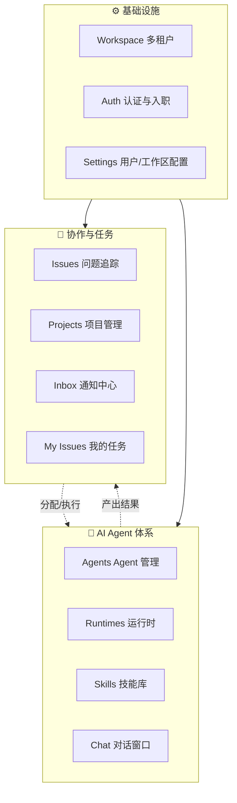

### 1.2 核心功能速览表

| #   | 功能                  | 一句话描述                                            | 面向用户             | 入口路由     |
| --- | --------------------- | ----------------------------------------------------- | -------------------- | ------------ |
| 1   | **Issues**            | 问题/任务的创建、追踪、状态流转，支持列表与看板视图   | 人类 & Agent         | `/issues`    |
| 2   | **Projects**          | 将 Issues 聚合为项目，按里程碑管理                    | 人类                 | `/projects`  |
| 3   | **Inbox**             | 聚合所有与我相关的事件（分配、@、Agent 完成等）       | 人类                 | `/inbox`     |
| 4   | **My Issues**         | 快速访问分配给自己的所有任务                          | 人类                 | `/my-issues` |
| 5   | **Agents**            | 创建和管理 AI Agent：配置模型、技能、指令、查看历史   | 人类配置，Agent 执行 | `/agents`    |
| 6   | **Runtimes**          | 管理 Agent 的运行时（本地 daemon / 云端模型）         | 管理员               | `/runtimes`  |
| 7   | **Skills**            | 自定义 Agent 可调用的工具能力（如 read_file、deploy） | 管理员               | `/skills`    |
| 8   | **Settings**          | 用户档案、外观、API Token、工作区、成员、仓库         | 所有人               | `/settings`  |
| ＋  | **Auth / Onboarding** | 登录、注册、OAuth、首次引导                           | 所有人               | `/auth/*`    |
| ＋  | **Command Palette**   | 全局搜索 + 快捷动作（⌘K）                             | 所有人               | 悬浮         |
| ＋  | **Chat**              | 浮窗与 Agent 即时对话                                 | 所有人               | 悬浮         |

### 1.3 人机协作主流程

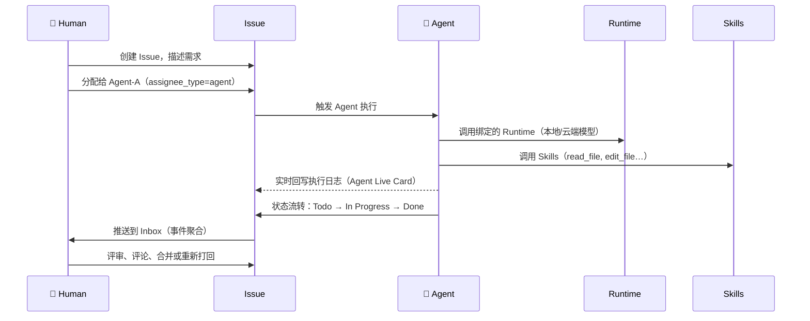

### 1.4 概念数据模型（ER 简图）

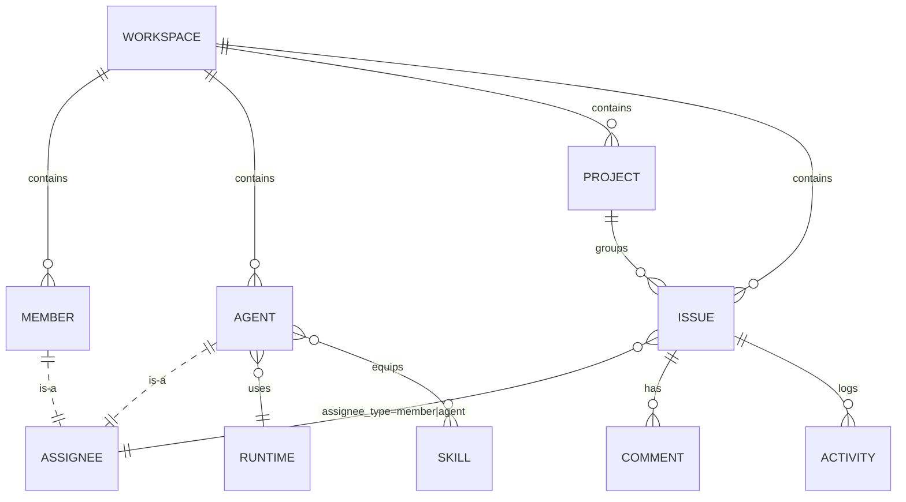

> **关键点**：`ASSIGNEE` 是多态的 —— Member 与 Agent 共享同一个负责人字段，这是 Multica 让 AI 成为一等公民的根本机制。

---

## 二、整体布局（App Shell）

- **三栏架构**：左侧边栏（Sidebar）+ 顶部条（Topbar）+ 主内容区。
- **核心文件**
  - 侧边栏 `packages/views/layout/app-sidebar.tsx`
  - Web 根布局 `apps/web/app/(dashboard)/layout.tsx`
  - Desktop 根布局 `apps/desktop/src/renderer/src/components/desktop-layout.tsx`

### 线框图（以 Desktop 实际形态为准）

```
┌──────────────────────────────────────────────────────────────────────────┐
│ 🟢🟡🔴 │ BRU-12: 111 │ Issues │ +                                       │  ← 标签栏（Desktop 多 Tab）
├──────────────────┬───────────────────────────────────────────────────────┤
│ ▼ bruce-code     │  bruce-code › Issues                                  │  ← 面包屑
│ 🔍 Search   ⌘K   │  [ All │ Members │ Agents ]                           │  ← 视图 Scope
│ [+ New Issue] C  │ ┌─────────┬────────┬──────────┬──────────┬──────────┐ │
│ ──────────────── │ │ Backlog │  Todo  │ InProgress│ InReview │   Done   │ │
│  📥 Inbox    (2) │ │   4     │   2    │    0     │    2     │    3     │ │
│  ⭐ My Issues    │ ├─────────┼────────┼──────────┼──────────┼──────────┤ │
│ Pinned           │ │ BRU-12  │ BRU-10 │          │ BRU-11   │ BRU-6    │ │
│  📌 BRU-12 111   │ │ 111     │ test1  │ No issues│ 宣告一下…│ 测试     │ │
│ ──────────────── │ │ BRU-4   │ BRU-9  │          │ BRU-8    │ BRU-5    │ │
│ Workspace        │ │ Invite… │ test   │          │ 数据分析 │ 上海天气 │ │
│  ≡ Issues        │ │ BRU-3   │        │          │          │ BRU-1    │ │
│  ◈ Projects      │ │ Create… │        │          │          │ Say hi…  │ │
│  🤖 Agents       │ │ BRU-2   │        │          │          │          │ │
│ ──────────────── │ │ Setup…  │        │          │          │          │ │
│ Configure        │ └─────────┴────────┴──────────┴──────────┴──────────┘ │
│  ⚙ Runtimes  •   │                                                       │
│  🧩 Skills       │                                                       │
│  🛠 Settings     │                                                       │
├──────────────────┤                                                       │
│ 👤 85089081      │                                                       │
│   …@qq.com   ⋯   │                                                       │
└──────────────────┴───────────────────────────────────────────────────────┘
      Sidebar                            Main Area（当前为 Issues 看板视图）
```

**关键校正**

- Desktop 顶部是**多 Tab 标签栏**（非单独的 Topbar 面包屑），每个 Tab 对应一个独立导航栈。
- 面包屑（`bruce-code › Issues`）位于主内容区顶部，**不在**侧边栏上方。
- 侧边栏分组**没有 "Personal" 标题**，Inbox / My Issues 直接置于 Workspace 切换器之后；依次是 **Pinned → Workspace → Configure**。
- 搜索框是侧边栏内的独立行（`🔍 Search ⌘K`），不是顶部浮动。
- Footer 展示**用户名 + 邮箱**两行，尾随 `⋯` 菜单按钮。

### 端差异（Mermaid）

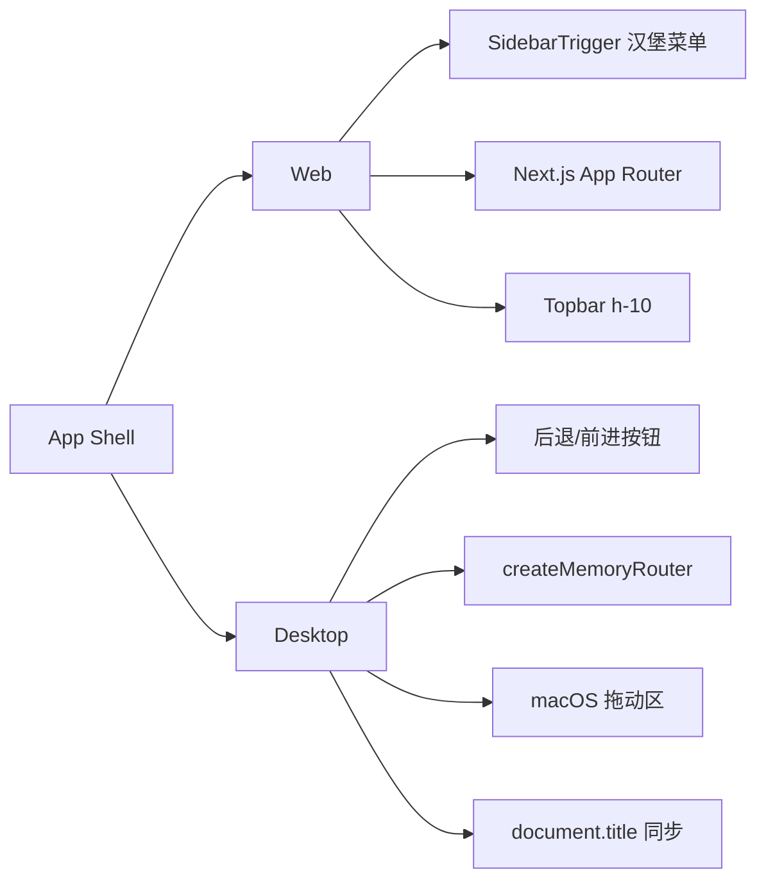

---

## 三、侧边栏（Sidebar）

### 结构线框图

```
┌─────────────────────────┐
│ ▼ Acme Workspace    ⇅   │ ← Header：工作区切换 + 搜索插槽
│ [ + New Issue    C ]    │ ← 新建（快捷键 C）
├─────────────────────────┤
│ Personal                │
│   📥 Inbox        ( 3 ) │ ← 未读计数
│   ⭐ My Issues          │
├─────────────────────────┤
│ Workspace               │
│   ≡ Issues              │ ← 可拖拽置顶
│   ◈ Projects            │
│   🤖 Agents             │
├─────────────────────────┤
│ Configure               │
│   ⚙ Runtimes       •    │ ← 更新指示点
│   🧩 Skills             │
│   🛠 Settings           │
├─────────────────────────┤
│ 📌 Pinned (可拖排序)    │
│   • Issue #42           │
│   • Project Alpha       │
├─────────────────────────┤
│ 👤 me@acme.com      ⋮   │ ← Footer 用户菜单
└─────────────────────────┘
```

### 导航分组与菜单（Mermaid 树状）

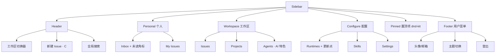

---

## 四、顶部栏（Topbar）

```
Web 端：
┌─────────────────────────────────────────────────────────────┐
│ ☰   Issues / #123 Fix login bug                  🔍  🔔    │
└─────────────────────────────────────────────────────────────┘

Desktop 端：
┌─────────────────────────────────────────────────────────────┐
│ 🟢🟡🔴  [◀][▶]  Issues — Acme Workspace            [— □ ✕] │
│ └ macOS 按钮    └ 前进后退        └ title 同步  └ 拖拽区   │
└─────────────────────────────────────────────────────────────┘
```

---

## 五、核心功能模块（详解）

### 1. 认证与入职（Auth & Onboarding）

#### 流程图

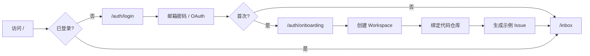

#### 子功能

- `/auth/login` 邮箱密码 + OAuth
- 邮件验证码（60s 重发冷却）
- `/auth/callback` OAuth 回调
- `/auth/onboarding` 创建首个工作区、绑定仓库、生成示例 Issue

---

### 2. 问题管理（Issues）

#### 列表页线框

```
┌─────────────────────────────────────────────────────────────┐
│ Issues                        [ List | Board ]   + New      │
│ Filter: [Status▼][Priority▼][Assignee▼][Project▼]  Scope:   │
│                                                 All/Mem/Agt │
├─────────────────────────────────────────────────────────────┤
│ ○  Todo    #101  Fix login redirect   🤖 Agent-A  P1  2h    │
│ ◐  Doing   #102  Refactor sidebar     👤 Alice    P2  1d    │
│ ●  Done    #103  Add billing docs     👤 Bob      P3  3d    │
└─────────────────────────────────────────────────────────────┘
```

#### 看板视图

```
┌────────────┬────────────┬────────────┬────────────┐
│  Backlog   │   Todo     │  In Prog   │    Done    │
├────────────┼────────────┼────────────┼────────────┤
│ #201 Doc   │ #101 Login │ #102 Side  │ #103 Bill  │
│ #204 …     │ #105 …     │ 🤖 #108 …  │ #99 …      │
│            │            │            │            │
└────────────┴────────────┴────────────┴────────────┘
         ↑ 拖拽切换状态
```

#### 详情页（AI 特色）

```
┌───────────────────────────────────────────────────────────┐
│  #101 Fix login redirect                      [Todo ▼]    │
│  Assignee: 🤖 Agent-A     Priority: P1    Project: Web    │
├───────────────────────────────────────────────────────────┤
│ ╭──── 🤖 Agent Live Card ─────────────────────────────╮  │ ← sticky
│ │ Agent-A · Running · ⏱ 00:02:34                 ⏹ ⛶  │  │
│ │ ▸ tool_call: read_file src/auth/login.ts           │  │
│ │ ▸ thinking: Looking at the redirect chain…         │  │
│ │ ▸ tool_call: edit_file src/auth/login.ts           │  │
│ ╰─────────────────────────────────────────────────────╯  │
│                                                           │
│ Description (Markdown 富文本)                             │
│  When user logs in, they are redirected to /…             │
│                                                           │
│ Activity                                                  │
│  • Alice created this issue · 2h ago                      │
│  • Agent-A assigned · 1h ago                              │
│  • Agent-A started run · 5m ago  [view transcript]        │
│                                                           │
│ Comments  [ Write… ]                                      │
└───────────────────────────────────────────────────────────┘
```

#### 子功能

- 列表 / 看板切换
- 多维筛选（状态、优先级、负责人、创建者、项目、标签）
- Scope：All / Members / Agents
- Agent 实时卡片：耗时、日志、Stop、全屏转录、多 Agent 并发
- 执行历史回放
- 快速创建模态框（`create-issue`），支持项目预填、Agent 直接分配

---

### 3. 项目管理（Projects）

```
┌─────────────────────────────────────────────────────────┐
│ Projects                                       + New    │
├─────────────────────────────────────────────────────────┤
│ ◈ Project Alpha     Lead: Alice   12 issues   ████░ 60% │
│ ◈ Project Beta      Lead: Bob      7 issues   ██░░░ 30% │
│ ◈ Project Gamma     Lead: 🤖 Agt   3 issues   █████ 95% │
└─────────────────────────────────────────────────────────┘
         ↓ 点击进入详情
┌─────────────────────────────────────────────────────────┐
│ ◈ Project Alpha                                         │
│ Description … Status … Lead …                           │
│ ─── Sub-Issues ───────────────────────────────────────  │
│ ○ #101  ◐ #102  ● #103 …                                │
└─────────────────────────────────────────────────────────┘
```

---

### 4. 收件箱（Inbox）

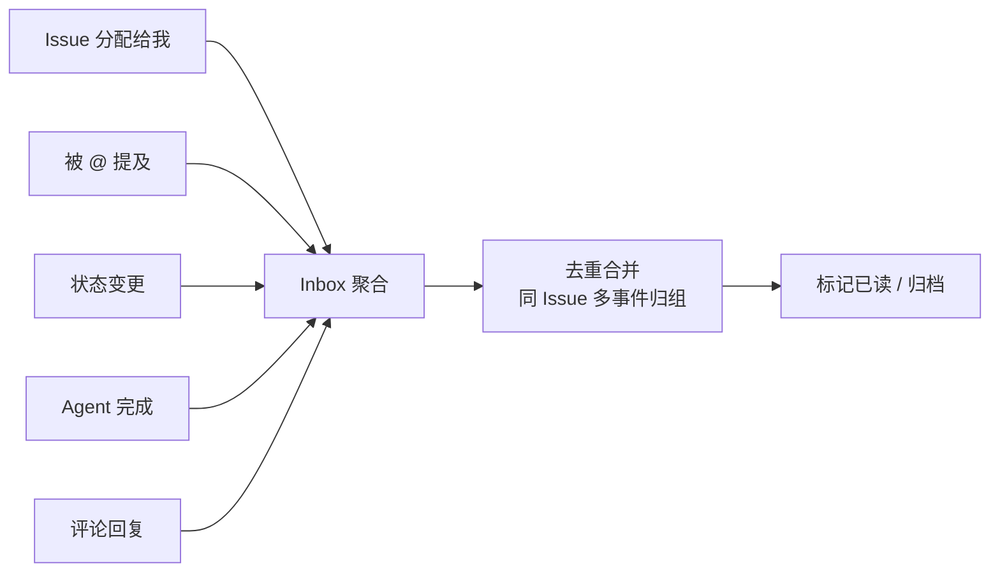

```
┌─────────────────────────────────────────────────────────┐
│ Inbox                                     [Unread | All] │
├─────────────────────────────────────────────────────────┤
│ ● #101 Fix login   Agent-A finished · 3 events     2m   │
│ ● #102 Refactor    @you mentioned by Alice         1h   │
│ ○ #103 Billing     Status Done → Archived          2d   │
└─────────────────────────────────────────────────────────┘
```

---

### 5. My Issues

- 仅展示 `assignee = currentUser` 的 Issues
- 复用 Issues 列表组件 + 预设筛选

---

### 6. Agents（AI Agent 管理）

#### 双面板布局

```
┌─────────────────┬─────────────────────────────────────────┐
│ Agents   + New  │  Agent-A · online                   ⚙   │
│ [✓] show archv. │  Runtime: local-daemon  Model: sonnet   │
├─────────────────┼─────────────────────────────────────────┤
│ 🤖 Agent-A  ●   │  ┌ Settings │ Skills │ Tasks │ Instr. ┐│
│ 🤖 Agent-B      │  │                                     ││
│ 🤖 Agent-C  📦  │  │  Instructions (System Prompt)       ││
│                 │  │  You are a senior engineer who …    ││
│                 │  │                                     ││
│                 │  │  Skills (✓ = enabled)               ││
│                 │  │  [✓] read_file   [✓] edit_file      ││
│                 │  │  [ ] deploy      [✓] grep_search    ││
│                 │  └─────────────────────────────────────┘│
└─────────────────┴─────────────────────────────────────────┘
     可拖动分割条 ↔
```

#### 子功能

- 创建 / 存档 / 恢复（含存档过滤）
- 四 Tab：Settings / Skills / Tasks / Instructions
- 骨架屏加载态
- 任务历史 + 执行日志回放

---

### 7. Runtimes（运行时）

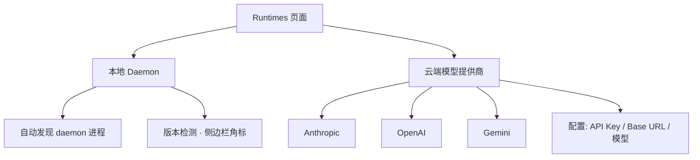

---

### 8. Skills（技能库）

```
┌──────────────────────────────────────────────────────┐
│ Skills                                    + New      │
├──────────────────────────────────────────────────────┤
│ 🧩 read_file       内置   Read files from workspace  │
│ 🧩 edit_file       内置   Edit files with patch       │
│ 🧩 deploy          自定义 Deploy to staging           │
│ 🧩 query_db        自定义 Run SQL against replica     │
└──────────────────────────────────────────────────────┘
         ↓ 编辑
┌──────────────────────────────────────────────────────┐
│ Skill: deploy                                        │
│ Description: Deploy to staging                       │
│ Trigger: when issue has label "deploy"               │
│ Parameters Schema (JSON):                            │
│ { "env": "string", "tag": "string" }                 │
└──────────────────────────────────────────────────────┘
```

---

### 9. Settings

#### 布局

```
┌─────────────────┬──────────────────────────────────────┐
│ MY ACCOUNT      │                                      │
│  👤 Profile     │  Profile                             │
│  🎨 Appearance  │  ─ Avatar  [Upload]                  │
│  🔑 API Tokens  │  ─ Name    [ Bruce        ]          │
│                 │  ─ Email     bruce@acme.com          │
│ ACME WORKSPACE  │                                      │
│  ⚙ General      │                                      │
│  📁 Repos       │                                      │
│  👥 Members     │                                      │
└─────────────────┴──────────────────────────────────────┘
    w-52 导航             max-w-3xl 内容
```

#### 子功能树

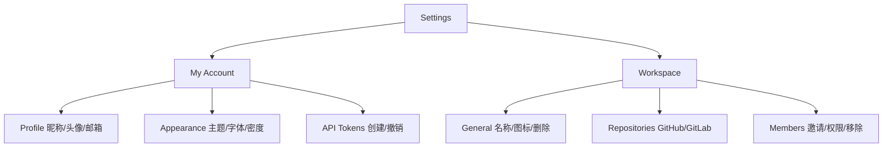

---

### 10. 着陆页（Landing · 仅 Web）

```
┌─────────────────────────────────────────────────────┐
│  Multica — AI-native task management                │
│  [ Get started ]   [ About ]   [ Changelog ]        │
└─────────────────────────────────────────────────────┘
```

- `/` 首页 · `/about` 关于 · `/changelog` 更新日志

---

## 六、跨模块共享功能

### 1. 全局搜索（Command Palette）

```
┌───────────────────────────────────────┐
│ 🔍  Search or run command…      ⌘K   │
├───────────────────────────────────────┤
│ Issues                                │
│   #101  Fix login redirect            │
│   #102  Refactor sidebar              │
│ Projects                              │
│   ◈ Project Alpha                     │
│ Agents                                │
│   🤖 Agent-A                          │
│ Actions                               │
│   + Create issue                      │
│   ⇅ Switch workspace                  │
└───────────────────────────────────────┘
```

### 2. 模态框注册表

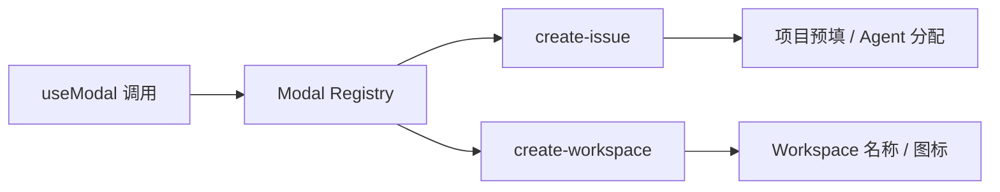

### 3. 编辑器（Rich Text / Markdown）

- 用于 Issue 描述、评论、Agent Instructions

### 4. 聊天悬浮窗（Chat）

```
                               ┌─────────────────────┐
                               │ 🤖 Chat with Agent-A │
                               ├─────────────────────┤
           浮在右下角 → 展开 → │ You: rerun last task│
                               │ Agent: on it …      │
                               │ [ type a message ]  │
                               └─────────────────────┘
```

### 5. 导航适配层

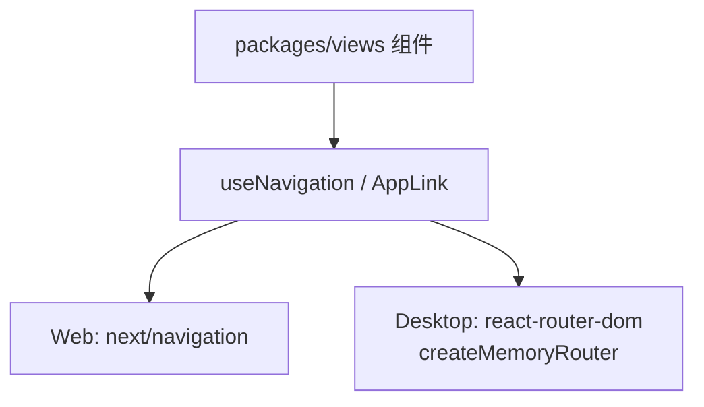

---

## 七、AI-Native 差异化特性总览

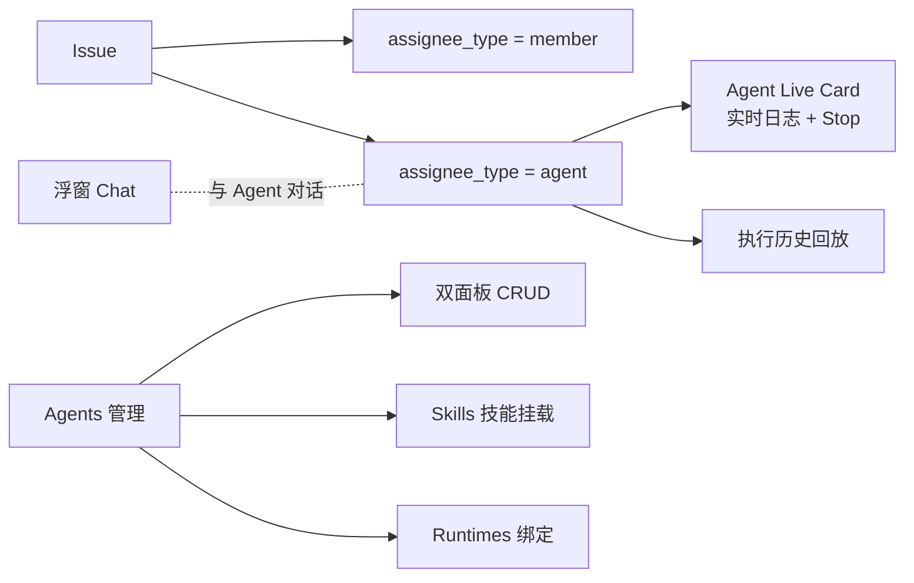

| 特性                 | 呈现位置             | 说明                                   |
| -------------------- | -------------------- | -------------------------------------- |
| Agent 作为一等负责人 | Issue 分配器、筛选器 | `assignee_type = agent` 与 member 并列 |
| Agent 实时执行卡片   | Issue 详情页         | 实时日志、耗时、Stop、转录             |
| Agents 管理台        | `/agents`            | 双面板 CRUD + 技能 + 任务历史          |
| Runtimes 配置        | `/runtimes`          | 本地 daemon / 云端模型统一管理         |
| Skills 技能库        | `/skills`            | 可复用技能挂载到 Agent                 |
| Chat 悬浮对话        | 全局浮窗             | 随时与 Agent 交互                      |

---

## 八、页面路由速查表

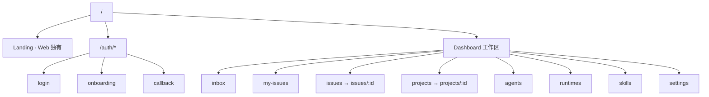

| 路由                      | 模块      | 类型   |
| ------------------------- | --------- | ------ |
| `/auth/login`             | Auth      | 公共   |
| `/auth/onboarding`        | Auth      | 公共   |
| `/auth/callback`          | Auth      | 公共   |
| `/inbox`                  | Inbox     | 工作区 |
| `/my-issues`              | My Issues | 工作区 |
| `/issues`                 | Issues    | 工作区 |
| `/issues/[id]`            | Issues    | 工作区 |
| `/projects`               | Projects  | 工作区 |
| `/projects/[id]`          | Projects  | 工作区 |
| `/agents`                 | Agents    | 工作区 |
| `/runtimes`               | Runtimes  | 工作区 |
| `/skills`                 | Skills    | 工作区 |
| `/settings`               | Settings  | 工作区 |
| `/` `/about` `/changelog` | Landing   | 仅 Web |
