# Plane UI 功能层次梳理

> 按「产品定位 → 核心功能全景 → 整体布局 → 模块细节」的层次组织，覆盖 Cloud / 自托管（Community Edition）双形态统一 UI。
> 每章均附 ASCII 线框图 / Mermaid 图表辅助理解。
> 参考版本：Plane v1.3.0 · 最后更新 2026-04-15

---

## 〇、产品定位（Product Overview）

**Plane 是一个开源全能型项目管理平台** —— 对标 Jira，但把 "单一 Work Item + 三轴正交组织" 作为心智模型，用 Modules / Cycles / Epics 三种容器替代 Jira 的多层 Issue Type。面向 5–200 人的软件研发与产品团队。

### 与 Jira / Linear / Notion 的核心差异

| 维度     | Jira                                                 | Linear               | Notion                   | **Plane**                                         |
| -------- | ---------------------------------------------------- | -------------------- | ------------------------ | ------------------------------------------------- |
| 任务层级 | 多 Issue Type 树形（Epic → Story → Task → Sub-task） | 单一 Issue + Project | 平铺 Page / Database Row | **单一 Work Item + 可选 parent**                  |
| 类型系统 | 硬编码 Issue Types                                   | 有限类型             | Database 自定义          | **Work Item Types 🔒 Pro+**（选填标签）           |
| 时间维度 | Sprint                                               | Cycle                | ❌                       | **Cycle**（免费即有）                             |
| 子项目   | Component                                            | ❌                   | Subpage                  | **Module**（免费即有）                            |
| 长期主题 | Epic                                                 | Project              | ❌                       | **Epic 🔒 Pro+**                                  |
| 文档能力 | 需 Confluence 另购                                   | Docs（弱）           | ⭐ 核心                  | **Pages + Wiki**（内置）                          |
| 自动化   | 成熟                                                 | Triage 规则          | 按钮 + 公式              | **Automations 🔒 Pro+**                           |
| 部署形态 | SaaS / DC                                            | SaaS                 | SaaS                     | **开源 CE + SaaS + 商业自托管**                   |
| 定价模式 | 按用户月付                                           | 按用户月付           | 按用户月付               | **Free + One 买断 + Pro / Business / Enterprise** |

---

## 一、核心功能全景（Feature Map）

Plane 共 **10 大核心模块 + 5 类基础能力**，按作用域聚类：

### 1.1 能力层次总览

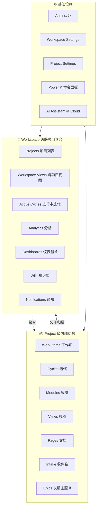

### 1.2 核心功能速览表

| #   | 功能                              | 一句话描述                                   | 面向用户     | 入口路由                      | 档位          |
| --- | --------------------------------- | -------------------------------------------- | ------------ | ----------------------------- | ------------- |
| 1   | **Home**                          | 工作区首页，聚合最近项目、我的任务、Stickies | 所有         | `/<ws>/`                      | Free          |
| 2   | **Projects**                      | 所有项目列表（Grid / List / By State）       | 所有         | `/<ws>/projects`              | Free          |
| 3   | **Work Items**                    | 任务核心，5 种 Layout，父子无限嵌套          | 所有         | `/<ws>/projects/<id>/issues`  | Free          |
| 4   | **Cycles**                        | 时间盒迭代（Scrum Sprint）                   | 所有         | `/<ws>/projects/<id>/cycles`  | Free          |
| 5   | **Modules**                       | 功能模块 / 子方向聚合                        | 所有         | `/<ws>/projects/<id>/modules` | Free          |
| 6   | **Views**                         | 保存的筛选+排序+Layout 组合                  | 所有         | `/<ws>/projects/<id>/views`   | Free          |
| 7   | **Pages**                         | 项目级 Notion 风富文本文档                   | 所有         | `/<ws>/projects/<id>/pages`   | Free          |
| 8   | **Intake**                        | 外部提单收件箱                               | Admin/Member | `/<ws>/projects/<id>/intake`  | Free          |
| 9   | **Epics**                         | 跨 Cycle/Module 长期主题                     | 所有         | `/<ws>/projects/<id>/epics`   | 🔒 Pro+       |
| 10  | **Wiki**                          | 工作区级独立知识库                           | 所有         | `/<ws>/` (A 栏 📘)            | 🔒 One+       |
| 11  | **Dashboards**                    | 自定义 Widget 仪表盘                         | 所有         | `/<ws>/dashboards`            | 🔒 Pro+       |
| 12  | **Analytics**                     | 工作区级图表分析                             | 所有         | `/<ws>/analytics`             | Free          |
| 13  | **Active Cycles**                 | 所有进行中迭代总览                           | 所有         | `/<ws>/active-cycles`         | 🔒 One+       |
| 14  | **Notifications**                 | 通知中心                                     | 所有         | `/<ws>/notifications`         | Free          |
| 15  | **AI Assistant**                  | 对话式 AI 助手                               | 所有         | A 栏 ✨                       | 🌐 Cloud only |
| ＋  | **Power K**                       | ⌘K 全局命令面板                              | 所有         | 悬浮                          | Free          |
| ＋  | **Settings**                      | 工作区 / 项目两级设置                        | Admin        | `/<ws>/settings/*`            | Free          |
| ＋  | **Your work / Drafts / Stickies** | 个人视图                                     | 所有         | `/<ws>/profile` 等            | Free          |

### 1.3 人机协作主流程

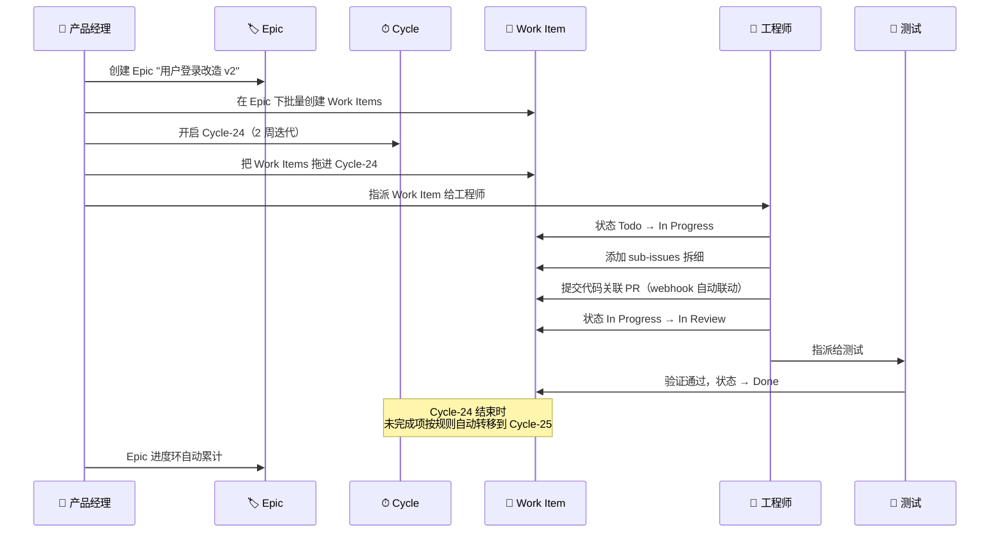

### 1.4 概念数据模型（ER 简图）

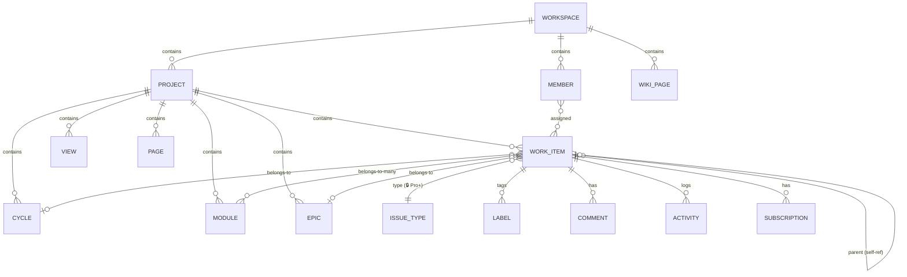

> **关键点 1**：`WORK_ITEM.parent` 是自引用外键，无硬编码深度限制，代替 Jira 的 Issue Type 树。
> **关键点 2**：`Cycle / Module / Epic` 是三个**正交的容器**，一个 Work Item 可同时属于多个，这是与 Jira 最大的差异。
> **关键点 3**：`ISSUE_TYPE` 是可选标签（Pro+ 才启用），不是强制层级分类。

---

## 二、整体布局（App Shell）

- **三列架构**：A 栏（App Rail）+ B 栏（Sidebar）+ C 栏（Main）。
- **核心路由**
  - 根布局 `apps/web/app/(all)/[workspaceSlug]/layout.tsx`
  - 项目布局 `apps/web/app/(all)/[workspaceSlug]/(projects)/`
  - 设置布局 `apps/web/app/(all)/[workspaceSlug]/(settings)/`
  - 侧栏 `apps/web/core/components/workspace/sidebar/`
  - App Rail `apps/web/core/components/app-rail/`

### 2.1 Web 线框图（以 Cloud Business trial 为准）

```
┌─────┬──────────────────────────┬────────────────────────────────────────┐
│     │                          │ ≡ │ my-ws › my-proj › Work items   🔔 ?│  ← 顶部 Header
│     │  my-workspace ▾    ⚙    │───┼────────────────────────────────────│
│  📦 │  [+ New work item   C]   │ [🔍 Filter] [🎛 Display] │ 📃▦📅📊▥│  ← C 栏顶部工具
│     │                          │                                        │
│  📘 │  🏠 Home                 │ ┌────────────────────────────────────┐ │
│     │  ✏️ Drafts          ⓪   │ │                                    │ │
│  ✨ │  👤 Your work            │ │                                    │ │
│     │  📌 Stickies             │ │       内容主区                     │ │
│  ⚙  │                          │ │    (列表 / 详情 / 编辑)            │ │
│     │  ─ Workspace ──          │ │                                    │ │
│     │  🗂 Projects             │ │                                    │ │
│     │  ···  More   ▸           │ │                                    │ │
│     │                          │ │                                    │ │
│     │  ─ Favorites ──          │ │                                    │ │
│     │  👉 my-ws123             │ │                                    │ │
│     │                          │ │                                    │ │
│     │  ─ Projects ── ▾         │ │                                    │ │
│     │  ▾ my-proj               │ │                                    │ │
│     │    📊 Overview           │ │                                    │ │
│     │    🎯 Work items         │ │                                    │ │
│     │    ⏱ Cycles             │ │                                    │ │
│     │    🧩 Modules            │ │                                    │ │
│     │    👁 Views              │ │                                    │ │
│     │    📄 Pages              │ └────────────────────────────────────┘ │
│     │                          │                                        │
│     │  ─ Try ── ▾              │                                        │
│     │  🐙 Connect GitHub       │                                        │
│     │  💬 Connect Slack        │                                        │
│     │  ✨ Try Plane AI         │                                        │
│     │                          │                                        │
│ 👤  │ ╔════════════════════╗   │                                        │
│     │ ║ Business trial 13d ║   │                                        │
│     │ ╚════════════════════╝   │                                        │
└─────┴──────────────────────────┴────────────────────────────────────────┘
 A 栏          B 栏 (Sidebar)                C 栏 (Main Area)
```

**关键要点**

- A 栏**永远可见**（4 个模式图标），切换后 B 栏完全换内容
- B 栏顶部永远是 **Workspace 切换器**，底部永远是 **Trial 徽标 / 用户头像**
- C 栏顶部永远是 **面包屑 + 全局工具（搜索、通知、帮助、头像）**
- 项目导航内嵌在 B 栏的 "Projects" 展开区（不是独立页面）
- Features 开关决定项目导航项是否显示（新建项目默认只有 5 项）

### 2.2 形态差异（Cloud vs 自托管 CE）

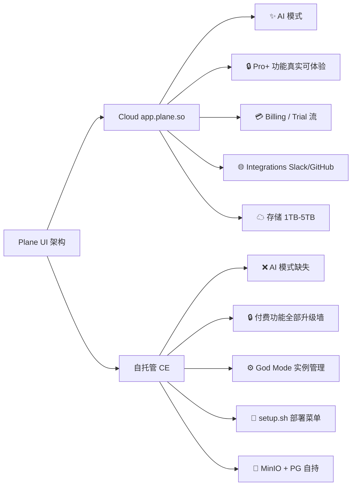

---

## 三、侧边栏（B 栏 Sidebar）

### 3.1 Projects 模式下的结构线框图

```
┌─────────────────────────────────┐
│ ▼ my-workspace       ⚙ ▭       │ ← Header：工作区切换 + 折叠按钮
│                                 │
│ ┌─────────────────────────────┐ │
│ │ ➕ New work item            │ │ ← 全局创建按钮（快捷键 C）
│ └─────────────────────────────┘ │
├─────────────────────────────────┤
│ 🏠 Home                         │
│ ✏️ Drafts                ⓪    │ ← 主入口（始终可见）
│ 👤 Your work                    │
│ 📌 Stickies                     │
├─────────────────────────────────┤
│ ─ Workspace ──                  │
│ 🗂 Projects                     │ ← 所有项目列表
│ ··· More                    ▸   │ ← 展开 5 项（§3.3）
├─────────────────────────────────┤
│ ─ Favorites ──  (拖拽排序)       │
│ ⭐ my-ws123                     │
├─────────────────────────────────┤
│ ─ Projects ── ▾                 │
│ ▾ my-proj                       │
│   📊 Overview                   │
│   🎯 Work items                 │
│   ⏱ Cycles                    │ ← 项目内导航（§3.4）
│   🧩 Modules                    │   (Features 开关控制显示)
│   👁 Views                      │
│   📄 Pages                      │
│   📥 Intake                     │
│   🏷 Epics              🔒      │
│ ▸ another-project               │
├─────────────────────────────────┤
│ ─ Try ── ▾                      │
│ 🐙 Connect GitHub               │
│ 💬 Connect Slack                │ ← CTA（可关闭）
│ ✨ Try Plane AI                 │
├─────────────────────────────────┤
│ ╔═══════════════════════════╗   │
│ ║ Business trial ends 13d   ║   │ ← 试用徽标
│ ╚═══════════════════════════╝   │
└─────────────────────────────────┘
```

### 3.2 导航分组与菜单树

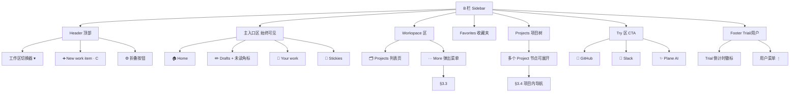

### 3.3 Workspace More 弹出菜单

```
              ┌─────────────────────────┐
  ··· More →  │  👁 Views              │  → /<ws>/workspace-views
              │  ⏱ Cycles             │  → /<ws>/active-cycles  🔒
              │  📈 Analytics         │  → /<ws>/analytics
              │  🗄 Archives          │  → /<ws>/archives
              │  📊 Dashboards    🔒  │  → /<ws>/dashboards
              └─────────────────────────┘
```

### 3.4 Project 内导航树

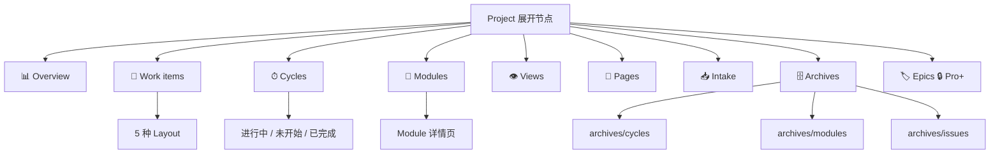

---

## 四、顶部栏（C 栏 Header）

Plane 的顶部栏不是平台差异（Web / Desktop），而是**页面场景差异**。以 Work Items 列表页 vs 详情页的对比最典型：

### 4.1 列表页顶栏

```
┌─────────────────────────────────────────────────────────────────────────────┐
│ ≡ │ my-ws › my-proj › Work items                   🔍 ⌘K │ 🔔 │ ? │ 👤 ▾   │
├───┼─────────────────────────────────────────────────────┴────┴───┴──────────┤
│   │ 🎯 Work items                                              [ ➕ New ]   │
├───┼──────────────────────────────────────────────────────────────────────────┤
│   │ [🔍 Filter ▾] [🎛 Display ▾] │ 📃 ▦ 📅 📊 ▥ │ [💾 Views ▾] │ ⚡ Bulk │
│   │                               ↑ Layout 切换 ↑                           │
└───┴──────────────────────────────────────────────────────────────────────────┘
  侧栏折叠             面包屑                         搜索 通知 帮助 头像
```

### 4.2 详情页顶栏

```
┌─────────────────────────────────────────────────────────────────────────────┐
│ ≡ │ my-ws › my-proj › Work items › MY123-12         🔍 ⌘K │ 🔔 │ ? │ 👤 ▾   │
├───┼─────────────────────────────────────────────────────┴────┴───┴──────────┤
│   │ ← Back  │ MY123-12    [🔗 copy] [⭐ subscribe] [📌 pin] [··· more ▾]    │
│   │                                                     │                   │
│   │                                                     ├─ 📤 Move to       │
│   │                                                     ├─ 🗄 Archive      │
│   │                                                     ├─ 📋 Duplicate    │
│   │                                                     └─ 🗑 Delete       │
└───┴──────────────────────────────────────────────────────────────────────────┘
```

### 4.3 全局 Header 元素说明

| 元素              | 作用                           | 快捷键          |
| ----------------- | ------------------------------ | --------------- |
| ≡ 折叠按钮        | 收起/展开 B 栏                 | -               |
| 面包屑            | 当前页层级路径（可点跳转上级） | -               |
| 🔍 搜索 / Power K | 全局命令面板                   | `⌘K` / `Ctrl+K` |
| 🔔 Notifications  | 通知中心                       | -               |
| ? 帮助            | 快捷键 / 文档链接              | `?`             |
| 👤 头像           | 个人菜单（设置、主题、登出）   | -               |

---

## 五、核心功能模块（详解）

### 5.1 认证与入职（Auth & Onboarding）

#### 流程图

```mermaid
flowchart LR
    A[访问 /] --> B{已登录?}
    B -->|否| C[/auth/sign-in]
    C --> D[邮箱密码 / Magic Link / OAuth]
    D --> Sm{SMTP 已配置?}
    Sm -->|是| EM[Magic Link 可用]
    Sm -->|否| PW[仅密码可用]
    D --> E{首次?}
    E -->|是| F[Onboarding 向导]
    F --> F1[Create Workspace<br/>名/slug/logo]
    F1 --> F2[邀请成员<br/>或跳过]
    F2 --> F3[选择模板<br/>或空白]
    F3 --> H[/<ws>/]
    E -->|否| H
    B -->|是| H
```

#### 子功能

- `/auth/sign-in` 邮箱 + 密码 / Magic Link / OAuth（Google / GitHub / GitLab / Gitea）
- `/auth/sign-up` 注册（自托管可在 God Mode 禁用）
- SSO（SAML / OIDC）🔒 One+
- 2FA + Passkeys 🔒 Pro+
- Domain Whitelist 🔒 Pro+
- Onboarding 向导：创建 Workspace → 邀请成员 → 选模板 → 进入首页
- **God Mode** 实例管理（自托管专属）：`/god-mode/` 配置 SMTP / OAuth / 登录策略

---

### 5.2 Projects 项目列表

#### 线框图

```
┌────────────────────────────────────────────────────────────────┐
│ 🗂 Projects                [Grid ▦][List 📃][By State 📊]  + │
│ Filter: [Lead ▾] [State ▾] [Archived ☐]                        │
├────────────────────────────────────────────────────────────────┤
│  ┌──────────────┐  ┌──────────────┐  ┌──────────────┐          │
│  │ 🟢 my-proj   │  │ 🟡 beta-proj │  │ 🔴 legacy    │          │
│  │ 32 items     │  │ 18 items     │  │ 120 items    │          │
│  │ Lead: Alice  │  │ Lead: Bob    │  │ Lead: Carol  │          │
│  │ ████░░ 60%   │  │ ██░░░░ 30%   │  │ █████░ 85%   │          │
│  │ State: On Tr │  │ State: At Ri │  │ State: Done  │          │
│  │ 👥 5 members │  │ 👥 3 members │  │ 👥 8 members │          │
│  └──────────────┘  └──────────────┘  └──────────────┘          │
└────────────────────────────────────────────────────────────────┘
```

#### 子功能

- 三种 Layout：Grid（卡片）/ List（行）/ By State 🔒 Pro+（状态看板）
- 可见性 🔒 Pro+：Public / Private / Secret
- 归档 Project（移到 Archives）
- 创建项目向导：名/identifier/logo/cover/可见性/Features 开关/Template 🔒 Business+

---

### 5.3 Work Items 工作项（核心）

#### 详情页三列布局（AI-native Plane 也用 AI Draft）

```
┌──────────────────────────────┬───────────────────────────────────────────┐
│ ← Work items › MY123-12      │ ▶ Properties                              │
│                              │                                           │
│ # MY123-12  [Type: Story🔒]  │   State       [ In Progress ▾ ]          │
│ ═══════════════════════════  │   Assignees   [ @John @Mary + ]          │
│ 改造登录流程                 │   Priority    [ High ▾ ]                 │
│                              │   Start date  [ 2026-04-15 ]             │
│ ─ Description ─              │   Due date    [ 2026-05-01 ]             │
│ /  slash commands            │   Cycle       [ Cycle-24 ▾ ]             │
│ (富文本 + work item embed    │   Module      [ Auth ▾ ]                 │
│  + code + image + database🔒)│   Estimate    [ 5 pt ]                   │
│                              │   Parent      [ EPIC-1 改造 auth 🔒 ]    │
│ ─ Sub-issues (3) ── ➕      │   Labels      [ bug ] [ frontend ]       │
│ [ ] MY123-13 拆 UI           │   Type 🔒     [ Story ▾ ]                │
│ [✓] MY123-14 后端接口        │   Custom 🔒   (任意用户字段)             │
│                              │   Time 🔒     [ 2h 30m  ▶ Start ]        │
│ ─ Links ── ➕                │   ─── 元信息 ───                         │
│ 🔗 PRD doc                   │   Created by  @Alice, 2d ago             │
│                              │   Updated     1h ago                     │
│ ─ Attachments ── ➕          │                                           │
│ 📎 design.fig                │                                           │
│                              │                                           │
│ ─ Linked Pages ── ➕         │                                           │
│ 📄 登录改造 RFC              │                                           │
│                              │                                           │
│ ─ Relations ── ➕            │                                           │
│ ⛔ Blocks: MY123-20           │                                           │
│ 🔗 Relates: MY123-8          │                                           │
│                              │                                           │
│ ╭ Activity │ Comments(4) ╮   │                                           │
│ │ @Alice created · 2d     │   │                                           │
│ │ @John state → Todo      │   │                                           │
│ │ @Mary added sub-issue   │   │                                           │
│ │ 💬 评论区 + reactions   │   │                                           │
│ ╰────────────────────────╯   │                                           │
└──────────────────────────────┴───────────────────────────────────────────┘
   主区（富文本 + 关联资源）              右侧属性面板
```

#### 5 种 Layout 概览

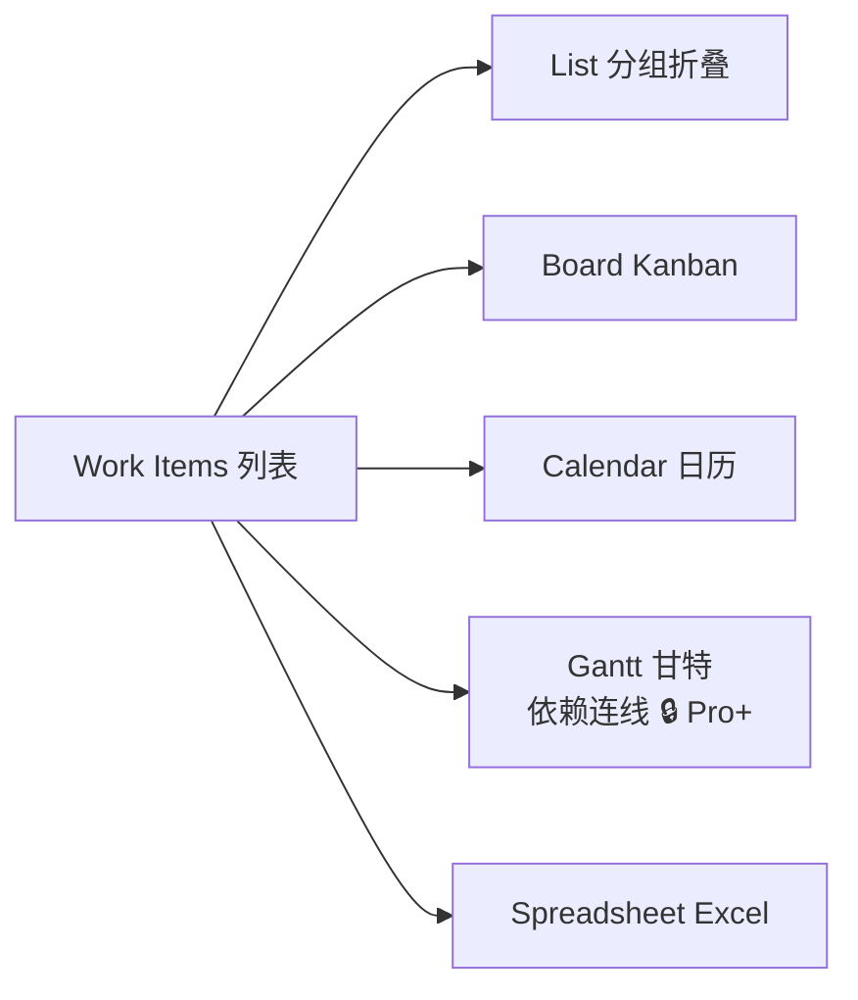

#### List Layout 线框

```
┌────────────────────────────────────────────────────────────────┐
│ ▾ In Progress (5)                                              │
│   MY-12  改造登录    [John]  High   Cycle-24   [Auth] 5pt      │
│   MY-15  OAuth 集成  [Mary]  Med    Cycle-24   [Auth] 3pt      │
│ ▾ Todo (8)                                                     │
│   ... ...                                                      │
│ ▾ Backlog (12)                                                 │
└────────────────────────────────────────────────────────────────┘
```

#### Board Layout (Kanban)

```
┌──────────┬──────────┬────────────┬──────────┬──────────┐
│ Backlog  │ Todo     │ In Progress│ In Review│ Done     │
│  (12)    │  (8)     │   (5)      │   (3)    │  (20)    │
├──────────┼──────────┼────────────┼──────────┼──────────┤
│ ┌──────┐ │ ┌──────┐ │ ┌────────┐ │ ┌──────┐ │ ┌──────┐ │
│ │ #23  │ │ │ #17  │ │ │ #12    │ │ │ #8   │ │ │ #1   │ │
│ │ 拆UI │ │ │ 接口 │ │ │ 登录   │ │ │ Bug  │ │ │ 文档 │ │
│ │ @Bob │ │ │ @May │ │ │ @John  │ │ │ @Sue │ │ │ ✓    │ │
│ └──────┘ │ └──────┘ │ └────────┘ │ └──────┘ │ └──────┘ │
│ ...      │ ...      │ ...        │ ...      │ ...      │
└──────────┴──────────┴────────────┴──────────┴──────────┘
         ↑ 拖拽切换状态
```

#### Gantt Layout（🔒 Pro+ 支持依赖连线）

```
                Apr 1  Apr 8  Apr 15  Apr 22  Apr 29
                │      │      │       │       │
MY-12  登录    ███████████
                         ⤵ blocks             (🔒 Pro+ 可拖画)
MY-15  OAuth         ████████████
                                   ⤵ blocks
MY-16  迁移                             ██████
```

#### 子功能

- 5 种 Layout 一键切换
- 多维筛选（state / assignee / priority / cycle / module / label / date / 自定义字段）
- Display Options：Group by / Sub-group by / Sort / 字段可见性 / Show sub-issues
- Saved Views（保存组合为视图）
- Shared Views 🔒 Pro+
- Bulk Ops 🔒 Pro+（批量改字段 / 移动 / 转换）
- Work Item Peek（列表点击时侧滑详情，不跳页）
- Relations：Blocks / Blocked by / Duplicates of / Relates to
- 无限 sub-issue 嵌套
- 评论：@mention / 富文本 / reactions
- 活动流：所有字段变更历史

---

### 5.4 Cycles 迭代

#### Cycle 详情页线框

```
┌──────────────────────────────────────────────────────────────────────┐
│ ⏱ Cycle-24  "2026 Q2 冲刺第一轮"          [▶ Active]  [··· more]   │
│ 2026-04-15 ~ 2026-04-29 (剩 11 天)           Lead: @Alice             │
├──────────────────────────────────────────────────────────────────────┤
│  ┌──── Progress ─────────────┐  ┌──── Burndown ──────────┐          │
│  │ Total    32  items        │  │      ╲                 │          │
│  │ Done     12  ████░░ 37%   │  │       ╲_               │          │
│  │ InProg    8  ██░░░░ 25%   │  │         ╲__            │          │
│  │ Todo     10                │  │            ╲___        │          │
│  │ Backlog   2                │  │               ╲___     │          │
│  └───────────────────────────┘  └────────────────────────┘          │
│                                                                      │
│  ─ Sidebar Tabs ────────────────────────────────────────             │
│  [ All │ Todo │ In Progress │ Done │ 🔒 Reports ]                    │
│                                                                      │
│  (Work Items 列表，可切 5 种 Layout)                                  │
└──────────────────────────────────────────────────────────────────────┘
```

#### 子功能

- Cycle 生命周期：Draft → Active → Completed → Archived
- 进度环 / 燃尽图 / Velocity（🔒 Pro+ 详细报告）
- 自动转移未完成项 🔒 Pro+
- Cycle 层级字段：name / 起止日期 / lead / 描述 / 关联 Epic
- Teamspace Cycles 🔒 Business+（跨项目同一 Cycle）

---

### 5.5 Modules 模块

```
┌──────────────────────────────────────────────────────────────┐
│ 🧩 Modules                                            + New  │
├──────────────────────────────────────────────────────────────┤
│ 🧩 Auth          Lead: @Alice    15 items    ████░░ 60%      │
│ 🧩 Billing       Lead: @Bob      22 items    ██░░░░ 30%      │
│ 🧩 Analytics     Lead: 🤖 Agent   8 items    █████░ 85%      │
└──────────────────────────────────────────────────────────────┘
         ↓ 点击进入详情
┌──────────────────────────────────────────────────────────────┐
│ 🧩 Auth                                                      │
│ Lead: @Alice   Members: 5   Target: 2026-06-30               │
│                                                              │
│ ─ Progress Chart ─   ─ Work Items (15) ─                     │
│   ████░░ 60%         (5 种 Layout 切换)                       │
│                                                              │
│ Auto-assignment 🔒 Pro+: [ Linear ▾ ]                         │
└──────────────────────────────────────────────────────────────┘
```

---

### 5.6 Views 视图

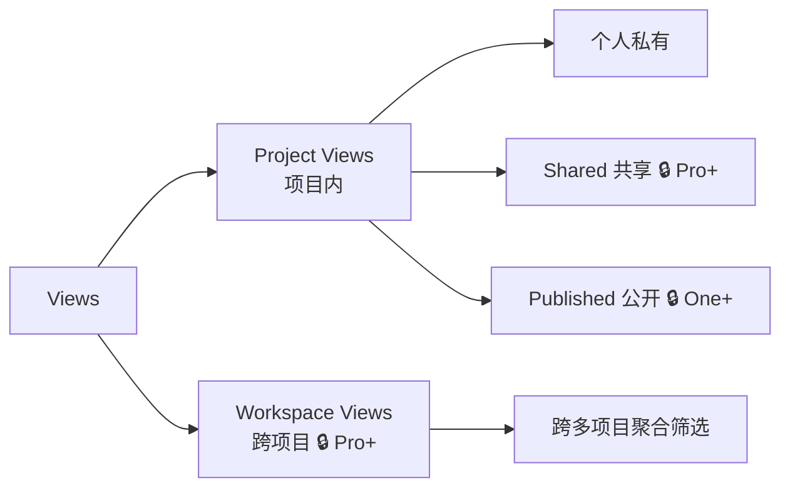

View = **保存的（筛选 + 排序 + Group by + Layout）组合**，每个 View 都是一个命名的查询。

#### 子功能

- 创建 / 编辑 / 删除 / 复制 View
- Shared Views（分享给项目/团队成员）🔒 Pro+
- Published Views（生成公网只读链接）🔒 One+
- Workspace Views（跨项目）🔒 Pro+

---

### 5.7 Pages 文档

```
┌──────────┬─────────────────────────┬────────────────────────────────┐
│          │ Pages                   │ ← Root › 登录改造 RFC          │
│          │ ➕ New Page             │                                │
│   B 栏   │                         │   # 登录改造 RFC                │
│          │ ─ Favorites ──         │   ═══════════════               │
│          │ ⭐ 公司 OKR            │                                │
│          │                         │   富文本编辑器                  │
│          │ ─ Pages (Wiki) ── ▾   │   / slash commands              │
│          │ ▾ 🏠 首页              │                                │
│          │   ▾ 📄 产品规划        │   支持块类型:                   │
│          │     📄 2026 Q2        │   - 标题 / 段落                 │
│          │     📄 2026 Q3        │   - Work Item Embed             │
│          │   ▸ 📄 工程 🔒嵌套     │   - Page Link                   │
│          │                         │   - Database 🔒 Business+      │
│          │ ─ Shared with me ─    │   - Formula 🔒 Business+        │
│          │                         │   - Image / Video / File       │
│          │                         │                                │
│          │                         │   [🕓 History] [🔗 Publish]   │
│          │                         │   [📤 Export] [📋 Template]   │
└──────────┴─────────────────────────┴────────────────────────────────┘
```

#### 子功能

- 项目级 Pages（普通）+ 工作区级 Wiki 🔒 One+
- Real-time Collab 🔒 One+（多光标）
- Nested Pages 🔒 Business+
- Page Embeds（Work Item / Page / Database）
- Link to Work Items（双向关联）🔒 One+
- Publish Page 🔒 One+（公网只读链接）
- Versions 🔒 Pro+（2 天 / 3 月 / 无限）
- Exports 🔒 Pro+（PDF / Word）
- Templates 🔒 Pro+

---

### 5.8 Intake 外部收件箱

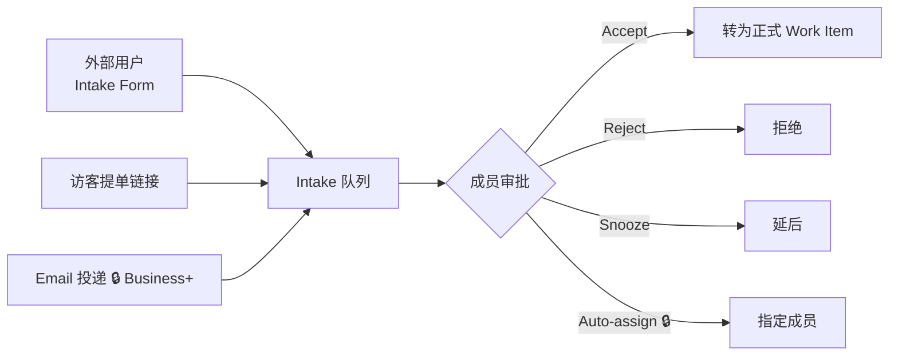

```
┌────────── Intake / my-proj ────────────────────────────────────┐
│ [🟡 Pending(5)] [✓ Accepted(12)] [✗ Rejected] [💤 Snoozed]    │
├───────────────────────────────────┬────────────────────────────┤
│ 🟡 #001 报表导出 Bug              │  #001 报表导出 Bug          │
│   by guest@xxx  2h ago            │                            │
│   [Accept] [Reject] [Snooze]      │  来源: guest@xxx            │
│                                   │  时间: 2h ago               │
│ 🟡 #002 新增暗黑模式              │                            │
│   by anon@yyy  5h ago             │  详情: 点击导出报错...       │
└───────────────────────────────────┴────────────────────────────┘
```

#### 子功能

- 内部 Triage 视图（Pending/Accepted/Rejected/Snoozed）
- Accept → 转为正式 Work Item（可预填 type/labels/assignee）
- Intake Form 🔒 Business+（公网表单）
- Email Intake 🔒 Business+（独立邮箱地址）
- Intake Auto-Assignee 🔒 Business+

---

### 5.9 Epics 长期主题（🔒 Pro+）

```
┌──────────── 🏷 Epics / my-proj ────────────────── + New Epic ──┐
│ ┌──────────────────────────────────────────────────────────┐  │
│ │ 🏷 EPIC-1 "用户登录改造 v2"             ████░ 60%        │  │
│ │ Lead: @Alice    Target: 2026-06-30                        │  │
│ │ 15 work items · 3 cycles · 2 modules                      │  │
│ └──────────────────────────────────────────────────────────┘  │
│ ┌──────────────────────────────────────────────────────────┐  │
│ │ 🏷 EPIC-2 "支付流程重构"               ██░░░ 20%         │  │
│ │ Lead: @Bob      Target: 2026-09-30                        │  │
│ └──────────────────────────────────────────────────────────┘  │
└────────────────────────────────────────────────────────────────┘
          ↓ 点击进入详情
┌────── 🏷 EPIC-1 "用户登录改造 v2" ──────────────────────────────┐
│ Description (富文本)                                            │
│ ─ Progress ─  ████░ 60% (9/15)                                  │
│ ─ Contained Work Items ─ (5 种 Layout)                          │
│ ─ Linked Modules ─ Auth                                         │
│ ─ Linked Cycles ─ Cycle-24, Cycle-25, Cycle-26                  │
│ ─ Checkpoints 🚧 ─ (里程碑时间点)                                │
│ ─ Activity / Comments ─                                         │
└─────────────────────────────────────────────────────────────────┘
```

---

### 5.10 Settings 设置

#### 两级作用域

```mermaid
graph TD
    S[Settings ⚙] --> WS[Workspace Settings]
    S --> PS[Project Settings]
    WS --> WS1[General 名称/URL/logo/domains 🔒]
    WS --> WS2[Members + Roles]
    WS --> WS3[Guests 🔒 One+]
    WS --> WS4[Billing / Plan]
    WS --> WS5[SSO SAML/OIDC 🔒 One+]
    WS --> WS6[2FA/Passkeys 🔒 Pro+]
    WS --> WS7[Password Policy 🔒 Pro+]
    WS --> WS8[Integrations 🔒 Pro+]
    WS --> WS9[Importers Jira/GitHub]
    WS --> WSa[Exports]
    WS --> WSb[Webhooks]
    WS --> WSc[API Tokens]
    WS --> WSd[Activity Logs 🔒 Business+]

    PS --> PS1[General]
    PS --> PS2[Members]
    PS --> PS3[Features<br/>Cycles/Modules/Views/Pages/Intake/Epics 🔒]
    PS --> PS4[States 状态分组]
    PS --> PS5[Labels]
    PS --> PS6[Estimates]
    PS --> PS7[Work Item Types 🔒 Pro+]
    PS --> PS8[Custom Properties 🔒 Pro+]
    PS --> PS9[Automations 🔒 Pro+]
    PS --> PSa[Workflows + Approvals 🔒 Business+]
```

#### Features 开关线框（与 UI 截图一致）

```
┌──────────────────────────────────────────────────┐
│  Projects and work items                         │
│  Toggle these on or off this project.            │
├──────────────────────────────────────────────────┤
│  ⏱ Cycles                              ⚪ OFF   │
│  🧩 Modules                             ⚪ OFF   │
│  👁 Views                              ⚪ OFF   │
│  📄 Pages                              🟢 ON    │
│  📥 Intake                              ⚪ OFF   │
│  🏷 Epics                      🔒      ⚪ OFF   │
└──────────────────────────────────────────────────┘
```

---

## 六、跨模块共享功能

### 6.1 Power K 全局命令面板

```
                    (背景遮罩)
           ┌──────────────────────────────────────────┐
           │  🔍 Search or type a command...          │
           ├──────────────────────────────────────────┤
           │  ─ Recent ──                             │
           │  📄 登录改造 PRD                         │
           │  🎯 MY123-12 改造登录                    │
           │  ─ Projects ──                           │
           │  🗂 my-project                           │
           │  ─ Actions ──                            │
           │  ➕ Create work item                     │
           │  ➕ Create cycle                         │
           │  👁 Create view                          │
           │  ─ Settings ──                           │
           │  ⚙ Workspace settings                    │
           │  ? Type ? for help           [ESC]       │
           └──────────────────────────────────────────┘
```

**唤起方式**：`⌘K` / `Ctrl+K` / Header 🔍 图标

### 6.2 Notifications 通知中心

```
                      ┌────────────────────────────────┐
  Header 🔔 点击  →  │  🔔 Notifications              │
                      ├────────────────────────────────┤
                      │ [Unread] [Mentions] [All]      │
                      │ ● @Alice 评论了 MY-12    2m   │
                      │ ● 你被 @ 在 MY-15         1h   │
                      │ ○ Cycle-24 已完成         2d   │
                      │ ...                            │
                      └────────────────────────────────┘
```

### 6.3 Work Item Peek（列表侧滑详情）

```
 ┌──── Work items ─────┐ ┌──── Peek ───────────────────┐
 │ MY-12 改造登录       │ │ ← Close      ↗ Open full    │
 │ MY-15 OAuth ←选中   │ │                              │
 │ MY-16 迁移脚本       │ │  MY-15 OAuth 集成           │
 │ ...                 │ │  描述 / Sub-issues / ...    │
 └─────────────────────┘ │  [属性面板]                  │
                         └──────────────────────────────┘
```

### 6.4 Editor（富文本编辑器）

用于 Work Item 描述、Page、Comments、Epic 描述、Cycle 描述：

- 支持块类型：heading / paragraph / list / code / image / video / file / embed
- `/` slash commands 插入工作项引用、页面引用、图片、代码块等
- 🔒 Business+：Database 块、Formula 块
- 基于 Tiptap + Yjs（🔒 One+ 实时协作）

### 6.5 Upgrade / Trial 浮层

```
┌──────────────────────────────┐
│ 🔒 该功能仅 Pro+ 可用         │
├──────────────────────────────┤
│ Pro features include:        │
│ ✓ Epics                      │
│ ✓ Work Item Types            │
│ ✓ Custom Properties          │
│ ✓ Dashboards                 │
│ ✓ Automations                │
│                              │
│ [Upgrade to Pro]             │
│ [Start 14-day Trial ☁]       │
└──────────────────────────────┘
```

### 6.6 Modal Registry（弹窗注册表）

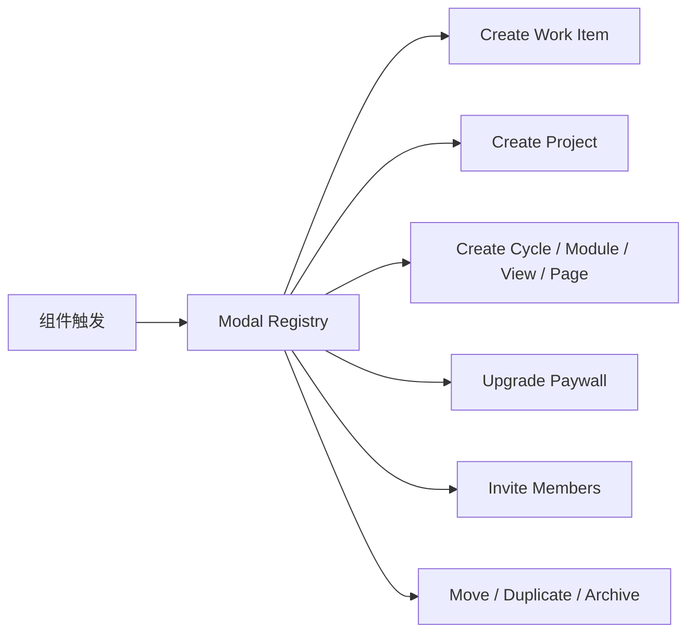

---

## 七、差异化特性总览

### 7.1 Plane 最具识别度的 UI / IA 设计

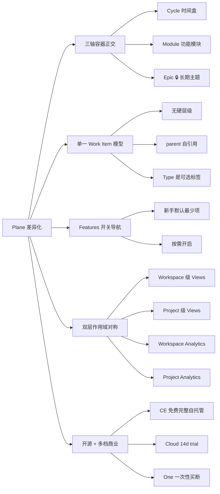

### 7.2 特性对照表

| 特性                | 呈现位置                                          | 价值点                                             |
| ------------------- | ------------------------------------------------- | -------------------------------------------------- |
| **三轴容器正交**    | Work Item 属性面板 Cycle/Module/Parent 三字段并列 | 一个 item 可同时属于 Cycle-24、Auth Module、EPIC-1 |
| **Features 开关**   | Project Settings → Features                       | 新手默认只 5 项，避免认知负担                      |
| **Power K ⌘K**      | 全局                                              | 键盘党 DAU 留存神器                                |
| **Work Item Peek**  | 列表点击                                          | 快速预览不跳页                                     |
| **Layout Switcher** | Work Items 顶栏                                   | 5 种视图一键切换                                   |
| **God Mode**        | 自托管专属 `/god-mode/`                           | 实例级 SMTP/OAuth/策略配置                         |
| **双层作用域**      | Workspace/Project 两级同名功能                    | 支持"跨项目聚合"+"项目内聚焦"两种心智              |
| **开源 + 分档商业** | Pricing 页                                        | Free CE 自托管无限制使用                           |

---

## 八、页面路由速查表

### 8.1 路由树

```mermaid
graph TD
    ROOT[/] --> LAND[Landing 公开]
    ROOT --> AUTH[/auth/*]
    ROOT --> GM[/god-mode/ 自托管]
    ROOT --> WS[/:workspaceSlug/*]

    AUTH --> AU1[sign-in]
    AUTH --> AU2[sign-up]
    AUTH --> AU3[onboarding]

    WS --> WS1[/ Home]
    WS --> WS2[drafts]
    WS --> WS3[stickies]
    WS --> WS4[profile Your work]
    WS --> WS5[projects]
    WS --> WS6[workspace-views]
    WS --> WS7[active-cycles 🔒]
    WS --> WS8[analytics]
    WS --> WS9[dashboards 🔒]
    WS --> WSa[browse]
    WS --> WSb[notifications]
    WS --> WSc[archives]
    WS --> WSd[settings/*]

    WS5 --> PROJ[projects/:id/]
    PROJ --> P1[/ Overview]
    PROJ --> P2[issues + issues/:id]
    PROJ --> P3[cycles + cycles/:id]
    PROJ --> P4[modules + modules/:id]
    PROJ --> P5[views + views/:id]
    PROJ --> P6[pages + pages/:id]
    PROJ --> P7[intake]
    PROJ --> P8[epics 🔒]
    PROJ --> P9[archives/*]
```

### 8.2 路由明细表

| 路由                                                   | 模块             | 档位    | 说明                 |
| ------------------------------------------------------ | ---------------- | ------- | -------------------- |
| `/`                                                    | Landing          | 公开    | 营销首页（仅 Cloud） |
| `/auth/sign-in`                                        | Auth             | 公共    | 登录                 |
| `/auth/sign-up`                                        | Auth             | 公共    | 注册                 |
| `/auth/onboarding`                                     | Auth             | 公共    | 首次引导             |
| `/god-mode/`                                           | Admin            | 自托管  | 实例管理             |
| `/<ws>/`                                               | Home             | Free    | 工作区首页           |
| `/<ws>/drafts`                                         | Drafts           | Free    | 草稿箱               |
| `/<ws>/stickies`                                       | Stickies         | Free    | 便签                 |
| `/<ws>/profile`                                        | Your work        | Free    | 我的任务             |
| `/<ws>/projects`                                       | Projects         | Free    | 项目列表             |
| `/<ws>/projects/<id>/`                                 | Project Overview | Free    | 项目总览             |
| `/<ws>/projects/<id>/issues`                           | Work Items       | Free    | 工作项列表           |
| `/<ws>/projects/<id>/issues/<issueId>`                 | Work Item        | Free    | 工作项详情           |
| `/<ws>/projects/<id>/cycles`                           | Cycles           | Free    | 迭代                 |
| `/<ws>/projects/<id>/cycles/<cycleId>`                 | Cycle Detail     | Free    | 迭代详情             |
| `/<ws>/projects/<id>/modules`                          | Modules          | Free    | 模块                 |
| `/<ws>/projects/<id>/modules/<moduleId>`               | Module Detail    | Free    | 模块详情             |
| `/<ws>/projects/<id>/views`                            | Project Views    | Free    | 项目视图             |
| `/<ws>/projects/<id>/pages`                            | Pages            | Free    | 项目文档             |
| `/<ws>/projects/<id>/pages/<pageId>`                   | Page Detail      | Free    | 文档详情             |
| `/<ws>/projects/<id>/intake`                           | Intake           | Free    | 收件箱               |
| `/<ws>/projects/<id>/epics`                            | Epics            | 🔒 Pro+ | 长期主题             |
| `/<ws>/projects/<id>/archives/{cycles,modules,issues}` | Archives         | Free    | 项目归档             |
| `/<ws>/workspace-views`                                | Workspace Views  | 🔒 Pro+ | 跨项目视图           |
| `/<ws>/active-cycles`                                  | Active Cycles    | 🔒 One+ | 全局进行中迭代       |
| `/<ws>/analytics`                                      | Analytics        | Free    | 工作区分析           |
| `/<ws>/dashboards`                                     | Dashboards       | 🔒 Pro+ | 自定义仪表盘         |
| `/<ws>/browse`                                         | Browse           | Free    | 全局浏览             |
| `/<ws>/notifications`                                  | Notifications    | Free    | 通知中心             |
| `/<ws>/archives`                                       | Archives         | Free    | 工作区归档           |
| `/<ws>/settings/(workspace)/general`                   | WS Settings      | Free    | 工作区通用           |
| `/<ws>/settings/(workspace)/members`                   | Members          | Free    | 成员管理             |
| `/<ws>/settings/(workspace)/billing`                   | Billing          | Free    | 订阅                 |
| `/<ws>/settings/(workspace)/integrations`              | Integrations     | 🔒 Pro+ | 集成                 |
| `/<ws>/settings/(workspace)/webhooks`                  | Webhooks         | Free    | Webhook              |
| `/<ws>/settings/projects/<id>/general`                 | Project Settings | Free    | 项目通用             |
| `/<ws>/settings/projects/<id>/features`                | Features         | Free    | 功能开关             |
| `/<ws>/settings/projects/<id>/states`                  | States           | Free    | 状态配置             |
| `/<ws>/settings/projects/<id>/labels`                  | Labels           | Free    | 标签管理             |
| `/<ws>/settings/projects/<id>/estimates`               | Estimates        | Free    | 估点                 |
| `/<ws>/settings/projects/<id>/automations`             | Automations      | 🔒 Pro+ | 自动化规则           |

---

## 变更记录

| 日期       | 版本 | 说明                                   |
| ---------- | ---- | -------------------------------------- |
| 2026-04-15 | v1.0 | 初版（文字 + 少量框图）                |
| 2026-04-15 | v2.0 | 每章加 ASCII 结构框图                  |
| 2026-04-15 | v3.0 | 按 8 章模板重构，对齐 Multica 文档骨架 |
