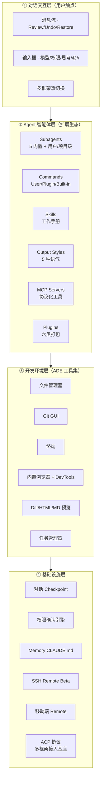
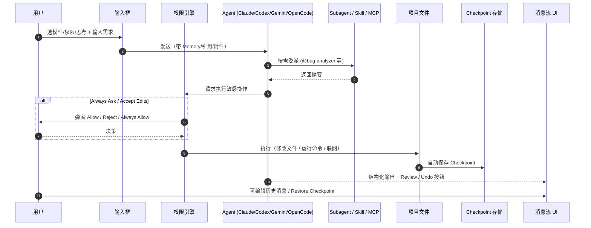
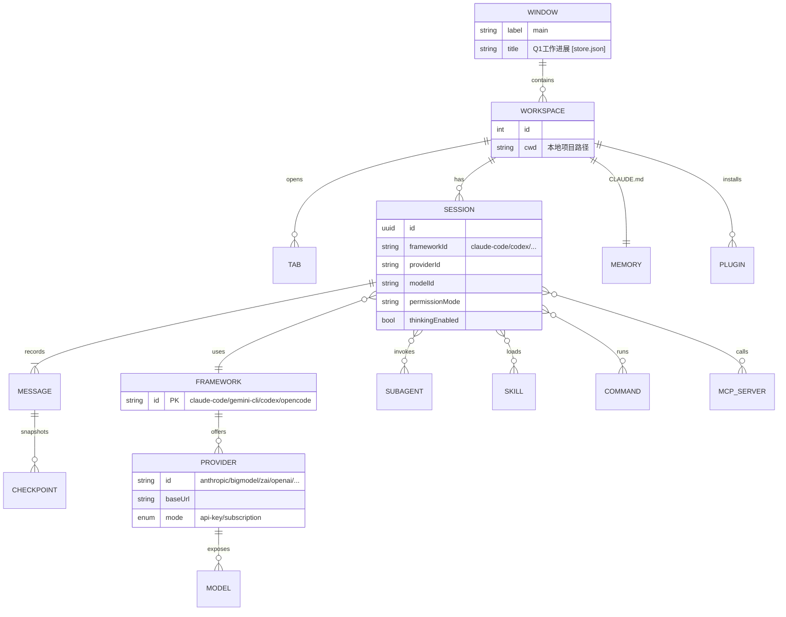
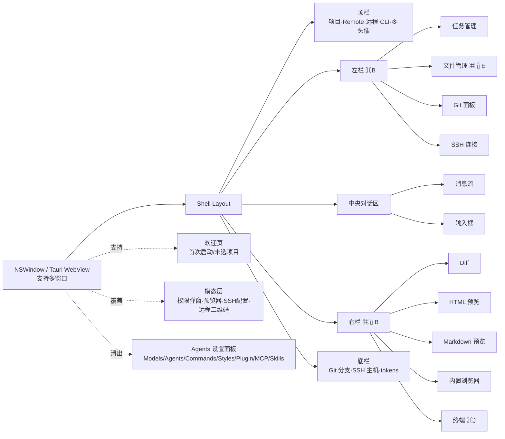
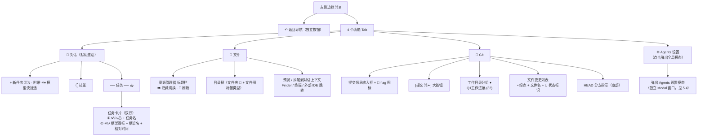
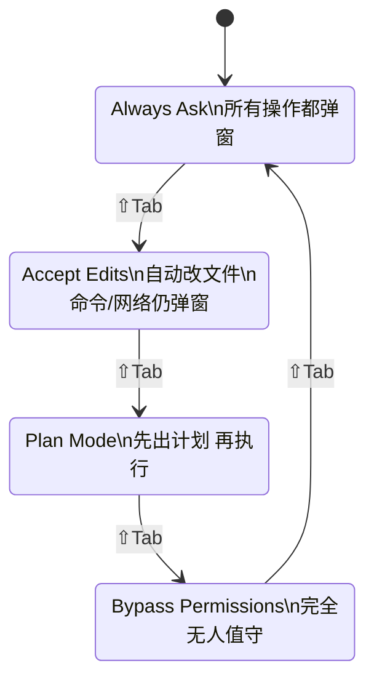
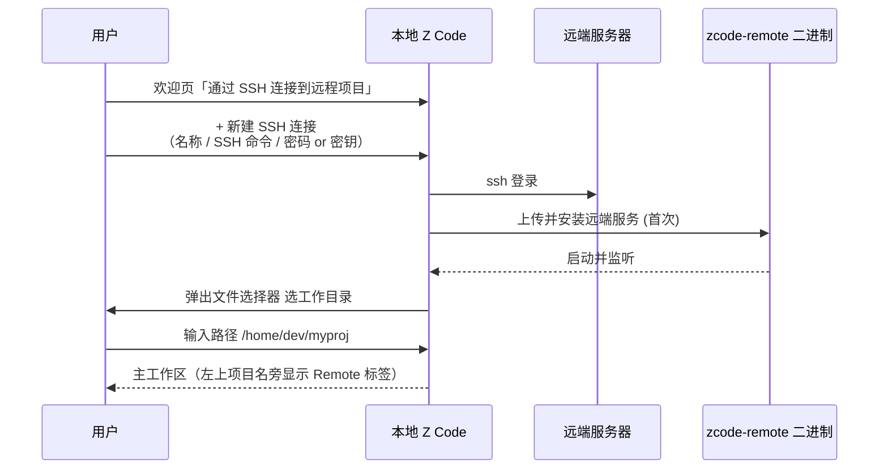
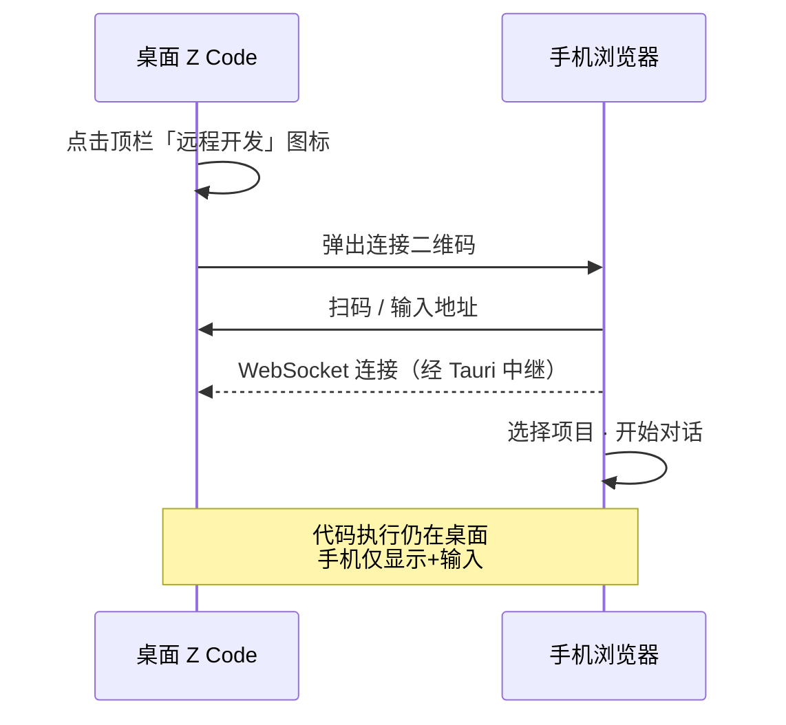
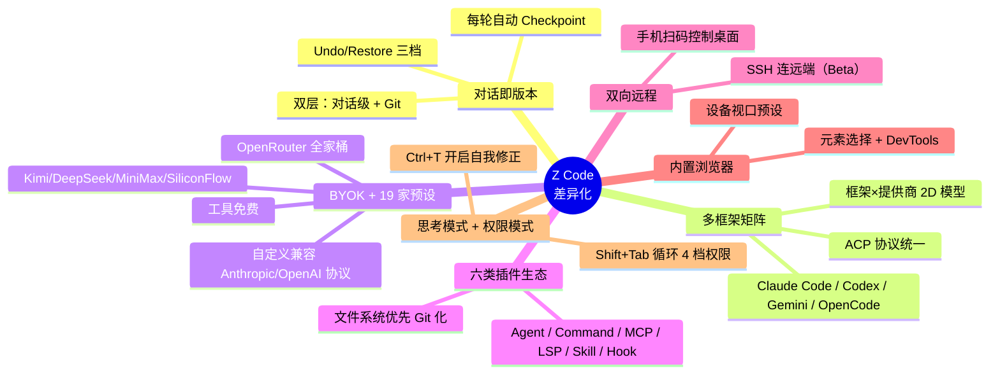

# Z Code 产品 UI 功能层次文档

> 目标：系统还原本机已安装的 **Z Code 0.27.2**（macOS Apple Silicon，闭源 Tauri 桌面应用）的 UI 结构、功能分布与差异化能力。
>
> 因无源码可扫，证据来源三条：① 官网 `https://zcode-ai.com/cn/docs` 23 页文档；② 本地 `.app` Bundle 资源；③ 本机用户数据 `~/Library/Application Support/ai.z.zcode/store.json`（Zustand 持久化 state，71KB）。
>
> 每条关键断言均标注来源：`[docs/<slug>]`、`[bundle:<path>]`、`[store.json:<key>]`。无直接证据但基于逻辑合理推断处显式标注 `（推断）`。

---

## 〇 产品定位

**一句话定位**：Z Code 是一款 ADE（Agentic Development Environment）—— 与 IDE "手动编码为主" 的范式反向，它让 AI Agent 成为开发主角，用自然语言驱动从编码、调试到预览的完整开发流程 `[docs/welcome][docs/qa]`。

### 竞品差异对比·

| 维度       | 传统 IDE（VS Code/JetBrains） | Cursor/Windsurf         | **Z Code**                                                                                                                                                     |
| ---------- | ----------------------------- | ----------------------- | -------------------------------------------------------------------------------------------------------------------------------------------------------------- |
| 核心交互   | 手写代码 + 插件               | 编辑器内嵌 AI 补全/Chat | **对话优先**，AI Agent 主导                                                                                                                                    |
| Agent 框架 | 单一（各自内置）              | Cursor Composer 单家    | **4 家并存可热切换**：Claude Code / Codex / Gemini CLI / OpenCode `[store.json:agent-storage]`                                                                 |
| 版本管理   | Git 一套                      | Git + 有限 rollback     | **双层**：对话级 Checkpoint（逐轮自动）+ 内置 Git GUI `[docs/version-control]`                                                                                 |
| 扩展机制   | Marketplace（插件商店）       | 仅支持 MCP/自定义规则   | **六位一体**：Agent/Command/MCP/LSP/Skill/Hook 全插件化 `[docs/plugin]`                                                                                        |
| 模型供应   | 依赖插件                      | 订阅制为主              | **BYOK + 19 家预设**（推断 19 家，含 BigModel/Z.AI/Anthropic/OpenAI/Google/Moonshot/DeepSeek/MiniMax/SiliconFlow/OpenRouter/Kimi）`[store.json:remote-config]` |
| 远程开发   | SSH Remote（VS Code）         | —                       | **双向**：SSH 连远端（Beta）+ 手机扫码控制桌面 `[docs/ssh][docs/remote]`                                                                                       |
| 付费       | 订阅                          | 订阅                    | **工具免费，Key 自备**，含 GLM Coding Plan 套餐选项 `[docs/qa]`                                                                                                |

> 未发现商业版/付费墙代码（闭源无法 grep）；官网 Q&A 明确「Z Code 工具本身完全免费，但需自备 API Key」—— 商业化通过**背靠智谱 BigModel 的 Key 销售**完成，而非向工具收费 `[docs/qa]`。

---

## 一 核心功能全景

### 1.1 能力层总览



### 1.2 功能速览表

| 功能               | 入口                | 快捷键            | 核心特征                                                    | 来源                                               |
| ------------------ | ------------------- | ----------------- | ----------------------------------------------------------- | -------------------------------------------------- |
| 新建会话           | 左栏「+」 / 菜单    | `⌘N`              | 同一项目下创建新任务                                        | `[docs/keyboard-shortcuts]`                        |
| 左侧边栏开合       | 顶栏切换            | `⌘B`              | 任务/文件/Git/SSH 四面板                                    | `[docs/keyboard-shortcuts][docs/ADE-tools]`        |
| 右侧边栏开合       | 顶栏切换            | `⌘⇧B`             | Diff/HTML/MD/浏览器/终端                                    | `[docs/keyboard-shortcuts][docs/ADE-tools]`        |
| 文件管理器         | 左栏                | `⌘⇧E`             | 预览/添加上下文/多端跳转                                    | `[docs/ADE-tools]`                                 |
| 终端               | 右栏                | `⌘J`              | 再次按 `⌘J` 隐藏右栏                                        | `[docs/keyboard-shortcuts]`                        |
| 聚焦输入框         | —                   | `⌘L`              | —                                                           | `[docs/keyboard-shortcuts]`                        |
| 切换权限模式       | 输入框              | `⇧Tab` / `Ctrl+P` | Always Ask ↔ Accept Edits ↔ Plan ↔ Bypass                   | `[docs/agents][docs/keyboard-shortcuts]`           |
| 模型选择器         | 输入框              | `Ctrl+M`          | 打开模型列表，底部「管理模型」                              | `[docs/keyboard-shortcuts][docs/configuration]`    |
| 思考模式           | 输入框              | `Ctrl+T`          | 开启前 Agent 会自我修正                                     | `[docs/agents][docs/keyboard-shortcuts]`           |
| 引用 @             | 输入框 `@`          | —                 | MCP/文件夹/Agents/Skills                                    | `[docs/agents][docs/skill]`                        |
| 命令 /             | 输入框 `/`          | —                 | User/Plugin/Built-in Commands                               | `[docs/commands]`                                  |
| 附件 📎            | 输入框              | —                 | 图片/代码文件上传                                           | `[docs/agents]`                                    |
| 智能体框架切换     | 对话顶部菜单        | —                 | Claude Code/Codex/Gemini/OpenCode                           | `[docs/agent-framework][store.json:agent-storage]` |
| Review 本轮变更    | 消息下方按钮        | —                 | 多文件 Diff 视图                                            | `[docs/version-control]`                           |
| Undo 上一轮        | 消息下方按钮        | —                 | 回到上一轮完成态                                            | `[docs/version-control]`                           |
| Restore Checkpoint | 历史消息节点        | —                 | 跳回任意节点完整状态                                        | `[docs/version-control]`                           |
| 编辑已发送消息     | hover 消息          | —                 | Agent 基于新内容重新生成                                    | `[docs/edit-history]`                              |
| 权限确认弹窗       | 危险操作触发        | —                 | Allow / Reject / Always Allow                               | `[docs/safety-confirm]`                            |
| 设置面板           | 顶栏齿轮 / 欢迎页   | —                 | 默认 Tab = **Models** `[store.json:zcode-settings-storage]` | `[docs/configuration]`                             |
| SSH 远程           | 欢迎页 / 项目名菜单 | —                 | 密码 or 密钥；导入 `~/.ssh/config`                          | `[docs/ssh]`                                       |
| Remote 远程控制    | 顶栏图标            | —                 | 桌面为 Server，手机扫码控制                                 | `[docs/remote]`                                    |
| 命令行面板         | 顶栏                | —                 | 项目级 shell                                                | `[docs/ADE-tools]`                                 |
| 反馈               | 菜单栏 帮助→反馈    | —                 | 飞书表单 + 日志打包                                         | `[docs/feedback]`                                  |

### 1.3 协作时序（一轮典型对话）



### 1.4 核心实体关系（ER）



> ⚠️ Framework 与 Provider 的多对多关系是 Z Code 的**关键差异化数据模型**：同一提供商（如 bigmodel）被 4 个框架分别配置一次，即 `providersMap.<framework>.<provider>` 三层结构 `[store.json:agent-storage]`。19 家云端预设提供商 + BYOK 自定义 `[store.json:remote-config]`。

---

## 二 整体布局

### 2.1 App Shell 线框（主工作区）

> **基于用户提供截图对齐**。`Image#3` 显示左栏顶部为横向图标 Tab 条（非之前推断的纵向列表），`Image#2` 展示完整主工作区。

```
┌────────────────────────────────────────────────────────────────────────────────────┐
│ ● ● ●  [◨] [≡]  [🟢 等待手机]  │Q1工作进展│ +      [↻Restart Updates] [⎇▾][📱][▢][🌐][⋯]│ ← 顶栏
├──────────────────────────┬─────────────────────────────────────────────────────────┤
│ [↶] [📂•] [📁] [🌿] [⚙] │ ✳ Claude Code                                    [⊟]  │
│ ━━━━━━━━━━━━━━━━━━━━━━━━ │                                                         │
│ [+ 新任务]    ✳▾   ⌘N   │ ┌─ 消息流 ─────────────────────────────────────────┐ │
│ 𓊆 技能                  │ │    <command-name>/model</command-name>           │ │
│                         │ │    <command-args>claude-opus-4-6</command-args>  │ │
│ ── 任务 ─────────── 📥   │ │                                                  │ │
│                         │ │  Set model to claude-opus-4-6                    │ │
│ ✅ 1                    │ │                                                  │ │
│    ✳ Claude Code  12h   │ │                           1                      │ │
│                         │ │  ⦁ Failed to authenticate. API Error: 403        │ │
│ ○ 你好                  │ │                                                  │ │
│    ✳ Claude Code  12h   │ │                        介绍下                    │ │
│                         │ │  ⦁ Internal error: API Error: Rate limit reached │ │
│ ○ 你是哪个版本的模型？  │ │                                                  │ │
│    ✳ Claude Code  12h   │ └──────────────────────────────────────────────────┘ │
│                         │ ┌─ 输入框 ─────────────────────────────────────────┐ │
│ ⚠ 你好，本项目有什么... │ │  描述后续调整内容                                  │ │
│    ⚡ Codex       22h   │ │                                                  │ │
│                         │ │  📎 @ 𓊆 ⟳ ✦           逐步确认 ▾  glm-5.1 ▾  ↑ │ │
│ ○ 本项目有什么功能呢？  │ └──────────────────────────────────────────────────┘ │
│    ✳ Claude Code  23h   │                                                         │
│ ○ 你好                  │                                                         │
│    ✳ Claude Code  23h   │                                                         │
│ ○ 你好                  │                                                         │
│    ✳ Claude Code  1d    │                                                         │
└──────────────────────────┴─────────────────────────────────────────────────────────┘
```

**关键修正（基于截图）**：

| 元素                       | 实际位置 / 样式                                                                     | 之前推断                        |
| -------------------------- | ----------------------------------------------------------------------------------- | ------------------------------- |
| 左栏顶部结构               | **1 个 ↶ 导航按钮 + 4 个功能 Tab**（🤖 对话 · 📁 文件 · 🌿 Git · ⚙ Agents 设置）    | 纵向列表 ❌ / 5 Tab（含 SSH）❌ |
| 「+ 新任务」               | 横向 Tab 下方显著按钮，右侧附**模型快捷选择**（✳▾）和 `⌘N` 标签                     | 仅按钮                          |
| 「技能」                   | 在「+ 新任务」下方作为二级入口（`𓊆 技能`）                                          | 未识别                          |
| 任务列表分组               | 「任务」组标题 + 右侧 📥 图标（推断：收件箱/已读）                                  | 无分组                          |
| 任务状态图标               | ✅ 绿勾（完成）/ ○ 空心（普通）/ ⚠ 黄警（有错）                                     | 未区分                          |
| 任务卡片                   | 两行：① 任务名 ② ✳ 框架图标 + 框架名（Claude Code / Codex）+ 相对时间（12h/22h/1d） | 单行                            |
| 输入框占位符               | `描述后续调整内容`                                                                  | `请把 README...`                |
| 输入框工具条               | 左：📎 附件 · @ 引用 · 𓊆 技能 · ⟳ · ✦                                               | 顺序/图标不准                   |
| 权限模式文案               | **「逐步确认」**（= Always Ask 中文）                                               | 英文标签                        |
| 模型标识                   | 右下角仅显示模型 ID（如 `glm-5.1`），框架图标已前移到会话头                         | 框架+模型同栏                   |
| 顶栏「等待手机」           | 绿色 pill 按钮，表示 Remote 已启动等待手机扫码                                      | 仅 `Remote●` 圆点               |
| 顶栏「Restart to Updates」 | 右侧黄色按钮 = 0.28.0 更新已下载，重启生效                                          | 未体现                          |
| 顶栏标签页                 | `Q1工作进展` + `+` —— **多 Tab 设计**，可开多个工作区                               | 单一标题                        |
| 顶栏最右                   | `⎇▾` 分支切换 · `📱` 手机预览 · `▢` 布局 · `🌐` 浏览器 · `⋯` 更多                   | 📡/CLI/⚙/头像 ❌                |
| 顶栏最左                   | `◨` 左栏切换 · `≡` 菜单 —— 窗口控制按钮内嵌在 webview 顶栏                          | 无左栏按钮                      |

### 2.1.1 左栏顶部横向 Tab 条（高保真）

```
┌──────────────────────────────────────────┐
│                                          │
│  ( ↶ ) │ ( 🤖 )  ( 📁 )  ( 🌿 )  ( ⚙ )   │  ← 独立返回按钮 ｜ 4 个功能 Tab
│           ━━━                            │
└──────────────────────────────────────────┘
```

**5 个圆形控件，但分两组**（`[截图 Image#4~#8]` 用户逐个点击验证）：

| 图标 | 类型                       | 功能                                   | 点击后                |
| ---- | -------------------------- | -------------------------------------- | --------------------- |
| `↶`  | **独立导航按钮**（非 Tab） | 返回/撤回导航历史                      | 不切换主内容          |
| `🤖` | Tab① 对话/任务             | 任务管理（新任务 + 技能 + 会话列表）   | 左栏主区切到任务列表  |
| `📁` | Tab② 文件                  | 资源管理器（当前 workspace 目录）      | 左栏主区切到文件树    |
| `🌿` | Tab③ Git                   | Git 提交与历史                         | 左栏主区切到 Git 面板 |
| `⚙`  | Tab④ Agents 设置           | **打开全局设置弹窗**（不是侧栏内面板） | 弹出 Agents 设置模态  |

**关键修正**：

1. `↶` 不是 Tab，是独立的"返回"按钮 —— 视觉上与 4 个 Tab 同框但语义不同。截图中它始终不高亮。
2. 原先推断第 4 个 Tab 是 SSH —— **错误**。实际是 Agents 设置，且点击后是**全局弹窗**，不是侧栏内面板。
3. SSH 功能不在左栏 Tab 中 —— 实际入口是「欢迎页」或「项目名菜单 Connect Via SSH」`[docs/ssh]`。
4. 🤖 位置原标注 📂，实际是**机器人形状图标**（语义更贴合"AI 对话任务"）。

> 证据：`[截图 Image#4 对话激活态 / Image#5 文件空态 / Image#6 文件填充态 / Image#7 对话填充态 / Image#8 Git 填充态 / Image#9 Agents 设置弹窗]`

### 2.2 窗口/容器层级（Mermaid）



### 2.3 端差异

| 端                   | 形态                                                    | 能力                                  | 来源                                            |
| -------------------- | ------------------------------------------------------- | ------------------------------------- | ----------------------------------------------- |
| **macOS 桌面端**     | Tauri + WebView（可执行文件 `z-code`，最低 macOS 11.0） | 完整 ADE；四大框架 + 内置 ACP 代理    | `[bundle:Contents/Info.plist][bundle:binaries]` |
| **Windows 桌面端**   | 同上                                                    | 完整（官网提供 Windows 下载）         | `[docs/install]`                                |
| **移动端**（Web）    | 浏览器 + WebSocket 连桌面                               | 仅会话显示 + 文字输入；代码执行在桌面 | `[docs/remote]`                                 |
| **远端 Linux/macOS** | SSH 连接 Beta，服务端二进制 `zcode-remote`              | 远端代码/执行，本地显示               | `[docs/ssh][bundle:binaries]`                   |

---

## 三 左侧边栏

### 3.1 分组结构（横向 Tab + 纵向内容）

**修正**：左栏顶部有 **1 个 `↶` 独立返回按钮 + 4 个功能 Tab**，Tab 切换左栏主内容区；第 4 个 ⚙ 不是内嵌面板而是**弹出全局设置模态**。`[截图 Image#4~#9]`



> 之前推断第 4 个 Tab 为 SSH —— **已纠正**。SSH 入口在欢迎页 / 项目名菜单 `[docs/ssh]`，不占左栏 Tab 位。

### 3.2 Tab ① 🤖 对话（任务管理）

```
┌ 🤖 对话（激活高亮）───────────────────┐
│                                       │
│ [+ 新任务]           ✳▾      ⌘N     │  ← 右侧小箭头可快速切默认模型
│                                       │
│ 𓊆 技能                               │  ← 二级入口（推断：打开 Skills 管理）
│                                       │
│ ── 任务 ───────────────────── 📥     │  ← 分组标题 + 右侧 📥（推断：收件箱）
│                                       │
│ ┌─ 当前激活（浅蓝底）───────────────┐│
│ │ ✅ 1                              ││
│ │    ✳ Claude Code           12h  ││
│ └─────────────────────────────────┘│
│                                       │
│ ○ 你好                                │
│   ✳ Claude Code               12h   │
│                                       │
│ ○ 你是哪个版本的模型？                │
│   ✳ Claude Code               12h   │
│                                       │
│ ⚠ 你好，本项目有什么功能？            │  ← 黄色警告 = 上次对话有错误
│   ⚡ Codex                    22h   │  ← Codex 框架（橙色闪电图标）
│                                       │
│ ○ 本项目有什么功能呢？                │
│   ✳ Claude Code               23h   │
│                                       │
│ ○ 你好                                │
│   ✳ Claude Code               23h   │
│                                       │
│ ○ 你好                                │
│   ✳ Claude Code                1d   │
└───────────────────────────────────────┘
```

**与之前推断的差异**：

| 差异点     | 截图实际                                               | 之前推断                     |
| ---------- | ------------------------------------------------------ | ---------------------------- |
| 分组       | 单一「任务」分组，按时间**倒序平铺**                   | 按「今天/昨天」分日期分组 ❌ |
| 搜索框     | 截图中未见                                             | 画了 🔍 搜索框 ❌            |
| 时间格式   | 相对时间 `12h / 22h / 1d`                              | 绝对时间 `10:42` ❌          |
| 任务名来源 | **自动从用户首条消息截取**（"你好"/"你好，本项目..."） | 语义化命名 ❌                |
| 每卡片副行 | 框架图标 + 框架名                                      | 无副行                       |
| 状态图标   | ✅ 完成 / ○ 普通 / ⚠ 错误                              | 用 ▶/● 区分活跃 ❌           |
| 模型选择   | 「+ 新任务」右侧 `✳▾` 快捷切默认模型                   | 放在输入框内                 |

> 「任务」= Session，store.json 记录本机缓存 12 个 session `[store.json:zcode-session.sessionCacheStatesMap]`。任务名看起来是**从用户首条消息自动截取**（截图可见多个"你好"任务）。

### 3.3 Tab ② 📁 文件（资源管理器）

**空态**（`[截图 Image#5]`）：

```
┌ 📁 文件 ────────────────────┐
│                            │
│  资源管理器       👁  🔄   │  ← 标题栏
│                            │   · 👁 显示/隐藏隐藏文件
│                            │   · 🔄 刷新目录
└────────────────────────────┘
```

**填充态**（`[截图 Image#6]`，当前 workspace = `Q1工作进展`）：

```
┌ 📁 文件 ────────────────────┐
│                            │
│  资源管理器       👁  🔄   │
│                            │
│  📂 Q1工作进展             │  ← 根目录（展开）
│  📁 _reports              │
│  📁 .git                  │  ← 隐藏目录可见（👁 已开）
│  📁 materials             │
│  📁 outputs               │
│  📄 .DS_Store             │
│  📝 Q1工作进展_us.md       │
└────────────────────────────┘
```

**修正要点**：

| 元素     | 实际                                           | 之前推断         |
| -------- | ---------------------------------------------- | ---------------- |
| 标题栏   | 「资源管理器」+ 👁 + 🔄                        | 无标题栏         |
| 隐藏文件 | **👁 可显/隐**（`.git` `.DS_Store` 可见）      | 未提及           |
| 图标分类 | 目录用 📂/📁、md 用蓝色 📝、普通文件用 📄      | 未细分           |
| 预期能力 | 右键预览/加入上下文/跳转（`[docs/ADE-tools]`） | 写过但未截图验证 |

### 3.4 Tab ③ 🌿 Git（提交面板）

**填充态**（`[截图 Image#8]`）：

```
┌ 🌿 Git ─────────────────────────────┐
│                                    │
│  [提交更改                  ] 🚩   │  ← 提交信息输入框 + 🚩 flag 图标
│                                    │     （推断：切换提交类型/范围）
│  ┌────────────────────────────────┐│
│  │   提交              ⌘↩         ││  ← 深色大按钮，主操作
│  └────────────────────────────────┘│
│                                    │
│  ▾ Q1工作进展                 32   │  ← 工作目录分组 + 变更总数
│                                    │
│   •  📝 1月份月度工作报告.md    U  │  ← • 绿点 = 已改/新增
│   •  📝 2月份月度工作报告.md    U  │    U 标识 = Untracked（未跟踪）
│   •  📝 Q1业绩考核排名.md       U  │
│   •  📝 Q1代码贡献详情.md       U  │
│   •  📝 Q1关键结果提炼.md       U  │
│   •  📝 Q1季度交付汇总...       U  │
│   •  📝 Q1季度工作报告.md       U  │
│   •  📝 周例会汇报-2026-01-...  U  │
│   •  📝 周例会汇报-2026-01...md U  │
│   •  📝 刘东辉.md                U  │
│                                    │
│  🌿 HEAD                           │  ← 底部分支指示
└────────────────────────────────────┘
```

**修正要点**：

| 元素         | 实际                                                         | 之前推断       |
| ------------ | ------------------------------------------------------------ | -------------- |
| 顶部大输入框 | **直接整合「提交更改」输入 + 🚩**（无分支/历史标签页）       | 分步多区块     |
| 主按钮       | 「提交 ⌘↩」深色大按钮（跨整行）                              | 小按钮         |
| 工作目录分组 | **`▾ Q1工作进展 32`** 可折叠，数字 = 变更总数                | 无分组         |
| 文件行       | **• 绿点 + 📝 图标 + 文件名 + U**（没有 M/U 两种并列，全 U） | M/U 两种       |
| 分支显示     | **底部「🌿 HEAD」**（未见分支名/提交历史）                   | 顶部状态栏     |
| 提交历史     | 截图中未显示                                                 | 写过"浏览历史" |

> 可能"提交历史 / 分支切换" 需要滚动或点击 HEAD 才会出现（推断）。

### 3.5 Tab ④ ⚙ Agents 设置（弹出模态）

点击 ⚙ 图标**不是切换左栏内容**，而是**弹出全局 Agents 设置模态窗口**（遮罩+居中卡片，见 5.4 章）。`[截图 Image#9]`

```
┌ 左栏点击 ⚙ ──────────────┐
│                          │
│  ( ↶ ) [🤖][📁][🌿][⚙●] │  ← ⚙ 临时高亮
│                          │
└──────────────────────────┘
       ↓ 弹出
┌───────────────────────────────────────────┐
│ 🧩 Agents 设置                    [✕]    │
│ ┌──────┬────────────────────────────────┐ │
│ │ 模型 │  Provider                      │ │
│ │ MCP  │  Z.AI / BigModel              │ │
│ │ ──── │  Official OAuth               │ │
│ │Claude│  Claude Code / Gemini CLI     │ │
│ │Gemini│  Codex / OpenCode             │ │
│ │Codex │  Customs                      │ │
│ │Open..│  OpenAI · + Add Custom        │ │
│ └──────┴────────────────────────────────┘ │
└───────────────────────────────────────────┘
```

---

## 四 顶部栏

### 4.1 macOS 桌面端 顶栏（基于截图校准）

```
┌──────────────────────────────────────────────────────────────────────────────────┐
│ ● ● ●  [◨] [≡]  [🟢 等待手机]  │Q1工作进展│ +    [↻Restart Updates] [⎇▾][📱][▢][🌐][⋯]│
└──────────────────────────────────────────────────────────────────────────────────┘
  红黄绿  ↑    ↑    ↑               ↑          ↑             ↑      ↑    ↑   ↑   ↑
         左栏  菜单  Remote 已启动    Tab 标签   版本更新提示   分支  手机 布局 浏览 更多
         开合       (等待手机扫码)    ＋新开Tab  (0.28.0 下载完)
```

**区段职责**：

| 区段     | 元素                   | 行为                                                              | 证据                                                     |
| -------- | ---------------------- | ----------------------------------------------------------------- | -------------------------------------------------------- |
| **最左** | 红/黄/绿三按钮         | 标准 macOS 窗口控制（关闭/最小化/全屏）                           | 系统                                                     |
|          | `◨`                    | 切换左栏显隐（= `⌘B`）                                            | `[截图 Image#2]`                                         |
|          | `≡`                    | 汉堡菜单（推断：主菜单 / 设置入口）                               | `[截图 Image#2]`                                         |
| **中左** | `🟢 等待手机`          | 绿色 pill —— Remote 开发已启动，等待手机扫码连接                  | `[截图 Image#2][docs/remote]`                            |
| **中**   | `│Q1工作进展│` + `+`   | **标签页式多 Tab**：每 Tab 对应一个 workspace；`+` 开新 workspace | `[截图 Image#2][store.json:workspace-tabs-by-window]`    |
| **中右** | `↻ Restart to Updates` | 黄色按钮：新版本（0.28.0）已下载，点击重启生效                    | `[截图 Image#2][store.json:remote-config.latestRelease]` |
| **最右** | `⎇▾`                   | Git 分支切换                                                      | `[截图 Image#2]`                                         |
|          | `📱`                   | 手机预览 / 设备视口（推断：切移动视口或打开 Remote）              | `[截图 Image#2]`                                         |
|          | `▢`                    | 布局切换（推断：切换右栏布局模式）                                | `[截图 Image#2]`                                         |
|          | `🌐`                   | 内置浏览器 / 打开预览                                             | `[截图 Image#2][docs/ADE-tools]`                         |
|          | `⋯`                    | 更多菜单（推断：设置 ⚙ / 账号 / 命令行等折叠入此）                | `[截图 Image#2]`                                         |

**重要发现**：

1. **标签页多工作区**：顶栏中部 `Q1工作进展 +` 证实 Z Code 采用**浏览器式 Tab 设计**，同一窗口可开多个 workspace `[store.json:workspace-tabs-by-window.main.tabs[]]`
2. **自动升级机制**：`Restart to Updates` 按钮 + `remote-config.latestRelease.version = "0.28.0"`（本机 0.27.2）证实 Z Code 使用 Tauri 自动更新
3. **设置齿轮不在顶栏一级**：官网说「点击右上角设置图标」，但截图未见独立齿轮，推断已折叠进 `⋯` 或 `≡` 菜单
4. **头像登录入口同样折叠**：官网多次提到点击头像，但截图未见头像，推断同上

**与之前推断的主要差异**：

| 元素         | 截图实际                           | 之前推断 ❌        |
| ------------ | ---------------------------------- | ------------------ |
| 项目名下拉   | 作为 Tab 标签展示，**无下拉箭头**  | `Q1工作进展 ▾`     |
| Remote 状态  | 绿色 pill「等待手机」              | 蓝/黄点「Remote●」 |
| 远程开发入口 | 融合进「等待手机」按钮 + `📱` 图标 | 独立 `📡` 图标     |
| 命令行面板   | 截图未见独立 CLI 按钮              | `[▸_]` 独立按钮    |
| 设置齿轮     | 折叠进 `⋯` 或 `≡`                  | 独立 `[⚙]`         |
| 头像         | 折叠                               | 独立 `[👤]`        |
| 顶栏多 Tab   | **支持**，可 `+` 新开              | 未体现             |
| 版本更新提示 | 顶栏黄色 `Restart to Updates`      | 未体现             |

### 4.2 欢迎页 顶部（首次/未选项目）

```
┌──────────────────────────────────────────────────────────┐
│ ● ● ●                                        [⚙] [👤]  │
│                                                          │
│                  Z Code                                  │
│                                                          │
│     [Connect]   [Set Your API Key]   [Manage Models]    │
│                                                          │
│       [📁 打开文件夹 ⌘O]  [🔗 通过 SSH 连接到远程]       │
│                                                          │
│   最近项目                                                │
│   ├ FocusPilot           2026-04-15                     │
│   ├ Q1工作进展           2026-04-14 ●                   │
│   └ ...                                                  │
└──────────────────────────────────────────────────────────┘
```

---

## 五 核心功能模块详解

### 5.1 对话输入框（基于截图校准）

```
┌ 输入框 ─────────────────────────────────────────────────────────────────┐
│                                                                        │
│  描述后续调整内容                                                         │  ← 占位符
│                                                                        │
│                                                                        │
│ ─────────────────────────────────────────────────────────────────────  │
│  📎   @   𓊆   ⟳   ✦                    [逐步确认 ▾] [glm-5.1 ▾] [↑] │
│  ↑    ↑    ↑    ↑    ↑                        ↑            ↑       ↑  │
│ 附件  引用 技能  命令 特性                     权限模式      模型    发送 │
└────────────────────────────────────────────────────────────────────────┘
```

**左侧工具条（5 图标，顺序以截图为准）**：

| 图标 | 功能                                               | 证据                                      |
| ---- | -------------------------------------------------- | ----------------------------------------- |
| `📎` | 附件上传（图片/代码）                              | `[截图 Image#2][docs/agents]`             |
| `@`  | 引用面板（MCP/文件夹/Agents/Skills）               | `[截图 Image#2][docs/agents][docs/skill]` |
| `𓊆`  | 技能面板（同侧栏「技能」，截图中是相似古埃及符号） | `[截图 Image#2][docs/skill]`              |
| `⟳`  | 推断：循环/重试 或 `/` 命令触发（需实操验证）      | `[截图 Image#2]`                          |
| `✦`  | 推断：思考模式 `Ctrl+T` 开关 或特性入口（星形）    | `[截图 Image#2][docs/agents]`             |

**右侧控制（2 个下拉 + 1 个发送）**：

| 控件           | 截图实际文案     | 对应功能                                          | 证据                                 |
| -------------- | ---------------- | ------------------------------------------------- | ------------------------------------ |
| `[逐步确认 ▾]` | **「逐步确认」** | 权限模式切换（= Always Ask 的中文化）             | `[截图 Image#2][docs/agents]`        |
| `[glm-5.1 ▾]`  | `glm-5.1`        | 当前模型（非 Claude 模型，说明正用智谱 BigModel） | `[截图 Image#2][docs/configuration]` |
| `[↑]`          | 蓝色圆形         | 发送（`⌘↩`）                                      | `[截图 Image#2]`                     |

**与之前推断的关键差异**：

| 维度         | 截图实际                                                 | 之前推断 ❌                        |
| ------------ | -------------------------------------------------------- | ---------------------------------- |
| 权限模式文案 | **中文化**「逐步确认」「接受修改」等                     | 英文 `Always Ask`                  |
| 模型标识     | 仅显示模型 ID（`glm-5.1`）                               | 模型 + 框架 `Sonnet + Claude Code` |
| 框架切换位置 | **不在输入框**，而在会话头部（截图顶部 `✳ Claude Code`） | 在输入框工具条                     |
| 思考模式     | 可能是 ✦ 星形图标（未验证）                              | 独立 `💭 思考模式` 开关            |
| 工具条图标数 | 5 个                                                     | 3 个（📎/@//）                     |

**会话框架标识**（截图顶部可见）：

```
┌ 消息流顶部 ────────────────────────┐
│                                   │
│ ✳  Claude Code               [⊟] │  ← 当前会话使用的框架 + 折叠按钮
│                                   │
```

每个会话**锁定一个框架**，在任务卡片副行同步显示（`✳ Claude Code` / `⚡ Codex`）。

**行为开关**（`[store.json:follow-up-storage]`）：

- `behavior: "steer"` → Agent 工作中继续输入时，新消息"转向"当前任务（推断 `steer` 还有 `append`、`queue` 等备选值）

### 5.2 消息流 · 版本控制三按钮

```
┌ 🤖 Claude Code · Sonnet 4.6 · 11:42 ───────────────────┐
│                                                        │
│ 已完成以下修改：                                        │
│ 1. packages/auth/oauth.ts (新增)                       │
│ 2. packages/auth/index.ts (修改)                       │
│ 3. packages/auth/__tests__/oauth.test.ts (新增)        │
│                                                        │
│ [📋 Review]  [↶ Undo]  [⏮ Restore Checkpoint]          │
└────────────────────────────────────────────────────────┘
```

| 按钮                   | 作用范围     | 行为                         |
| ---------------------- | ------------ | ---------------------------- |
| **Review**             | 本轮         | 打开多文件 Diff 弹窗         |
| **Undo**               | 最后一轮     | 撤销本次对话产生的文件改动   |
| **Restore Checkpoint** | 跳到历史节点 | 项目文件整体回到该消息完成态 |

对历史**用户消息**悬停会出现编辑按钮，修改后 Agent 基于新内容**重跑**后续 `[docs/edit-history]`。

### 5.3 权限确认引擎



**触发弹窗**：

```
┌ ⚠ 即将执行 ─────────────────────────────────┐
│                                             │
│  $ rm -rf ./dist && npm run build           │
│                                             │
│  [ Allow ]   [ Reject ]   [ Always Allow ]  │
│                                             │
│  来源：Claude Code · Bash Tool              │
└─────────────────────────────────────────────┘
```

> `Always Allow` 仅对当前 session 生效，范围为"同类操作" `[docs/safety-confirm]`。

### 5.4 Agents 设置弹窗（核心配置中心）

**入口**：左栏第 4 个 ⚙ Tab 点击即弹出 `[截图 Image#9]`。非内嵌侧栏面板，而是**模态窗口**（遮罩+居中卡片+右上 ✕ 关闭）。

**实际结构**（截图校准，与之前推断差异巨大）：

```
┌ 🧩 Agents 设置                                    [✕]  ┐
│                                                        │
│ ┌─ 左导航 ─────┐  ┌─ 右主内容（随左侧选择变化）────┐ │
│ │              │  │                                │ │
│ │ ⬢ 模型  ●   │  │ 模型                           │ │
│ │ ⌂ MCP 服务器│  │                                │ │
│ │ ──────────  │  │ ┌─ 二级 Provider 列表 ──┬── 详情区 ─┐│ │
│ │             │  │ │                        │           ││ │
│ │ ✳ Claude Code ▸│  │ Provider              │ Claude Code│││ │
│ │ ⬥ Gemini CLI ▸│  │   Ⓩ Z.AI         ●    │ [已启用]   │││ │
│ │ ⚡ Codex    ▸│  │   Ⓑ BigModel     ●    │ [Disable]  │││ │
│ │ ▣ OpenCode  ▸│  │                        │           ││ │
│ │             │  │ Official OAuth         │ 连接 Anthropic││ │
│ │             │  │   ✳ Claude Code   ● ◉  │ 账户...     │││ │
│ │             │  │   ⬥ Gemini CLI   ●    │ [Connect    │││ │
│ │             │  │   ⚡ Codex        ●    │  Claude Code]│││ │
│ │             │  │   ▣ OpenCode     ●    │             │││ │
│ │             │  │                        │ 模型    [拉取]│││ │
│ │             │  │ Customs                │  claude-opus-4-6 🔗│ │
│ │             │  │   🅾 OpenAI       ●    │  default    🔗│ │
│ │             │  │   + Add Custom         │  sonnet     🔗│ │
│ │             │  │                        │  sonnet[1m] 🔗│ │
│ │             │  │                        │  haiku      🔗│ │
│ │             │  │                        │             ││ │
│ │             │  │                        │ 模型映射 ▾   ││ │
│ └─────────────┘  └────────────────────────┴─────────────┘│ │
└────────────────────────────────────────────────────────────┘
```

#### 5.4.1 左导航结构（两组）

| 组           | 项              | 作用                                                                  |
| ------------ | --------------- | --------------------------------------------------------------------- |
| **全局**     | ⬢ 模型 ●        | 全局模型与提供商配置（默认激活）                                      |
|              | ⌂ MCP 服务器    | 全局 MCP 服务列表与 JSON 编辑                                         |
| _（分隔线）_ |                 |                                                                       |
| **按框架**   | ✳ Claude Code ▸ | 框架级配置（子项推断：Commands / Output Styles / Skills / Plugin 等） |
|              | ⬥ Gemini CLI ▸  | 同上                                                                  |
|              | ⚡ Codex ▸      | 同上                                                                  |
|              | ▣ OpenCode ▸    | 同上                                                                  |

> **重大修正**：之前推断设置是扁平 7 Tab（Models/Agents/Commands/Styles/Plugin/MCP/Skills）。实际是 **2 个全局 Tab + 4 个框架 Tab** 的二级结构。Commands/Styles/Skills/Plugin/Subagents **大概率在各框架的展开项内**（每个框架右侧 `▸` 箭头），这才是官网为何频繁写 "Agents 设置 > 命令 / 输出样式 / 技能" 的原因 —— 各框架下各有一套。

#### 5.4.2 模型 Tab 的实际结构（三段式）

截图确认模型 Tab 右侧主内容区是 **Provider 列表 + 详情区** 的二栏布局。Provider 列表再分三组：

| 组                 | 含义                                                    | 截图中的条目                                        |
| ------------------ | ------------------------------------------------------- | --------------------------------------------------- |
| **Provider**       | Anthropic/OpenAI 协议兼容的第三方提供商（API Key 模式） | Z.AI ● · BigModel ●                                 |
| **Official OAuth** | 四大框架的**官方订阅套餐**（OAuth 登录连账号）          | Claude Code ● · Gemini CLI ● · Codex ● · OpenCode ● |
| **Customs**        | 用户自定义提供商                                        | OpenAI ● · `+ Add Custom`                           |

> Provider 右侧的圆点（●）是**启用状态指示灯**（蓝色=已启用）。

**详情区**（选中「Claude Code (Official OAuth)」时展示，`[截图 Image#9]`）：

| 区块         | 内容                                                                                                                              |
| ------------ | --------------------------------------------------------------------------------------------------------------------------------- |
| 标题         | `Claude Code` + `[已启用]` 绿色徽章 + `Disable` 按钮                                                                              |
| OAuth 连接区 | 说明文案 + `[Connect Claude Code]` 蓝色大按钮（跳 Anthropic 授权）                                                                |
| 模型列表     | 标题「模型」+ 右侧「拉取」按钮；下列可用模型（带 🔗 映射图标）：`claude-opus-4-6` · `default` · `sonnet` · `sonnet[1m]` · `haiku` |
| 模型映射     | 底部 `模型映射 ▾` 可展开（推断：把框架期望的模型别名映射到实际 provider 的模型 ID）                                               |

**新发现（截图证据）**：

1. **OAuth 模式独立出来**：Z Code 把"官方订阅登录"从"API Key 模式"中分离，这是官网没明说的 UI 分组。
2. **「拉取」按钮**：支持动态从 provider 拉取可用模型列表（不限死在 bundle 预设）。
3. **模型映射机制**：🔗 图标 + `模型映射 ▾` 说明存在 **provider 模型 ↔ 框架期望模型** 的重命名层（如把 BigModel 的 `glm-4.7` 映射成 Claude Code 可识别的 `sonnet`，实现"用国产模型跑 Claude Code"的核心魔法）。

#### 5.4.3 各框架展开项（推断 · 待截图验证）

基于官网文档 + 左导航 `▸` 箭头，推断每个框架展开后的二级结构：

| 框架          | 推断子项                                                                   |
| ------------- | -------------------------------------------------------------------------- |
| ✳ Claude Code | 模型默认值 / 命令 (Commands) / 输出样式 / 技能 (Skills) / 插件 / Subagents |
| ⬥ Gemini CLI  | 同类子项（可能缺部分，Gemini 无 Subagent 机制）                            |
| ⚡ Codex      | 同类子项                                                                   |
| ▣ OpenCode    | 同类子项                                                                   |

> 需要你点击各框架 `▸` 展开截图，才能确认实际子项列表。

#### 5.4.4 与之前推断的总览差异

| 维度                        | 截图实际                                 | 之前推断 ❌       |
| --------------------------- | ---------------------------------------- | ----------------- |
| 呈现形式                    | **模态弹窗**（遮罩+居中卡片）            | 侧栏内面板/全屏页 |
| 左导航结构                  | 2 全局 + 4 框架（分组）                  | 扁平 7 Tab        |
| Commands/Styles/Skills 位置 | 在各**框架**子菜单内                     | 顶级 Tab          |
| Provider 分组               | Provider / Official OAuth / Customs 三段 | 单一列表          |
| OAuth 方式                  | 独立呈现                                 | 未识别            |
| 模型映射                    | **有** 🔗 图标 + 折叠区                  | 未识别            |
| 「拉取」按钮                | 右上角「拉取」可刷新模型                 | 未提及            |

**19 家远程预设提供商**（云端拉取白名单，`[store.json:remote-config.remoteConfigs.providers]`）：

```
bigmodel · z-ai · kimi-coding · minimax-global · deepseek
siliconflow-china · siliconflow-global · moonshot-china
openrouter · anthropic · google-ai-studio · openai
```

> 这些是云端白名单池，用户可在 Customs 或通过特定 Provider 入口添加。

### 5.5 Subagents（5 个内置·本地验证）

**全部基于本地 `[bundle:subagents/]` 实体文件**：

| 名称              | 定位                            | 典型调用                        |
| ----------------- | ------------------------------- | ------------------------------- |
| `bug-analyzer`    | 深度调试 + 根因                 | `@bug-analyzer 调查报错`        |
| `code-reviewer`   | 安全 + 性能 + 生产可靠性        | `@code-reviewer 审查支付模块`   |
| `dev-planner`     | 需求→开发计划（分解+依赖+时间） | `@dev-planner 拆解登录功能`     |
| `story-generator` | 从 diff / PRD → 用户故事        | `@story-generator 生成 Q1 故事` |
| `ui-sketcher`     | 需求→ASCII UI 蓝图              | `@ui-sketcher 画登录页`         |

**自定义 Subagent** 为 `.md` + YAML frontmatter：

```yaml
---
name: security-auditor
description: 安全专家，处理身份验证/支付/敏感数据时使用
model: inherit # 可选 fast / inherit / 具体模型 ID
---
（Markdown 正文）
```

### 5.6 Output Styles（本地实体 2 个可见）

| 风格                    | Bundle 证据                               | 描述                         |
| ----------------------- | ----------------------------------------- | ---------------------------- |
| Default                 | —                                         | 高效简洁（未在 bundle 展示） |
| Explanatory             | —                                         | 详细解释                     |
| Learning                | —                                         | 引导式教学                   |
| **Coding Vibes**        | `[bundle:configs/coding-vibes.md]`        | 网络用语 + emoji             |
| **Structural Thinking** | `[bundle:configs/structural-thinking.md]` | 分层模块化                   |

`~/.claude/output-styles/` 下的用户自定义风格与内置共存；单选切换 `[docs/output-style]`。

### 5.7 MCP Servers（本机实装 7 个）

对比官网文档 vs 本地实装：

| MCP                         | 官网内置 | 本地已装 | 类型                                             |
| --------------------------- | -------- | -------- | ------------------------------------------------ |
| `web-search-prime`          | ✅       | ✅       | `http`                                           |
| `zai-mcp-server`            | ✅       | ✅       | `stdio`（`npx @z_ai/mcp-server`）                |
| `web-reader`                | ✅       | ❌       | —                                                |
| `zread`                     | ❌       | ✅       | `http`（智谱开放平台）                           |
| `context7`                  | ❌       | ✅       | `http`（mcp.context7.com）                       |
| `memory`                    | ❌       | ✅       | `stdio`（`@modelcontextprotocol/server-memory`） |
| `chrome-devtools`           | ❌       | ✅       | 浏览器调试                                       |
| `figma-dev-mode-mcp-server` | ❌       | ✅       | Figma 设计模式                                   |

`[store.json:mcp-storage.config.mcp.mcpServers]` → 本机实装 7 个，官网文档滞后于实际生态。

### 5.8 右栏 · 内置浏览器

```
┌ 🌐 内置浏览器 ──────────────────────────────────────┐
│ ← → ↻  http://localhost:3000        [📱 Mobile ▾]  │
├─────────────────────────────────────────────────────┤
│                                                     │
│        [网页实时渲染区]                               │
│                                                     │
│   ┌ 元素选择器 Hover ──────┐                       │
│   │ <button.bg-blue-500>  │                       │
│   │ Tailwind: px-4 py-2    │                       │
│   │ Size: 128 × 40 px      │                       │
│   └────────────────────────┘                       │
│                                                     │
├─ DevTools ──────────────────────────────────────────┤
│ [Elements] [Console] [Sources] [Network]             │
│ ▸ <html>                                             │
│   ▾ <body>                                           │
│     <div class="flex items-center">…                 │
└─────────────────────────────────────────────────────┘
```

**能力** `[docs/ADE-tools]`：

- 实时预览前端项目（无需切换外部浏览器）
- 元素选择：显示 tag + Tailwind class + 像素尺寸
- 完整 DevTools：Elements/Console/Sources 等
- 设备视口预设：Mobile 375×667 等

### 5.9 Git 面板

```
┌ 🌿 Git ────────────────────────────┐
│                                    │
│ 分支: main  ↑2 ↓0                  │
│                                    │
│ ─ Changes (3) ─                    │
│ M  src/auth/oauth.ts               │
│ M  README.md                       │
│ U  src/auth/__tests__/oauth.test.ts│
│                                    │
│ ┌ 提交信息 ────────────────┐      │
│ │ feat(auth): add OAuth2   │      │
│ │                          │      │
│ └──────────────────────────┘      │
│ [✓ Commit]                         │
│                                    │
│ ─ History ─                        │
│ • a1b2c3d  refactor auth   2h      │
│ • d4e5f6a  init            3d      │
└────────────────────────────────────┘
```

### 5.10 SSH 远程连接（Beta）



**支持架构** `[docs/ssh]`：Linux x86_64 / Linux ARM64 / macOS x86_64 / macOS arm64。暂不支持 Windows 服务端。本地证据：`[bundle:binaries/zcode-remote-macos-arm64]`。

### 5.11 Remote 远程（手机端控制桌面）



> 限制：同一时刻 1 桌面 ↔ 1 手机；桌面关机/休眠即中断 `[docs/remote]`。

---

## 六 跨模块共享功能

| 共享能力                | 使用位置                                   | 配置来源                                        | 证据                                            |
| ----------------------- | ------------------------------------------ | ----------------------------------------------- | ----------------------------------------------- |
| **Memory 自动注入**     | 所有会话启动时                             | 项目根 `CLAUDE.md`（沿用 Claude Code 命名）     | `[docs/memory]`                                 |
| **@ 引用面板**          | 对话输入框                                 | MCP / 文件夹 / Agents / Skills 全部可引用       | `[docs/agents][docs/skill]`                     |
| **/ 命令面板**          | 对话输入框                                 | User/Plugin/Built-in 三类汇总                   | `[docs/commands]`                               |
| **权限确认弹窗**        | 任何危险 Agent 动作                        | 对话级权限模式 + 会话级 Always Allow 白名单     | `[docs/safety-confirm]`                         |
| **Checkpoint 自动存档** | 每轮消息完成                               | 由 Agent 产生的所有文件变更自动捕获             | `[docs/version-control]`                        |
| **Edit in VSCode**      | Skills / Commands 编辑器                   | 外部 IDE 跳转                                   | `[docs/skill]`                                  |
| **Open Folder**         | Skills / Commands                          | 打开 `~/.claude/skills/` 等目录                 | `[docs/skill][docs/commands]`                   |
| **Plugin 市场**         | 安装 Agent/Command/MCP/LSP/Skill/Hook 六类 | GitHub `owner/repo` / SSH / JSON URL / 本地路径 | `[docs/plugin]`                                 |
| **ACP 接入协议**        | 非 Claude Code 框架（Codex/OpenCode）      | 本地 `zcode-acp-agent` 代理进程                 | `[bundle:binaries/zcode-acp-agent-macos-arm64]` |

---

## 七 差异化特性

### 7.1 特性关系图



### 7.2 特性→证据

| 差异化特性          | 竞品通常做法         | Z Code 做法                                                        | 证据                                                                |
| ------------------- | -------------------- | ------------------------------------------------------------------ | ------------------------------------------------------------------- |
| 多 Agent 框架热切换 | 单一框架             | **对话中顶部菜单切换 4 家**，共享同一工作流                        | `[docs/agent-framework][store.json:agent-storage]`                  |
| 对话级版本          | 依赖 Git 手动        | **每轮自动 Checkpoint**，Undo/Restore/编辑消息三入口               | `[docs/version-control][docs/edit-history]`                         |
| 文件系统优先扩展    | UI 商店 + 二进制插件 | **Agents/Commands/Skills/Memory 全部是 Markdown 文件**，Git 版本化 | `[docs/specialized-agents][docs/commands][docs/skill][docs/memory]` |
| 手机端远程          | 无                   | **WebSocket + Tauri 中继，扫码即连**                               | `[docs/remote]`                                                     |
| 权限四档            | 单一 Ask/Allow       | **Always Ask / Accept Edits / Plan / Bypass**，`⇧Tab` 循环         | `[docs/agents][docs/safety-confirm]`                                |
| 19 家云端预设       | 3-5 家主流           | 含国内外头部云 + 开源聚合器                                        | `[store.json:remote-config]`                                        |
| Plan Mode           | 多为实验功能         | **先计划再执行** 作为正式权限档                                    | `[docs/agents]`                                                     |
| ACP 协议            | 私有集成             | **Agent Client Protocol** 作为多 CLI 接入基座                      | `[bundle:binaries/zcode-acp-agent]`                                 |
| 内置浏览器 DevTools | 外部浏览器           | Elements/Console/Sources + 设备视口，一体化                        | `[docs/ADE-tools]`                                                  |

---

## 八 入口速查表（Z Code 为桌面应用，无 URL 路由，以入口代之）

### 8.1 入口树（Mermaid）

```mermaid
flowchart TB
    E((启动 Z Code))
    E --> W[欢迎页]
    W --> W1[Connect]
    W --> W2[Set Your API Key]
    W --> W3[Manage Models → 设置.Models]
    W --> W4[⌘O 打开文件夹]
    W --> W5[通过 SSH 连接到远程项目]
    W --> W6[最近项目]

    E --> P[主工作区]
    P --> P1[⌘B 左栏]
    P1 --> P1a[任务]
    P1 --> P1b[⌘⇧E 文件]
    P1 --> P1c[Git]
    P1 --> P1d[SSH]
    P --> P2[⌘⇧B 右栏]
    P2 --> P2a[Diff]
    P2 --> P2b[HTML 预览]
    P2 --> P2c[Markdown 预览]
    P2 --> P2d[内置浏览器]
    P2 --> P2e[⌘J 终端]
    P --> P3[顶栏]
    P3 --> P3a[项目名 ▾ · Connect Via SSH]
    P3 --> P3b[远程开发 📡]
    P3 --> P3c[命令行面板]
    P3 --> P3d[⚙ 设置]
    P3 --> P3e[👤 头像]

    P3d --> S[Agents 设置]
    S --> S1[Models ★默认]
    S --> S2[Agents]
    S --> S3[Commands]
    S --> S4[Output Styles]
    S --> S5[Plugin]
    S --> S6[MCP 服务器]
    S --> S7[Skills]

    P --> IM[对话中]
    IM --> IM1[⌘N 新建会话]
    IM --> IM2[⌘L 聚焦输入]
    IM --> IM3[Ctrl+M 模型]
    IM --> IM4[Ctrl+P 权限 / ⇧Tab 循环]
    IM --> IM5[Ctrl+T 思考]
    IM --> IM6[@ 引用]
    IM --> IM7[/ 命令]
    IM --> IM8[📎 附件]
    IM --> IM9[顶部菜单 切换框架]

    P --> M[模态层]
    M --> M1[权限确认]
    M --> M2[专业预览器]
    M --> M3[Remote 二维码]
    M --> M4[SSH 连接配置]
    M --> M5[版权 Review 多文件 Diff]
```

### 8.2 入口→功能映射表

| 层   | 入口                       | 目标              | 快捷键            | 来源                        |
| ---- | -------------------------- | ----------------- | ----------------- | --------------------------- |
| 窗口 | ⌘⇧N                        | 新建开始窗口      | `⌘⇧N`             | `[docs/keyboard-shortcuts]` |
| 窗口 | ⌘O                         | 打开文件夹        | `⌘O`              | `[docs/keyboard-shortcuts]` |
| 窗口 | ⌘W                         | 关闭标签 / 窗口   | `⌘W`              | `[docs/keyboard-shortcuts]` |
| 会话 | 新建 / ⌘N                  | 新建会话          | `⌘N`              | `[docs/keyboard-shortcuts]` |
| 布局 | ⌘B                         | 左栏开合          | `⌘B`              | 同上                        |
| 布局 | ⌘⇧B                        | 右栏开合          | `⌘⇧B`             | 同上                        |
| 布局 | ⌘⇧E                        | 右栏+文件管理器   | `⌘⇧E`             | 同上                        |
| 布局 | ⌘J                         | 终端              | `⌘J`              | 同上                        |
| 输入 | ⌘L                         | 聚焦输入框        | `⌘L`              | 同上                        |
| 输入 | Ctrl+P / ⇧Tab              | 权限模式          | `Ctrl+P` / `⇧Tab` | 同上                        |
| 输入 | Ctrl+M                     | 模型选择          | `Ctrl+M`          | 同上                        |
| 输入 | Ctrl+T                     | 思考模式          | `Ctrl+T`          | 同上                        |
| 输入 | `@`                        | 引用面板          | 字面符            | `[docs/agents]`             |
| 输入 | `/`                        | 命令面板          | 字面符            | `[docs/commands]`           |
| 输入 | `/init`                    | 生成 CLAUDE.md    | 内置命令          | `[docs/memory]`             |
| 输入 | `/compact`                 | 压缩对话历史      | 内置命令          | `[docs/commands]`           |
| 输入 | `/pr-comments`             | 拉 GitHub PR 评论 | 内置命令          | `[docs/commands]`           |
| 设置 | ⚙                          | Agents 设置       | —                 | `[docs/configuration]`      |
| 设置 | 模型选择器底部「管理模型」 | 跳转 设置.Models  | —                 | `[docs/configuration]`      |
| 远程 | 项目名▾ → Connect Via SSH  | SSH 面板          | —                 | `[docs/ssh]`                |
| 远程 | 顶栏 📡 远程开发           | 手机扫码连接      | —                 | `[docs/remote]`             |
| 帮助 | 菜单栏 帮助 → 反馈         | 飞书反馈表        | —                 | `[docs/feedback]`           |

### 8.3 键盘热键一览

| Mac      | Windows/Linux | 功能         |
| -------- | ------------- | ------------ |
| `⌘⇧N`    | `Ctrl+⇧+N`    | 新建开始窗口 |
| `⌘O`     | `Ctrl+O`      | 打开文件夹   |
| `⌘N`     | `Ctrl+N`      | 新建会话     |
| `⌘B`     | `Ctrl+B`      | 左栏         |
| `⌘⇧B`    | `Ctrl+⇧+B`    | 右栏         |
| `⌘⇧E`    | `Ctrl+⇧+E`    | 文件管理器   |
| `⌘W`     | `Ctrl+W`      | 关闭         |
| `⌘J`     | `Ctrl+J`      | 终端         |
| `⌘L`     | `Ctrl+L`      | 聚焦输入框   |
| `⇧Tab`   | `⇧Tab`        | 权限循环     |
| `Ctrl+P` | `Ctrl+P`      | 权限列表     |
| `Ctrl+M` | `Ctrl+M`      | 模型列表     |
| `Ctrl+T` | `Ctrl+T`      | 思考模式     |

---

## 附录 A · 证据索引

### A.1 本地 Bundle 证据

```
/Applications/Z Code.app/Contents/
├── Info.plist              → CFBundleShortVersionString 0.27.2；LSMinimumSystem 11.0
├── MacOS/z-code            → 主可执行文件（Tauri 壳）
└── Resources/
    ├── binaries/
    │   ├── zcode-acp-agent-macos-arm64    ← 多框架 ACP 接入基座
    │   └── zcode-remote-macos-arm64       ← SSH 远端安装产物
    ├── bundled-agents/darwin-arm64/
    │   ├── claude-code-darwin-arm64.tgz
    │   ├── codex-acp-0.9.4-aarch64-apple-darwin.tar.gz
    │   ├── gemini-cli-darwin-arm64.tgz
    │   └── opencode-darwin-arm64.tgz
    ├── bundled-node/darwin-arm64/   ← Node 运行时
    ├── configs/                     ← 2 个内置 Output Style
    │   ├── coding-vibes.md
    │   └── structural-thinking.md
    └── subagents/                   ← 5 个内置 Subagent
        ├── bug-analyzer.md
        ├── code-reviewer.md
        ├── dev-planner.md
        ├── story-generator.md
        └── ui-sketcher.md
```

### A.2 本机 store.json 关键键（71KB Zustand persist）

```
~/Library/Application Support/ai.z.zcode/store.json
├── agent-storage
│   └── providersMap
│       ├── claude-code   → [anthropic, zai, bigmodel]
│       ├── gemini-cli    → [zai, bigmodel]
│       ├── codex         → [codex, zai, bigmodel]
│       └── opencode      → [zai, bigmodel]
├── mcp-storage.config.mcp.mcpServers
│   └── [7 实装] web-search-prime · zai-mcp-server · zread
│                · context7 · memory · chrome-devtools
│                · figma-dev-mode-mcp-server
├── remote-config.remoteConfigs
│   ├── providers  → 19 条云端预设
│   └── latestRelease → v0.28.0（本机 0.27.2 可升级）
├── zcode-settings-storage
│   ├── defaultTab: "Models"
│   ├── defaultAgentId: "codex"
│   └── tabSwitchCounter: 43
├── zcode-workspace.activeWorkspace
│   └── cwd: /Users/bruce/Workspace/.../Q1工作进展
├── workspace-tabs-by-window.main
│   ├── activeTabPath
│   └── tabs[]
├── zcode-session
│   └── sessionCacheStatesMap → 12 个缓存会话
├── windows-storage.windows
│   └── [{label: "main", title: "Q1工作进展"}]
├── ssh-connections.connections  → []（空）
├── follow-up-storage.behavior    → "steer"
├── mobile-transport-device-auth-v1 → 设备密钥
└── last-focused-window           → "main"
```

### A.3 官网 23 页文档

```
开始使用（6）: welcome · install · configuration · build-your-first-web-app
             · remote · feedback
核心功能（11）: agents · specialized-agents · edit-history · commands
              · output-style · plugin · mcp-services · skill · memory
              · ssh · version-control
深度集成（3）: agent-framework · safety-confirm · ADE-tools
帮助（2）: keyboard-shortcuts · qa
```

抓取源 `https://zcode-ai.com/cn/docs`，调研日期 2026-04-16。

---

## 附录 B · 已知待澄清项（因闭源无法直接验证）

| 待澄清                                       | 推断                                                     | 验证方式                         |
| -------------------------------------------- | -------------------------------------------------------- | -------------------------------- |
| 输入框 `follow-up-storage.behavior` 的备选值 | `steer` + 可能 `append` / `queue`                        | 需触发 Agent 工作中再输入观察 UI |
| 设置面板 Tab 的中文名实际渲染                | 官网使用"模型/智能体/命令/输出样式/插件/MCP 服务器/技能" | 需截图对齐                       |
| Models Tab 是否按 Framework 分组在 UI 上     | 是（基于 providersMap 三层结构强推）                     | 截图验证                         |
| 是否支持多窗口                               | 支持（`windows-storage.windows[]` 为数组）               | 实际打开验证                     |
| 专业预览器是否存在通用入口                   | 官网仅以 PPT 案例展示，通用性未明                        | 实测其它项目                     |
| 版本差异                                     | 本机 0.27.2，最新 0.28.0                                 | 需升级后补充                     |
